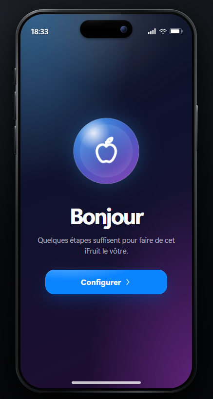
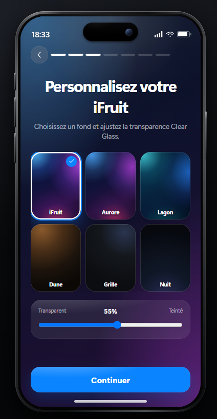
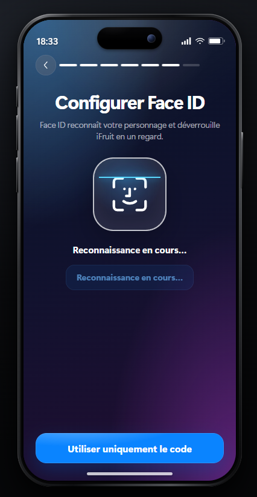
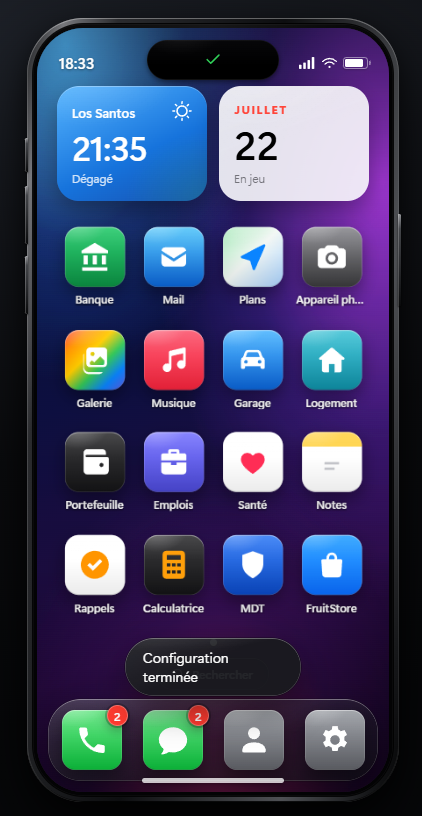
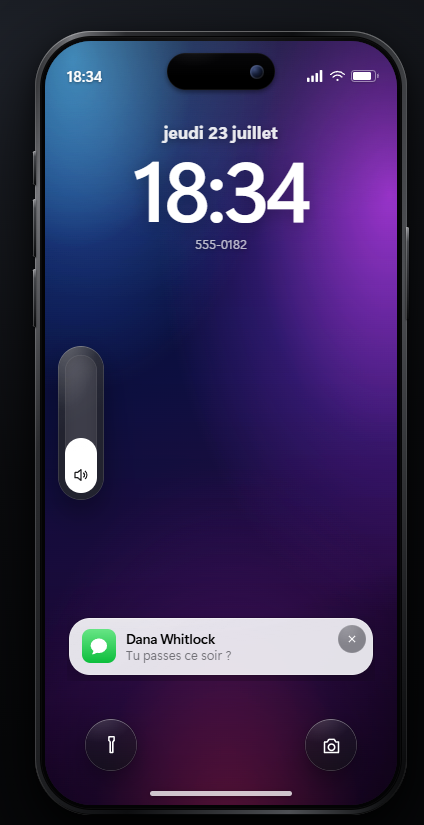
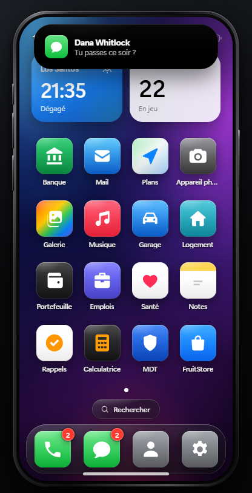
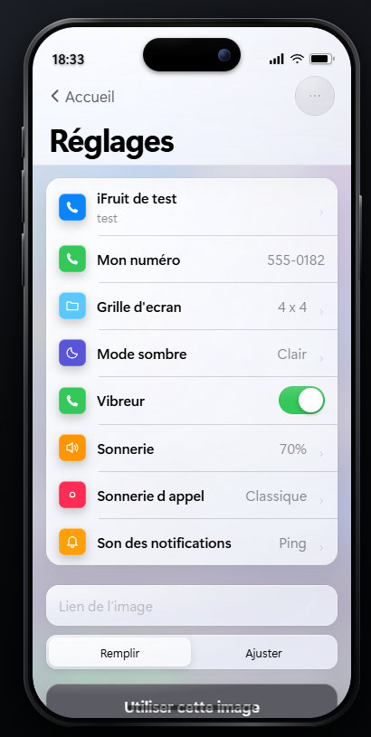
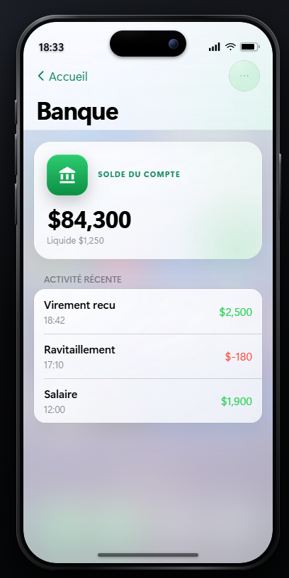
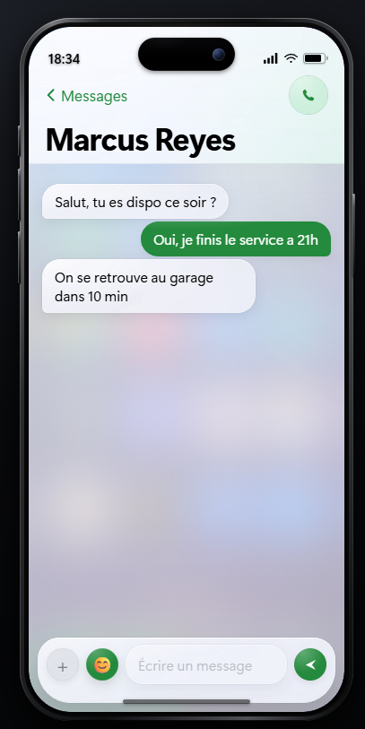
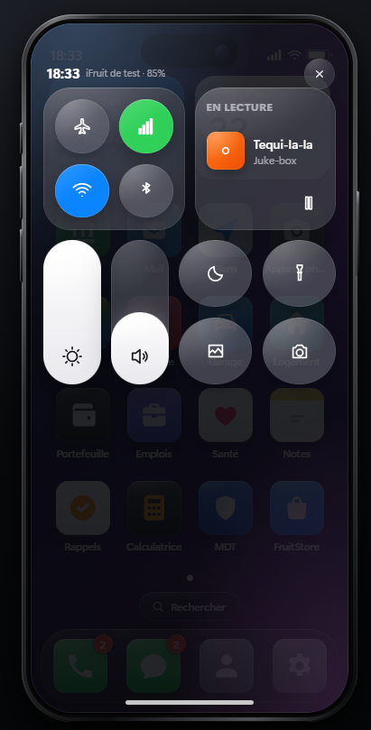

# v-phone

An iOS 27 style phone for FiveM that runs on **your** framework. qb-core, qbx_core, ox_core, ESX or no framework at all: the phone detects what is running and adapts, and every one of those decisions is a line in the config file when you want it to be different.

Twenty apps, a real FruitStore, three social networks, an app SDK so other resources can ship their own apps, and a first run setup with a passcode and Face ID.

## Screenshots

### First run

A phone opened for the first time is activated, not just switched on: a name, an appearance, a wallpaper with the Clear Glass slider, a six digit passcode, and Face ID if the player wants it.

| Hello | Wallpaper and transparency | Face ID |
|---|---|---|
|  |  |  |

### Every day

| Home screen | Lock screen | Dynamic Island |
|---|---|---|
|  |  |  |

The Dynamic Island is not decoration: a message arrives out of it, a call lives in it, and locking pinches it around a padlock.

### Apps

| Settings | Bank | Messages |
|---|---|---|
|  |  |  |

### Control centre

Pull down from the top right for the toggles, the brightness and volume slabs, and what is playing.



## Features

### The phone
- **iOS 27 interface**: Clear Glass materials, a Dynamic Island that reacts to calls, notifications, locking and Face ID, a control centre, a notification shade and a Spotlight search.
- **First run setup**: name, appearance, wallpaper, transparency, a six digit passcode and optional Face ID. The passcode never reaches the page: the server keeps a character salted SHA-256 digest and blocks for thirty seconds after five failures.
- **Configurable home screen**: choose the dock, which apps ship installed, their order, which cannot be removed and which are hidden, all in one table.
- **Grid sizes** from 3x3 to 6x7, chosen by the player in Settings.
- **Interface sounds**: unlock, lock, keypad, switches, app open and close, sent message, shutter. All synthesised, no audio files shipped.
- **In hand**: a prop, an animation, and a phone that keeps working while you walk and drive.
- **Battery** with charging, power banks and a low battery warning.

### The apps
Phone, Messages, Contacts, Mail, Maps, Camera, Gallery, Music, Garage, Property, Wallet, Jobs, Health, Notes, Reminders, Calculator, MDT, FruitStore, Settings, plus four downloads: Bleeter, Snapmatic, Hush and Cipher.

- **Phone**: keypad, favourites, history, voicemail, speaker mode heard by nearby players.
- **Messages**: private and group threads, photos, GIFs, location sharing, reactions, forwarding and emoji.
- **Bleeter** (Twitter): two timelines, likes, comments, reposts, a searchable directory, follows, direct messages and profiles.
- **Snapmatic** (Instagram): stories with a 24 hour life, a photo feed, a profile grid, search and direct messages.
- **Hush** (Tinder): a card you throw with your finger, matches kept in their own tab, an editable profile.
- **Cipher**: an encrypted messenger. The server routes sealed envelopes and keeps neither the clear text nor a private key.

### For developers
- **Drop-in apps**: an app is a folder in `apps/`. No edit to the phone, no build step, no JavaScript framework. See [DEVELOPERS.md](DEVELOPERS.md).
- **App SDK**: the same Clear Glass components the native apps use.
- **Integration hooks**: point any app at your own script in one function rather than forking the resource.

## Compatibility

Everything below is detected automatically. Naming one explicitly in `Config.Compat` always wins, and `off` disables the integration.

| Kind | Supported |
|---|---|
| Framework | qb-core, qbx_core, ox_core, es_extended, standalone |
| Inventory | ox_inventory, qs-inventory (Quasar), ps-inventory, qb-inventory, origen_inventory, codem-inventory |
| Banking | Renewed-Banking, qb-banking, okokBanking, qs-banking, esx_banking |
| Voice | pma-voice, saltychat, mumble-voip |
| Notifications | ox_lib, qb-core, ESX, chat, or your own event |

**Standalone works.** With no framework the phone falls back to the licence identifier, and apps that need a job or a bank simply are not offered.

**The phone owns its own storage.** Preferences, layouts and photo lists live in `phone_kv`, keyed by character. Nothing is written into your framework's metadata column, so a framework update cannot break the phone.

## Installation

1. Install [oxmysql](https://github.com/overextended/oxmysql). It is the only hard requirement.
2. Drop this folder into your `resources` directory.
3. Add it to your `server.cfg`, after your framework:

   ```
   ensure oxmysql
   ensure v-phone
   ```

4. Start the server once. Every table is created automatically.
5. Open `config.lua` and read the `COMPATIBILITY` section at the top. On most servers you will not need to change anything.

Optional, from `server.cfg`:

```
set phone_locale "en"        # or fr
set phone_battery false      # any Config.Settings key, prefixed with phone_
set phone_requireItem true   # the player must carry the phone item
```

## Licence

[MIT with an attribution requirement](LICENSE). Use it, change it, sell your server with it.

The one thing you may not do is remove the credit the phone shows the player in **Settings > About**. Restyle it, translate it, put your own credits next to it. Do not take it away.

## Credits

Author: vyrriox

Bleeter, Snapmatic and Hush are brands from Grand Theft Auto V.

---

# v-phone (Version Française)

Un téléphone au style iOS 27 pour FiveM qui tourne sur **votre** framework. qb-core, qbx_core, ox_core, ESX ou aucun framework : le téléphone détecte ce qui tourne et s'y adapte, et chacune de ces décisions est une ligne du fichier de configuration quand vous voulez en changer.

Vingt applications, un vrai FruitStore, trois réseaux sociaux, un SDK pour que d'autres ressources livrent leurs propres applications, et une configuration au premier démarrage avec code et Face ID.

## Captures d'écran

### Premier démarrage

Un téléphone ouvert pour la première fois est activé, pas seulement allumé : un nom, une apparence, un fond d'écran avec le curseur Clear Glass, un code à six chiffres, et Face ID si le joueur le souhaite.

| Bonjour | Fond et transparence | Face ID |
|---|---|---|
|  |  |  |

### Au quotidien

| Écran d'accueil | Écran de verrouillage | Dynamic Island |
|---|---|---|
|  |  |  |

La Dynamic Island n'est pas décorative : un message en sort, un appel y vit, et le verrouillage la pince autour d'un cadenas.

### Applications

| Réglages | Banque | Messages |
|---|---|---|
|  |  |  |

### Centre de contrôle

Tirez depuis le coin haut droit pour les interrupteurs, les curseurs de luminosité et de volume, et ce qui est en lecture.


## Caractéristiques

### Le téléphone
- **Interface iOS 27** : matériaux Clear Glass, Dynamic Island qui réagit aux appels, aux notifications, au verrouillage et au Face ID, centre de contrôle, volet de notifications et recherche Spotlight.
- **Configuration au premier démarrage** : nom, apparence, fond d'écran, transparence, code à six chiffres et Face ID optionnel. Le code n'atteint jamais la page : le serveur garde une empreinte SHA-256 salée par personnage et bloque trente secondes après cinq échecs.
- **Écran d'accueil configurable** : le dock, les applications livrées, leur ordre, celles qu'on ne peut pas supprimer et celles qui sont masquées, le tout dans une seule table.
- **Grilles** de 3x3 à 6x7, choisies par le joueur dans les Réglages.
- **Sons d'interface** : déverrouillage, verrouillage, clavier, interrupteurs, ouverture et fermeture d'application, message envoyé, obturateur. Tous synthétisés, aucun fichier audio livré.
- **En main** : un prop, une animation, et un téléphone qui continue de fonctionner en marchant et en conduisant.
- **Batterie** avec recharge, batteries externes et alerte de batterie faible.

### Les applications
Téléphone, Messages, Contacts, Mail, Plans, Appareil photo, Galerie, Musique, Garage, Logement, Portefeuille, Emplois, Santé, Notes, Rappels, Calculatrice, MDT, FruitStore, Réglages, plus quatre téléchargements : Bleeter, Snapmatic, Hush et Cipher.

- **Téléphone** : clavier, favoris, historique, répondeur, haut-parleur entendu par les joueurs autour.
- **Messages** : conversations privées et groupées, photos, GIF, partage de position, réactions, transfert et emoji.
- **Bleeter** (Twitter) : deux fils, likes, commentaires, republications, annuaire cherchable, abonnements, messages privés et profils.
- **Snapmatic** (Instagram) : stories d'une journée, fil photo, profil en grille, recherche et messages privés.
- **Hush** (Tinder) : une carte qu'on lance au doigt, les matchs conservés dans leur onglet, un profil modifiable.
- **Cipher** : messagerie chiffrée. Le serveur route des enveloppes scellées et ne conserve ni le texte clair ni la clé privée.

### Pour les développeurs
- **Applications déposables** : une application est un dossier dans `apps/`. Aucune modification du téléphone, aucune étape de build, aucun framework JavaScript. Voir [DEVELOPERS.md](DEVELOPERS.md).
- **SDK** : les mêmes composants Clear Glass que les applications natives.
- **Points d'accroche** : branchez n'importe quelle application sur votre propre script en une fonction plutôt qu'en forkant la ressource.

## Compatibilité

Tout ce qui suit est détecté automatiquement. Nommer explicitement une ressource dans `Config.Compat` l'emporte toujours, et `off` désactive l'intégration.

| Type | Pris en charge |
|---|---|
| Framework | qb-core, qbx_core, ox_core, es_extended, autonome |
| Inventaire | ox_inventory, qs-inventory (Quasar), ps-inventory, qb-inventory, origen_inventory, codem-inventory |
| Banque | Renewed-Banking, qb-banking, okokBanking, qs-banking, esx_banking |
| Voix | pma-voice, saltychat, mumble-voip |
| Notifications | ox_lib, qb-core, ESX, chat, ou votre propre événement |

**Le mode autonome fonctionne.** Sans framework, le téléphone se rabat sur l'identifiant de licence, et les applications qui ont besoin d'un métier ou d'une banque ne sont simplement pas proposées.

**Le téléphone possède son propre stockage.** Préférences, dispositions et listes de photos vivent dans `phone_kv`, par personnage. Rien n'est écrit dans la colonne metadata de votre framework, donc une mise à jour de celui-ci ne peut pas casser le téléphone.

## Installation

1. Installez [oxmysql](https://github.com/overextended/oxmysql). C'est la seule dépendance obligatoire.
2. Déposez ce dossier dans votre répertoire `resources`.
3. Ajoutez-le à votre `server.cfg`, après votre framework :

   ```
   ensure oxmysql
   ensure v-phone
   ```

4. Démarrez le serveur une fois. Toutes les tables sont créées automatiquement.
5. Ouvrez `config.lua` et lisez la section `COMPATIBILITY` en haut. Sur la plupart des serveurs vous n'aurez rien à changer.

Optionnel, depuis `server.cfg` :

```
set phone_locale "fr"
set phone_battery false      # n'importe quelle clé de Config.Settings, préfixée par phone_
set phone_requireItem true   # le joueur doit porter l'objet téléphone
```

## Licence

[MIT avec obligation d'attribution](LICENSE). Utilisez-le, modifiez-le, vendez votre serveur avec.

La seule chose que vous ne pouvez pas faire, c'est retirer le crédit que le téléphone montre au joueur dans **Réglages > À propos**. Habillez-le, traduisez-le, mettez vos propres crédits à côté. Ne le supprimez pas.

## Credits

Author: vyrriox

Bleeter, Snapmatic et Hush sont des marques de Grand Theft Auto V.
