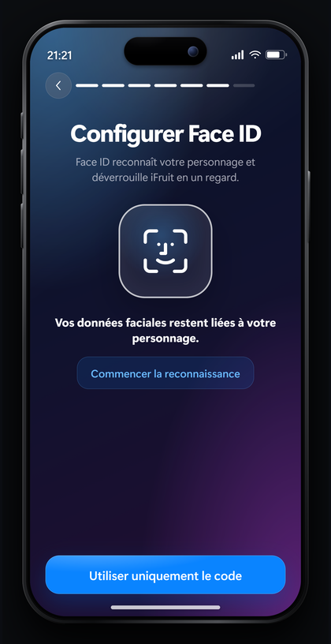
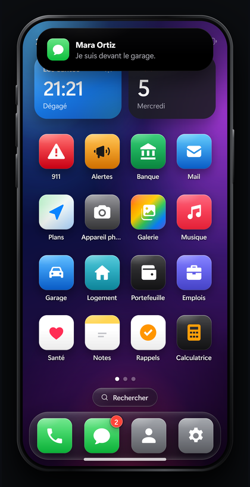
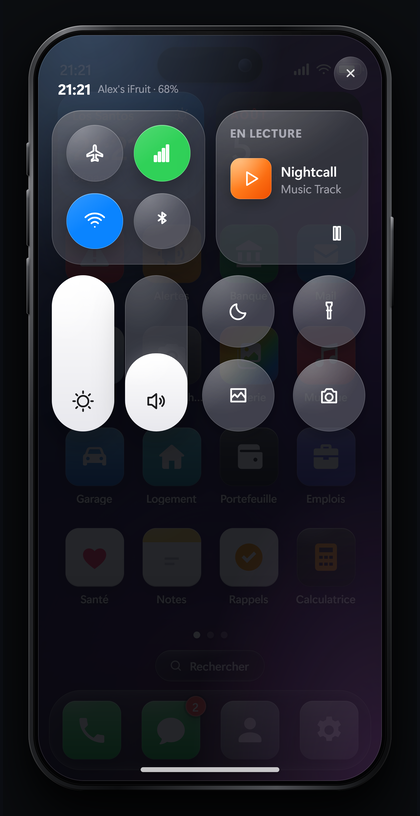

# v-phone

An iOS 27 style phone for FiveM that runs on **your** framework. qb-core, qbx_core, ox_core, ESX or no framework at all: the phone detects what is running and adapts, and every one of those decisions is a line in the config file when you want it to be different.

Twenty apps, a real FruitStore, three social networks, an app SDK so other resources can ship their own apps, and a first run setup with a passcode and Face ID.

## Screenshots

### First run

A phone opened for the first time is activated, not just switched on: a name, an appearance, a wallpaper with the Clear Glass slider, a six digit passcode, and Face ID if the player wants it.

| Hello | Wallpaper and transparency | Face ID |
|---|---|---|
|  |  |  |

### Every day

| Home screen | Lock screen | Dynamic Island |
|---|---|---|
|  |  |  |

The Dynamic Island is not decoration: a message arrives out of it, a call lives in it, and locking pinches it around a padlock.

### Apps

| Settings | Bank | Messages |
|---|---|---|
|  |  |  |

### Control centre

Pull down from the top right for the toggles, the brightness and volume slabs, and what is playing.



## Features

### The phone
- **iOS 27 interface**: Clear Glass materials, a Dynamic Island that reacts to calls, notifications, locking and Face ID, a control centre, a notification shade and a Spotlight search.
- **First run setup**: name, appearance, wallpaper, transparency, a six digit passcode and optional Face ID. The passcode never reaches the page: the server keeps a character salted SHA-256 digest and blocks for thirty seconds after five failures.
- **Configurable home screen**: choose the dock, which apps ship installed, their order, which cannot be removed and which are hidden, all in one table.
- **Grid sizes** from 3x3 to 6x7, chosen by the player in Settings.
- **Sound**: sixteen audio files ship with the phone, five ringtones, four alerts, five interface sounds and the payphone's two struck-metal key clicks. They are generated rather than sampled, so a melody is a table in `tools/make-sounds.py` and nothing is taken from anywhere.
- **In hand**: a prop, an animation, and a phone that keeps working while you walk and drive.
- **Battery** with charging in a vehicle, at a public charger, and inside a property you have a key to (Quasar housing and the rest). Power banks and a low battery warning. Charging in a vehicle and in a property are each a switch.
- **Paid charging points**: give a charger a price and the phone asks before it charges. One payment buys the whole stop - charge as long as you like, and pay again only after leaving the zone. The money goes to a job or society account you name, per charger. See [Paid charging points](#paid-charging-points).
- **Security you can change**: the passcode and Face ID are set during first run and can be changed from Settings afterwards - both asking for the current code first.
- **Police forensics**: a warrant terminal at a map point where police read a suspect's texts, contacts, calls and social from the number, on a lab-bench interface with a case reference and evidence rows. Opened by a key press, and by a target zone when a target script is running. Cipher stays end-to-end encrypted, with an optional, deliberately hard lawful-intercept crack.
- **Payphones**: the call boxes already standing in Los Santos, made to work - no coordinate list, because the client finds the props themselves. A booth **places calls and can never receive them**, its number is derived from where it stands so it is the same every restart, and calls are paid for with a prepaid card item fed into the box. Emergency numbers are free, and walking away hangs up.
- **Group calls**: put somebody else on a call that is already running, up to five. A voice channel has always been a conference - it wires every member to every other one, both ways - so the work is who may be added: the ceiling, whether only the person who placed the call may invite, and one invitation at a time so a tap-through cannot set a whole contact list ringing. Each line is degraded on its own bars, and somebody leaving gets their voice back at once rather than staying quiet for the rest of the call.
- **A call does not own the phone**: put an active call away with the chevron and it carries on in the Dynamic Island, green handset and timer, while you use Messages, Maps or anything else. Tapping the island brings it back.
- **Notifications, three levels per app**: on, silent (the banner and the card arrive, the sound does not) or off. The middle one is the difference between an app you silence and an app you switch off and then miss something important from. Alerts is the one app that cannot be silenced, and it says so rather than ignoring the tap.
- **Messages over more than one line**: Enter sends, Shift+Enter breaks the line, and the box grows with the text.
- **An outbox**: a message written with no signal is held by the handset and sent when the bars come back, one at a time, in order.
- **Apps take time to arrive**: ten seconds on four bars, a minute on one. The server owns the clock, so a download keeps running with the phone in a pocket, and walking out of a tunnel speeds it up.
- **`/phonedebug doctor`**: a static check run from inside the game. It reads the resource's own shipped files and reports the seams - a page route with no client callback, an app with no renderer, a locale key missing in one language, an icon that does not exist, a server callback nothing answers.
- **A theme in one place**: `Config.Theme` sets the accent and the whole system palette without editing a stylesheet inside somebody else's resource. Unset colours keep the phone's own.
- **`/refreshphone`**: a get-out-of-jail command for a phone stuck to the hand or a frozen animation.
- **Media hosting**: photos and short video clips captured in game and uploaded to a CDN (Fivemanage), with a per-file auto-delete clock. Clips post to Bleeter and Snapmatic.
- **Front camera**: a selfie mode - a game camera in front of you - for photos and clips of yourself.
- **FaceTime**: a real video call. With `Config.FaceTime.videoFeed` on, the front camera goes up and a shrunk, cropped frame of each player is relayed to the other a few times a second, over the normal voice call. Needs [screenshot-basic](https://github.com/citizenfx/screenshot-basic); off by default.

### The apps
Phone, Messages, Contacts, **911**, **Alerts**, Mail, Maps, Camera, Gallery, Music, Bank, **Bank Pro**, Garage, Property, Wallet, Jobs, Health, Notes, Reminders, Calculator, MDT, FruitStore, Settings, plus ten downloads: Bleeter, Snapmatic, Hush, Cipher, Zuber, Taxi, **Repair**, **Export**, FruitCharge and the Lottery.

- **Phone**: keypad, favourites, history, voicemail, speaker mode heard by nearby players, and group calls of up to five. On one bar the line breaks up - the voice really cuts out, both ends - and a bad enough line can drop the call.
- **911**: pick a service, pick a reason, and everybody working that service gets it on their own phone with a map pin they can drive to. Installed by default and not removable. The caller is told when somebody takes it, so silence never has to be guessed at. Anonymous reporting, per-service duty and grade rules, and an API so a shop till or a downed player can raise one.
- **Messages**: private and group threads, photos, GIFs, location sharing, reactions, forwarding and emoji.
- **Bank**: the balance your framework already keeps, a statement, transfers to another character by phone number, saved beneficiaries, and a notification when money arrives - a salary, a society payout, a transfer. No companion resource - it reads qb-core, qbx, ESX, ox or your banking script through the bridge. Limits, an optional fee and offline transfers are configurable.
- **Bleeter** (Twitter): two timelines, likes, comments, reposts, a searchable directory, follows, direct messages and profiles.
- **Snapmatic** (Instagram): stories with a 24 hour life, a photo feed, a profile grid, search and direct messages.
- **Hush** (Tinder): a card you throw with your finger, matches kept in their own tab, an editable profile.
- **Cipher**: an encrypted messenger. The server routes sealed envelopes and keeps neither the clear text nor a private key.
- **Bank Pro** (a download): the company account, for the character who runs the business. Deposit, withdraw, pay an employee, and transfer to a private individual or another company - all between BANK accounts, never cash. The history is the account's own statement, so an ATM deposit and a payroll run by another script are in it too.
- **Taxi** (a download): hail a ride, or drive one. Runs on **doc-taxijob** when present - its drivers, calls, fares and ratings, through its own callbacks - and on `Config.Taxi` otherwise. A passenger books, follows the ride, settles up and rates the driver; a driver gets the queue with the nearest fare first.
- **Zuber** (a download): food ordered from the phone. Runs on **doc-restaurant** when that resource is present - its restaurants, menus, promotions, loyalty and reviews, driven through its own callbacks without a line of it being changed - and on `Config.Zuber.restaurants` otherwise, so it works on qb-core, ESX, ox and standalone alike. A live order tracker, a history you can reorder from in one tap, favourites, a search across every menu, and a tip.
- **Bank Pro**: the business side of the bank, for whoever holds a boss grade. Payroll to an
  employee, a transfer out of the company to a private individual or another company, and the
  account's real movements rather than only the ones made from a phone. Which companies appear is
  a list you write in `Config.BankPro.payees`, with the name to show beside each one, so a server
  with forty jobs does not put forty rows in front of a business owner. Reads qb-banking,
  Renewed-Banking, doc-banking and ESX society accounts through the bridge.
- **Alerts** (installed by default): what the authorities broadcast, and what every phone
  receives. Runs on **doc-civilalerte** when present - its alerts, its table, its permissions
  and its Discord relay, through the same callback and events its own iframe used - and on
  `Config.Alerts` otherwise, with the phone's own table and its own job whitelist. Standing
  alerts, a searchable archive, and a composer for whoever may broadcast. It is not optional
  and it cannot be bought: an alert system only works if everybody already has it when the
  alert goes out.
- **Export** (a paid download, $1,000): what your haul is worth, before you drive across the map. Runs
  on **doc-shops** when present - its markets, items, fluctuating prices and history, read
  through its `GetMarketData` **server** export - and on `Config.Export.items` otherwise. The
  board with what moved at the top, a line per item, where a price sits between its floor and
  its ceiling, favourites, and **price alerts**: rises to, falls to, or swings by a percentage.
  The phone's own server watches the board on a timer, so an alert fires while the app is
  closed and the phone is in a pocket. It never sells anything - that happens at the shop.
- **Repair** (a free download): reaching a mechanic from the side of the road. Runs on
  **doc-mechanicmdt** when present - its garages, opening states, ratings, invoice rule and
  callout queue, through the eight server callbacks its own tablet and iframe used - and on
  `Config.Repair` otherwise. Garages sorted by distance with their score and whether anybody is
  in, a callout that carries your position, a live tracker, reviews, and a route. **Both sides**:
  a mechanic holding the job gets the queue on their phone, takes a job, routes to the customer
  and can ring them - which the original app had a tablet for, no use to somebody out on a job.
  Ringing a garage rings a mechanic who is actually on duty there.
- **Lottery** (a paid download, $250): the weekly draw. Runs on **doc-lottery** when present - its
  session, jackpot, tickets and prize tiers, through its own two callbacks - and on
  `Config.Lottery` otherwise, with its own draw on a schedule you set. Numbers are tapped on a
  grid rather than typed, there is a lucky dip, the draw itself is followed live in the app, and
  your own past lines and winnings are there - none of which its original app had.
- **Plugging in** (`Config.PlugIn`, off by default): by default the phone charges the moment
  you sit in any car or step into your own house. Turn this on and those places offer a
  switch in FruitCharge instead - "Put on charge" - and the battery only moves once it is
  thrown. Walking away unplugs it, so it is once per stop rather than once per session. Per
  source, so a server can require it in cars and leave public chargers automatic.
- **FruitCharge** (a paid download): finds every public charger, routes you to one, and pays a paid charger from the phone - with an optional auto-accept and a price ceiling. Standing at a paid charger without it points you at the store.

### For developers
- **Drop-in apps**: an app is a folder in `apps/`. No edit to the phone, no build step, no JavaScript framework. See [DEVELOPERS.md](DEVELOPERS.md).
- **App SDK**: the same Clear Glass components the native apps use.
- **Integration hooks**: point any app at your own script in one function rather than forking the resource.
- **A documented API**: thirty two server exports, five client exports, three events and seven hooks. See [API.md](API.md).

## Compatibility

Everything below is detected automatically. Naming one explicitly in `Config.Compat` always wins, and `off` disables the integration.

| Kind | Supported |
|---|---|
| Framework | qb-core, qbx_core, ox_core, es_extended, standalone |
| Inventory | ox_inventory, qs-inventory (Quasar), ps-inventory, qb-inventory, origen_inventory, codem-inventory |
| Banking | qs-banking, Renewed-Banking, qb-banking, okokBanking, esx_banking |
| Garage | qs-advancedgarages, jg-advancedgarages, qb-garages, cd_garage, okokGarage |
| Housing | qs-housing, ps-housing, qb-houses, ox_property, loaf_housing, esx_property |
| Voice | pma-voice, saltychat, mumble-voip |
| Notifications | ox_lib, qb-core, ESX, chat, or your own event |

**Every app is audited per ecosystem.** [COMPATIBILITY.md](COMPATIBILITY.md) lists what each app needs, what it reads on qb, ox, ESX and Quasar, and how to point it at your own script in one function.

**Standalone works.** With no framework the phone falls back to the licence identifier, and apps that need a job or a bank simply are not offered.

**The phone owns its own storage.** Preferences, layouts and photo lists live in `vphone_kv`, keyed by character. Nothing is written into your framework's metadata column, so a framework update cannot break the phone.

**Every table it creates begins with `vphone_`,** so it can never collide with another script's table. A server upgraded from an older build has its data moved to the new names automatically at boot.

## Dependencies

**Required** - the phone will not start without it:

- [oxmysql](https://github.com/overextended/oxmysql) - the database layer.

**Optional** - each unlocks one feature and is detected at runtime; the phone runs fine without any of them:

| Resource | Unlocks | Link |
|---|---|---|
| [screenshot-basic](https://github.com/citizenfx/screenshot-basic) | the Camera app uploading photos, and the FaceTime live picture | citizenfx/screenshot-basic |
| [screencapture](https://github.com/itschip/screencapture) | photos and **video clips** to a CDN (Fivemanage) | itschip/screencapture |
| [pma-voice](https://github.com/AvarianKnight/pma-voice) | phone call voice | AvarianKnight/pma-voice |
| [xsound](https://github.com/Xogy/xsound) | **the Music app actually playing** - see below | Xogy/xsound |
| [ox_lib](https://github.com/overextended/ox_lib) | nicer notifications | overextended/ox_lib |
| [ox_target](https://github.com/overextended/ox_target) | targeting the police forensics terminal | overextended/ox_target |
| A framework | jobs, money, licences, character names | [qb-core](https://github.com/qbcore-framework/qb-core) · [qbx_core](https://github.com/Qbox-project/qbx_core) · [ox_core](https://github.com/overextended/ox_core) · [es_extended](https://github.com/esx-framework/esx_core) |

Inventory, banking, garage and housing scripts are detected too - see [COMPATIBILITY.md](COMPATIBILITY.md) for the full list and the exact resource names.

The Bank, Garage, Property, Wallet and Jobs apps need **no companion resource**: they read whatever your framework and your scripts already keep, through the bridge.

### Music needs a player

The phone has no audio engine of its own, and it cannot have one: playing a URL out loud in
GTA means an NUI page that streams it, and that page belongs to a resource. So the Music app
keeps the library, the playlists, the queue and the favourites - all of that works with
nothing installed - and hands the actual sound to whatever player your server runs.

Install [**xsound**](https://github.com/Xogy/xsound) (MIT, free) and the phone plays tracks
itself, with all three outputs working:

```
ensure xsound
```

| Output | What happens |
|---|---|
| Headphones | only you hear it |
| Phone speaker | everybody near you hears it, and it follows you as you walk |
| Car radio | positioned on the vehicle, so it moves with the car |

`Config.Music.speakerRange` sets how far the speaker carries - 12 m by default, because a
phone speaker is a phone speaker.

`rcore_radiocar` and `xdiskjockey` are detected too, but neither can be driven from outside:
with those the phone opens their own interface and copies the link for you to paste. With no
player at all the app still works as a library and says so on screen.


## What lives in config.lua

`config.lua` is the only file you edit, and it carries its own contents table at the top with the
line number of every section. What follows is the map, not a second copy of it - the file itself
explains each setting where the setting is.

**The phone itself**
`Framework`, `Compat` (which framework, inventory, banking, voice and target script to use - all
`auto`), `Settings`, `PhoneItem`, `PowerbankItem`, `DeviceSize`, `DeviceSide`, `Watchdog`
(the nets that stop a stuck cursor), `Log`, `MigrateLegacyTables`.

**Apps**
`Apps` (the catalogue and the home-screen order), `AppMetadata` (what the store shows),
`Categories`, `StoreApps` (your own apps, no resource needed), `SdkExample` (the worked example in
`apps/example/`, off by default), `Compat.apps` (switch any app off entirely).

**Look**
`Wallpapers`, `DefaultWallpaper`, `WallpaperFit`, `WallpaperHosts` (which hosts a player may paste
an image from), `DefaultGlass`, `Clock`.

**Talking**
`Messages`, `Cipher`, `Calls` (including `badSignal`, which is what makes one bar sound like one
bar), `RingOut`, `Booth` (payphones), `Airdrop` (sharing between two phones in the room),
`RequiredContacts` (numbers in every phone - 911 is one, and calling it opens the app).

**Money and work**
`Bank`, `BankPro`, `Jobs`, `Licences`, `Property`, `Garages`, `Hospitals`, `Health`.

**The paid and the optional**
`Charging`, `PaidCharging` (public chargers) and `PlugIn` (charging on purpose), `Zuber`, `Taxi`, `Repair`, `Export`, `Lottery`, `Alerts`, `Media` (photo and
video hosting), `Music`, `Vehicle`, `Police` (the forensics terminal), `Social`, `Store`.

**Staff**
`Admin`, `Commands` (the three command groups), `Outage`.

## Installation

Nothing here is optional-but-actually-required. Step 3 is the only one most servers need.

### 1. oxmysql

The one hard requirement. [Install it](https://github.com/overextended/oxmysql) and make sure
your `mysql_connection_string` is set, because every table the phone needs is created through
it on the first start.

### 2. Drop the folder in

`resources/[phone]/v-phone`, or wherever you keep things. The folder name **must stay
`v-phone`** - the resource looks itself up by name in a few places.

### 3. server.cfg

Order matters: after your framework, after oxmysql.

```cfg
ensure oxmysql
ensure qb-core          # or qbx_core, ox_core, es_extended - whatever you run
ensure v-phone
```

### 4. Start the server once

Every table is created automatically, and the console says what was detected:

```
[v-phone] framework: qb-core
```

If that line says `standalone` and you do run a framework, the framework started *after* the
phone - move its `ensure` above. (Turn `Config.Log.boot = true` on to see that line at all;
it is off by default so a live console stays readable.)

### 5. Give players a phone item

**Skipped entirely if you do not want an item.** Set `Config.Settings.requireItem = false`, or
`set phone_requireItem false` in server.cfg, and everybody has a phone. That is a legitimate
choice and plenty of servers make it.

If you *do* want the item, see [Creating the items](#creating-the-items) below - it
is one row of SQL or one table entry, per framework.

### 6. Optional convars

```cfg
setr phone_locale "en"        # French is the default; en, or any locale file you add
set phone_battery false      # any Config.Settings key, prefixed with phone_
set phone_requireItem false   # everybody gets a phone, no item needed
set phone_camera true         # the Camera app (needs screenshot-basic or screencapture)
set phone_media true          # photo hosting
setr phone_verbose true       # the boot summary
setr phone_debug true         # the page's tracing in F8. Leave this OFF on a live server
```

`setr` where the client has to read it too, `set` where only the server does. A plain `set`
convar does not exist on a client at all, which is a mistake worth knowing about before it
costs you an afternoon.

### 7. Staff permissions

```cfg
add_ace group.admin vphone.admin allow
```

qb-core's own `qbadmin.menu` is accepted too, so existing staff usually work without this. See
[Admin commands](#admin-commands).

## Creating the items

Only needed when `Config.Settings.requireItem` is on (it is, by default). The item name the
phone looks for is `Config.PhoneItem`, `phone` out of the box - and `phone` and `iphone` are
both accepted whatever you set, so an item you already have usually just works.

The phone does **not** need the item to be usable-on-click: it opens with the keybind either
way. Making it usable is nicer, so both halves are below.

### qb-core

`qb-core/shared/items.lua` - add one entry:

```lua
['phone'] = {
    ['name'] = 'phone',
    ['label'] = 'Phone',
    ['weight'] = 700,
    ['type'] = 'item',
    ['image'] = 'phone.png',
    ['unique'] = false,
    ['useable'] = true,
    ['shouldClose'] = true,
    ['combinable'] = nil,
    ['description'] = 'To call and text people',
},
```

Recent qb-core versions ship a `phone` item already - check before adding a second one. Put a
`phone.png` in `qb-inventory/html/images/` or the slot shows a blank square.

Give one to a player:

```
/giveitem 1 phone 1
```

### qbx_core (Qbox)

Items live in `ox_inventory/data/items.lua`, because Qbox uses ox_inventory:

```lua
['phone'] = {
    label = 'Phone',
    weight = 700,
    stack = false,
    close = true,
    description = 'To call and text people',
},
```

No `client` block and no export: the phone listens to `ox_inventory:usedItem` itself, so
declaring the item is all there is to do.

### ox_core / ox_inventory

Same file, same entry as Qbox above.

### ESX

ESX keeps items in the database. One row:

```sql
INSERT INTO items (name, label, weight, rare, can_remove)
VALUES ('phone', 'Phone', 1, 0, 1);
```

On an ESX server using ox_inventory, use the ox entry above instead - ox_inventory reads its
own file, not the `items` table.

Give one to a player:

```
/giveitem 1 phone 1
```

### Any inventory: making it open the phone

The phone registers a usable item by itself for every inventory it detects: `ox_inventory`,
`qs-inventory`, `ps-inventory`, `qb-inventory`, `origen_inventory`, `codem-inventory`. On
qb-core and qbx it goes through `CreateUseableItem`, on ESX through `ESX.RegisterUsableItem`,
and on ox_inventory it listens to `ox_inventory:usedItem` - so on all of those, declaring the
item is enough.

If yours is not in that list, have it call the client export:

```lua
exports['v-phone']:Open()
```

`Config.Compat.inventory` also takes a resource name instead of `'auto'`, for a fork whose name
the bridge does not recognise.

### The power bank

Optional, and nothing breaks without it: a flat phone simply stays flat until the player finds a
charger. With the item, using it returns `Config.Settings.powerbankCharge` percent (45 by
default) and consumes it.

`Config.PowerbankItem` names it - `powerbank` out of the box, and that name keeps working
whatever you set, so an item you already have is never orphaned.

qb-core, in `qb-core/shared/items.lua`:

```lua
['powerbank'] = {
    ['name'] = 'powerbank',
    ['label'] = 'Power bank',
    ['weight'] = 400,
    ['type'] = 'item',
    ['image'] = 'powerbank.png',
    ['unique'] = false,
    ['useable'] = true,
    ['shouldClose'] = true,
    ['description'] = 'Recharges a phone',
},
```

ox_inventory (Qbox, ox_core, or ESX running ox_inventory), in `ox_inventory/data/items.lua`:

```lua
['powerbank'] = {
    label = 'Power bank',
    weight = 400,
    stack = true,
    close = true,
    description = 'Recharges a phone',
},
```

ESX with its own inventory:

```sql
INSERT INTO items (name, label, weight, rare, can_remove)
VALUES ('powerbank', 'Power bank', 1, 0, 1);
```

**`useable = true` matters on qb-core.** The phone registers the item itself, but qb only offers
the click in the inventory when its own catalogue says the item is usable.

Another resource can charge a phone without any item at all - a wall socket, an electric car -
with `exports['v-phone']:SetCharging(src, true, rate)`. See [API.md](API.md).

## Phone numbers

Every `#` in `Config.NumberFormat` becomes a digit and everything else is kept verbatim, so
all of these work:

| Format | Example |
|---|---|
| `555-####` | `555-0142` — the GTA shape, and the default |
| `5555-####-####` | `5555-0142-9930` |
| `(###) ###-####` | `(415) 555-0142` |
| `+33 # ## ## ## ##` | `+33 6 12 34 56 78` |
| `##########` | `4155550142` |

Four `#` minimum, 20 characters maximum, and it must not collide with
`Config.Booth.numberFormat` — a payphone is recognised by the shape of its number alone. The
server checks all three at boot and says which one is wrong.

### Grouping a number for reading

Ten digits in a row is not something a person can read back over voice. `Config.NumberDisplay`
puts a separator in **visually** while the stored value is untouched:

```lua
Config.NumberDisplay = {
    groupEvery    = 3,      -- 0 turns it off
    separator     = '-',
    onlyWhenPlain = true,   -- leave a number that already has punctuation alone
    scope         = 'own',  -- own | all
}
```

`4155550142` reads as `415-555-0142`. A trailing group of one is absorbed into the group
before it, so it is never `415-555-014-2` — a single orphaned digit looks like a bug rather
than a convention.

Nothing here changes the database, the dialler, the clipboard or what any export answers. It
is the last step before text reaches a screen. A number that already carries its own
punctuation — `555-0142`, because `Config.NumberFormat` said so — is left exactly as it is,
since regrouping it would give `555--01-42`.

`scope = 'own'` is your own number: the lock screen, Settings, Contacts, and where an app asks
you to confirm it. `all` extends it to every number the phone draws.

### Already have players with numbers?

qb-core writes a number into `charinfo` when a character is created, and ox_core keeps one in
`characters.phoneNumber`. By default the phone **adopts** it, so every script that already
knows how to reach a player still can.

If you would rather the phone's own format won:

```lua
Config.Compat.numbers = 'phone'   -- auto | framework | phone
```

`phone` ignores the framework's numbers entirely and mints in your format, and does not write
back into `charinfo`.

That governs characters from then on. It cannot retroactively change a number already stored,
so for players whose framework number was adopted on an earlier boot, run this once:

```
/phoneadmin renumber all confirm
```

Or one at a time: `/phoneadmin renumber 3 confirm`.

**Anybody who saved the old number in their contacts keeps the old number.** That is not
something the phone can fix — a contact is a row on somebody else's phone, and rewriting other
people's address books to follow a staff action would be worse than the problem. The
character's own contacts, messages and call log are untouched.


## Paid charging points

A charger with a `price` asks before it charges. The phone shows the offer, the player accepts
or refuses, and **one payment buys the whole stop**: they charge for as long as they like and
pay again only if they leave the zone and come back. Nothing is metered.

```lua
Config.Chargers = {
    { id = 'ch_lsia', label = 'LSIA, arrivals hall', x = -1037.0, y = -2737.0, z = 20.2,
      radius = 8.0, price = 40, account = 'airport' },   -- paid
    { id = 'ch_legion', label = 'Legion Square kiosk', x = 195.0, y = -933.0, z = 30.7,
      radius = 6.0 },                                    -- free
}

Config.PaidCharging = {
    enabled    = true,
    price      = 0,        -- for a charger whose row names none
    money      = 'cash',   -- or 'bank'
    account    = '',       -- where it goes when a row names none; '' pays nobody
    refusedFor = 90,       -- seconds before it asks again after a refusal
    skipAbove  = 95,       -- do not ask somebody whose phone is nearly full
}
```

`account` is a **job or society account** in your banking script. qb-banking, Renewed-Banking,
okokBanking and esx_addonaccount are handled; anything else fills
`Config.Compat.hooks.society = function(account, amount, reason) ... end`. An account that
cannot be credited still charges the player and prints one line naming it, so a kiosk never
stops working because a banking script changed.

Everything is decided on the server from the player's real position: the phone sends yes or no
and nothing else.

**Charging in a vehicle** is `Config.Compat.chargeInVehicle`, next to `chargeAtProperty`. Off
makes a long drive cost battery.

## The staff menu

`/phoneadmin` with no arguments opens a menu: pick the nearest player or type an id, then read
the phone, open it on their screen, set the battery or the number, send a message or a
notification, give or take an app, take the handset out of service, wipe it, or cut the
network.

It is drawn through **ox_lib** or **qb-menu**, whichever is running, and uses **qb-input** or
ox_lib's dialog to ask for values. With neither, it says so and the subcommands below still
work.

**qb-adminmenu cannot be extended by another resource** - it builds its menu from local
variables in its own client file and hands them to MenuV, so nothing outside that file can
reach them. To put the phone's menu in front of staff from any admin menu, point a button at:

```lua
TriggerServerEvent('v-phone:admin:menu')
```

The menu is a front end, not a second set of permissions: it sends the same arguments to the
same handler the typed command reaches, and the ace is checked there.

## Admin commands

Behind `Config.Admin.ace` (`vphone.admin` by default), or qb-core's `qbadmin.menu`. Type
`/phoneadmin` in chat and the autocomplete lists every subcommand with its arguments - staff
only, so a player who cannot run them is never offered them. With no arguments at all it opens
[the staff menu](#the-staff-menu).

Each one has its own switch in `Config.Admin.actions`, so an action you would rather staff did
not have is **removed**, not merely left untyped.

### Reading a phone

```
/phoneadmin info     [id|cid|number]      number, battery, unread, online
/phoneadmin who                            everybody with a phone open right now
/phoneadmin number   [id|cid]              read a number
/phoneadmin contacts [id|cid]              read the contact book
/phoneadmin apps     [id|cid]              what is installed
/phoneadmin bricked                        which phones are out of service
/phoneadmin outages                        what outages are in force, and for how long
/phoneadmin verified (snap)                who holds a verified badge
```

### Acting on one phone

```
/phoneadmin open     [id]                  open their phone on their screen (support)
/phoneadmin battery  [id] [0-100]
/phoneadmin number   [id|cid] [number]     set a number
/phoneadmin message  [id|cid] [text]       a text message, from Staff
/phoneadmin notify   [id|cid] [text]       a banner - does not persist, comes from no number
/phoneadmin app      [id|cid] give|take [appid]
/phoneadmin brick    [id|cid] (minutes)    take one handset out of service
/phoneadmin unbrick  [id|cid]
/phoneadmin wipe     [id|cid] confirm      DELETE everything on that phone. Irreversible
```

### The whole server

```
/phoneadmin announce   [text]              a banner on every phone online
/phoneadmin batteryall [0-100]
/phoneadmin outage     [bars 0-4] (minutes)              the whole server
/phoneadmin outage here [radius] [bars] (minutes)        a circle around you
/phoneadmin outage at [x] [y] [z] [radius] [bars] (minutes)
/phoneadmin outage clear [id|all]
```

An outage is a **ceiling in bars**, not an on/off switch: one bar is a far more interesting
outage than no phone, because calls drop and players have to move to be heard. It goes through
the same path as the map's dead zones and the worst one wins, so a global outage cannot be
escaped by standing somewhere with perfect reception. `minutes = 0`, or omitted, means until
somebody clears it. **Nothing is persisted** - a restart lifts every outage, deliberately, so
one nobody remembers setting can never survive a crash.

`brick` is the other half: the network is fine, that handset is not. For a phone that was
smashed or confiscated. Keyed by citizen id, so it survives reconnecting, and a bricked phone
refuses to **open** rather than opening onto features that quietly fail.

### Social

```
/phoneadmin verify [@handle] (off) (snap)   grant or revoke the verified badge
```

By handle rather than by character, because a badge belongs to an account and a report has the
@handle in it. It is an **export, never a callback**: a client cannot ask to be verified.

### Everybody's commands

```
/refreshphone      reset your own stuck phone: prop, animation, NUI focus, control guard
/phonediag         staff only, and only with debug on: what each callback and provider answers
```

Every refused staff command is printed to the server console with who tried it.


## Support

| You want to... | Go to |
| --- | --- |
| Report something broken | [Bug report](https://github.com/laforetbrut/v-phone-fivem/issues/new?template=01-bug.yml) |
| An app does not read your inventory / banking / housing script | [Compatibility report](https://github.com/laforetbrut/v-phone-fivem/issues/new?template=02-compatibility.yml) |
| Suggest a feature | [Feature request](https://github.com/laforetbrut/v-phone-fivem/issues/new?template=03-feature.yml) |
| Fix the docs | [Documentation](https://github.com/laforetbrut/v-phone-fivem/issues/new?template=04-docs.yml) |
| Ask a question, get setup help | [Discussions](https://github.com/laforetbrut/v-phone-fivem/discussions) |
| Report a vulnerability | [Privately](https://github.com/laforetbrut/v-phone-fivem/security/advisories/new) — never a public issue |

A bug report needs **both** consoles (server and client F8) and steps from a fresh connection.
Read [CONTRIBUTING.md](CONTRIBUTING.md) before opening a pull request.

## Licence

[MIT with an attribution requirement](LICENSE). Use it, change it, sell your server with it.

The one thing you may not do is remove the credit the phone shows the player in **Settings > About**. Restyle it, translate it, put your own credits next to it. Do not take it away.

## Credits

Author: vyrriox

Bleeter, Snapmatic and Hush are brands from Grand Theft Auto V.

---

# v-phone (Version Française)

Un téléphone au style iOS 27 pour FiveM qui tourne sur **votre** framework. qb-core, qbx_core, ox_core, ESX ou aucun framework : le téléphone détecte ce qui tourne et s'y adapte, et chacune de ces décisions est une ligne du fichier de configuration quand vous voulez en changer.

Vingt applications, un vrai FruitStore, trois réseaux sociaux, un SDK pour que d'autres ressources livrent leurs propres applications, et une configuration au premier démarrage avec code et Face ID.

## Captures d'écran

### Premier démarrage

Un téléphone ouvert pour la première fois est activé, pas seulement allumé : un nom, une apparence, un fond d'écran avec le curseur Clear Glass, un code à six chiffres, et Face ID si le joueur le souhaite.

| Bonjour | Fond et transparence | Face ID |
|---|---|---|
|  |  |  |

### Au quotidien

| Écran d'accueil | Écran de verrouillage | Dynamic Island |
|---|---|---|
|  |  |  |

La Dynamic Island n'est pas décorative : un message en sort, un appel y vit, et le verrouillage la pince autour d'un cadenas.

### Applications

| Réglages | Banque | Messages |
|---|---|---|
|  |  |  |

### Centre de contrôle

Tirez depuis le coin haut droit pour les interrupteurs, les curseurs de luminosité et de volume, et ce qui est en lecture.


## Caractéristiques

### Le téléphone
- **Interface iOS 27** : matériaux Clear Glass, Dynamic Island qui réagit aux appels, aux notifications, au verrouillage et au Face ID, centre de contrôle, volet de notifications et recherche Spotlight.
- **Configuration au premier démarrage** : nom, apparence, fond d'écran, transparence, code à six chiffres et Face ID optionnel. Le code n'atteint jamais la page : le serveur garde une empreinte SHA-256 salée par personnage et bloque trente secondes après cinq échecs.
- **Écran d'accueil configurable** : le dock, les applications livrées, leur ordre, celles qu'on ne peut pas supprimer et celles qui sont masquées, le tout dans une seule table.
- **Grilles** de 3x3 à 6x7, choisies par le joueur dans les Réglages.
- **Son** : seize fichiers audio sont livrés avec le téléphone, cinq sonneries, quatre alertes, cinq sons d'interface et les deux clics de touche en métal frappé de la cabine. Ils sont générés plutôt qu'échantillonnés : une mélodie est une table dans `tools/make-sounds.py` et rien n'est repris de nulle part.
- **En main** : un prop, une animation, et un téléphone qui continue de fonctionner en marchant et en conduisant.
- **Batterie** avec recharge dans un véhicule, à une borne publique, et à l'intérieur d'un logement dont vous avez la clé (Quasar housing et les autres). Batteries externes et alerte de batterie faible. La recharge en véhicule et en logement sont chacune une option.
- **Bornes de recharge payantes** : donnez un prix à une borne et le téléphone demande avant de recharger. Un seul paiement couvre tout le passage - rechargez autant que vous voulez, et ne repayez qu'après avoir quitté la zone. L'argent va sur le compte de métier ou de société que vous désignez, borne par borne. Voir [Bornes de recharge payantes](#bornes-de-recharge-payantes).
- **Une sécurité modifiable** : le code et le Face ID sont définis au premier démarrage et peuvent être changés ensuite depuis les Réglages - les deux demandant d'abord le code actuel.
- **Enquête police** : un terminal d'analyse à un point de la carte où la police lit les SMS, contacts, appels et réseaux d'un suspect à partir du numéro, sur une interface de laboratoire avec référence de dossier et lignes de preuve. Ouvert par une touche, et par une zone de target quand un script de target tourne. Cipher reste chiffré de bout en bout, avec une interception légale optionnelle et volontairement difficile.
- **Cabines téléphoniques** : les bornes déjà présentes à Los Santos, rendues fonctionnelles - aucune liste de coordonnées, car le client trouve les props lui-même. Une cabine **passe des appels et ne peut jamais en recevoir**, son numéro est dérivé de sa position et reste donc identique à chaque redémarrage, et les appels se paient avec un item carte prépayée inséré dans la borne. Les numéros d'urgence sont gratuits, et s'éloigner raccroche.
- **Appels de groupe** : ajouter quelqu'un à un appel déjà en cours, jusqu'à cinq. Un canal vocal a toujours été une conférence - il relie chaque membre à tous les autres, dans les deux sens - donc le travail porte sur qui peut être ajouté : le plafond, l'option où seul celui qui a lancé l'appel peut inviter, et une invitation à la fois pour qu'un enchaînement de taps ne fasse pas sonner tout un répertoire. Chaque ligne est dégradée sur ses propres barres, et celui qui quitte récupère sa voix immédiatement au lieu de rester muet le reste de l'appel.
- **Un appel ne confisque plus le téléphone** : rangez un appel actif avec le chevron et il continue dans la Dynamic Island, combiné vert et chrono, pendant que vous utilisez Messages, Plans ou autre chose. Toucher l'île le ramène.
- **Notifications, trois niveaux par application** : activées, silencieuses (la bannière et la carte arrivent, le son non) ou coupées. Le niveau intermédiaire est la différence entre une application qu'on fait taire et une qu'on coupe avant de rater quelque chose d'important. Alertes est la seule qui ne peut pas être réduite au silence, et elle le dit au lieu d'ignorer le tap.
- **Des messages sur plusieurs lignes** : Entrée envoie, Maj+Entrée saute la ligne, et la zone grandit avec le texte.
- **Une boîte d'envoi** : un message écrit sans réseau est gardé par le combiné et part quand les barres reviennent, un par un, dans l'ordre.
- **Les applications mettent du temps à arriver** : dix secondes à quatre barres, une minute à une seule. Le serveur possède l'horloge, donc un téléchargement continue téléphone en poche, et sortir d'un tunnel l'accélère.
- **`/phonedebug doctor`** : un contrôle statique lancé depuis le jeu. Il lit les fichiers livrés par la ressource elle-même et signale les jointures - une route de page sans callback client, une application sans rendu, une clé de langue absente d'un côté, une icône qui n'existe pas, un callback serveur auquel rien ne répond.
- **Un thème en un seul endroit** : `Config.Theme` définit l'accent et toute la palette système sans éditer une feuille de style à l'intérieur de la ressource de quelqu'un d'autre. Les couleurs non renseignées gardent celles du téléphone.
- **`/refreshphone`** : une commande de secours quand le téléphone reste collé à la main ou qu'une animation se fige.
- **Hébergement média** : photos et courts clips vidéo capturés en jeu et envoyés vers un CDN (Fivemanage), avec une horloge de suppression automatique par fichier. Les clips se publient sur Bleeter et Snapmatic.
- **Caméra frontale** : un mode selfie - une caméra de jeu devant vous - pour se photographier et se filmer.
- **FaceTime** : un vrai appel vidéo. Avec `Config.FaceTime.videoFeed` activé, la caméra frontale se lève et une image réduite et recadrée de chaque joueur est relayée à l'autre plusieurs fois par seconde, par-dessus l'appel vocal normal. Nécessite [screenshot-basic](https://github.com/citizenfx/screenshot-basic) ; désactivé par défaut.

### Les applications
Téléphone, Messages, Contacts, **911**, **Alertes**, Mail, Plans, Appareil photo, Galerie, Musique, Banque, **Bank Pro**, Garage, Logement, Portefeuille, Emplois, Santé, Notes, Rappels, Calculatrice, MDT, FruitStore, Réglages, plus dix téléchargements : Bleeter, Snapmatic, Hush, Cipher, Zuber, Taxi, **Dépannage**, **Export**, FruitCharge et la Loterie.

- **Téléphone** : clavier, favoris, historique, répondeur, haut-parleur entendu par les joueurs autour, et appels de groupe jusqu'à cinq. À une barre de réseau la ligne coupe — la voix se coupe vraiment, des deux côtés — et une ligne assez mauvaise peut faire raccrocher.
- **911** : on choisit un service, un motif, et toutes les personnes en poste dans ce service reçoivent l'alerte sur leur téléphone avec un point sur la carte. Installée par défaut, impossible à supprimer. L'appelant est prévenu quand quelqu'un prend l'appel, pour ne jamais avoir à interpréter le silence. Signalement anonyme, règles de service et de grade par service, et une API pour qu'une caisse de magasin ou un joueur à terre puisse lancer une alerte.
- **Messages** : conversations privées et groupées, photos, GIF, partage de position, réactions, transfert et emoji.
- **Banque** : le solde que votre framework tient déjà, un relevé, des virements vers un autre personnage par numéro de téléphone, des bénéficiaires enregistrés, et une notification quand de l'argent arrive — salaire, versement de société, virement. Aucune ressource compagnon : elle lit qb-core, qbx, ESX, ox ou votre script bancaire via le bridge. Limites, frais optionnels et virements hors ligne configurables.
- **Bleeter** (Twitter) : deux fils, likes, commentaires, republications, annuaire cherchable, abonnements, messages privés et profils.
- **Snapmatic** (Instagram) : stories d'une journée, fil photo, profil en grille, recherche et messages privés.
- **Hush** (Tinder) : une carte qu'on lance au doigt, les matchs conservés dans leur onglet, un profil modifiable.
- **Cipher** : messagerie chiffrée. Le serveur route des enveloppes scellées et ne conserve ni le texte clair ni la clé privée.
- **Bank Pro** (téléchargement) : le compte de l'entreprise, pour le personnage qui la dirige. Dépôt, retrait, paie d'un employé, et virement vers un particulier ou une autre entreprise — toujours entre comptes BANCAIRES, jamais d'espèces. L'historique est le relevé du compte lui-même : un dépôt au DAB ou une paie faite par un autre script y figurent aussi.
- **Taxi** (téléchargement) : commander une course, ou en conduire. Fonctionne sur **doc-taxijob** quand il est présent — ses chauffeurs, appels, tarifs et notes, via ses propres callbacks — et sur `Config.Taxi` sinon. Le passager réserve, suit la course, règle et note ; le chauffeur voit la file, la course la plus proche d'abord.
- **Zuber** (téléchargement) : commander à manger depuis le téléphone. Fonctionne sur **doc-restaurant** quand la ressource est présente — ses restaurants, cartes, promotions, fidélité et avis, pilotés par ses propres callbacks sans qu'une ligne n'en soit modifiée — et sur `Config.Zuber.restaurants` sinon, donc sur qb-core, ESX, ox et standalone. Suivi de commande en direct, historique avec « recommander » en un appui, favoris, recherche dans toutes les cartes, et pourboire.
- **Bank Pro** : le volet entreprise de la banque, pour qui détient un grade de patron. Paie d'un
  employé, virement de l'entreprise vers un particulier ou une autre société, et les mouvements
  réels du compte plutôt que les seuls faits depuis un téléphone. Les entreprises affichées sont
  une liste que vous écrivez dans `Config.BankPro.payees`, avec le nom à afficher pour chacune,
  pour qu'un serveur de quarante métiers n'en mette pas quarante devant un patron. Lit qb-banking,
  Renewed-Banking, doc-banking et les comptes de société ESX via le bridge.
- **Alertes** (installée par défaut) : ce que les autorités diffusent, et ce que tous les
  téléphones reçoivent. Fonctionne sur **doc-civilalerte** quand il est présent — ses alertes,
  sa table, ses permissions et son relais Discord, via le callback et les événements que sa
  propre iframe utilisait — et sur `Config.Alerts` sinon, avec la table du téléphone et sa
  propre liste de métiers. Alertes en cours, archives consultables, et un formulaire de
  diffusion pour ceux qui en ont le droit. Ni optionnelle ni payante : un système d'alerte ne
  sert que si tout le monde l'a déjà quand l'alerte part.
- **Export** (téléchargement payant, 1 000 $) : ce que vaut votre chargement, avant de traverser la
  carte. Fonctionne sur **doc-shops** quand il est présent — ses marchés, ses articles, ses
  cours fluctuants et son historique, via son export **serveur** `GetMarketData` — et sur
  `Config.Export.items` sinon. Le tableau avec ce qui bouge en tête, une courbe par article,
  la position du prix entre son plancher et son plafond, les favoris, et des **alertes de
  prix** : monte à, descend à, ou bouge de X%. Le serveur du téléphone surveille les cours sur
  une minuterie, donc une alerte part application fermée, téléphone en poche. L'application ne
  vend jamais rien : cela se passe au magasin.
- **Dépannage** (téléchargement gratuit) : joindre un mécano depuis le bord de la route.
  Fonctionne sur **doc-mechanicmdt** quand il est présent — ses garages, leurs états, les notes,
  sa règle de facture et sa centrale d'appel, via les huit callbacks serveur que sa tablette et
  son iframe utilisaient — et sur `Config.Repair` sinon. Garages triés par distance avec leur
  note et le nombre de mécanos en service, une demande qui emporte votre position, un suivi en
  direct, les avis, l'itinéraire. **Les deux côtés** : un mécano en poste reçoit la file sur son
  téléphone, prend une demande, trace la route vers le client et peut l'appeler — ce que
  l'application d'origine confiait à une tablette, inutile quand on est en intervention.
  Appeler un garage fait sonner un mécano réellement en service.
- **Loterie** (téléchargement payant, 250 $) : le tirage hebdomadaire. Fonctionne sur
  **doc-lottery** quand il est présent — sa session, sa cagnotte, ses tickets et ses rangs de gain,
  via ses deux callbacks — et sur `Config.Lottery` sinon, avec son propre tirage à l'heure que vous
  fixez. Les numéros se touchent sur une grille au lieu d'être tapés, il y a un flash, le tirage se
  suit en direct dans l'application, et vos grilles passées et vos gains y sont — ce que son
  application d'origine n'avait pas.
- **Se brancher** (`Config.PlugIn`, désactivé par défaut) : par défaut le téléphone se charge
  dès qu'on s'assoit dans une voiture ou qu'on entre chez soi. Activez ceci et ces endroits
  proposent un bouton dans FruitCharge — « Mettre en charge » — et la batterie ne bouge
  qu'une fois appuyé. S'éloigner débranche, donc c'est une fois par arrêt et non par session.
  Réglable par source : exiger le geste en voiture et laisser les bornes publiques automatiques.
- **FruitCharge** (téléchargement payant) : localise toutes les bornes publiques, place l'itinéraire vers l'une d'elles, et paie une borne payante depuis le téléphone — avec acceptation automatique et plafond de prix. Sans l'application, une borne payante renvoie vers le store.

### Pour les développeurs
- **Applications déposables** : une application est un dossier dans `apps/`. Aucune modification du téléphone, aucune étape de build, aucun framework JavaScript. Voir [DEVELOPERS.md](DEVELOPERS.md).
- **SDK** : les mêmes composants Clear Glass que les applications natives.
- **Points d'accroche** : branchez n'importe quelle application sur votre propre script en une fonction plutôt qu'en forkant la ressource.
- **Une API documentée** : trente-deux exports serveur, cinq exports client, trois événements et sept hooks. Voir [API.md](API.md).

## Compatibilité

Tout ce qui suit est détecté automatiquement. Nommer explicitement une ressource dans `Config.Compat` l'emporte toujours, et `off` désactive l'intégration.

| Type | Pris en charge |
|---|---|
| Framework | qb-core, qbx_core, ox_core, es_extended, autonome |
| Inventaire | ox_inventory, qs-inventory (Quasar), ps-inventory, qb-inventory, origen_inventory, codem-inventory |
| Banque | qs-banking, Renewed-Banking, qb-banking, okokBanking, esx_banking |
| Garage | qs-advancedgarages, jg-advancedgarages, qb-garages, cd_garage, okokGarage |
| Logement | qs-housing, ps-housing, qb-houses, ox_property, loaf_housing, esx_property |
| Voix | pma-voice, saltychat, mumble-voip |
| Notifications | ox_lib, qb-core, ESX, chat, ou votre propre événement |

**Chaque application est auditée par écosystème.** [COMPATIBILITY.md](COMPATIBILITY.md) liste ce dont chaque application a besoin, ce qu'elle lit sur qb, ox, ESX et Quasar, et comment la brancher sur votre propre script en une fonction.

**Le mode autonome fonctionne.** Sans framework, le téléphone se rabat sur l'identifiant de licence, et les applications qui ont besoin d'un métier ou d'une banque ne sont simplement pas proposées.

**Le téléphone possède son propre stockage.** Préférences, dispositions et listes de photos vivent dans `vphone_kv`, par personnage. Rien n'est écrit dans la colonne metadata de votre framework, donc une mise à jour de celui-ci ne peut pas casser le téléphone.

## Dépendances

**Obligatoire** - le téléphone ne démarre pas sans :

- [oxmysql](https://github.com/overextended/oxmysql) - la couche base de données.

**Optionnelles** - chacune débloque une fonctionnalité et est détectée à l'exécution ; le téléphone tourne très bien sans aucune :

| Ressource | Débloque | Lien |
|---|---|---|
| [screenshot-basic](https://github.com/citizenfx/screenshot-basic) | l'upload de photos de l'app Appareil photo, et l'image FaceTime en direct | citizenfx/screenshot-basic |
| [screencapture](https://github.com/itschip/screencapture) | photos et **clips vidéo** vers un CDN (Fivemanage) | itschip/screencapture |
| [pma-voice](https://github.com/AvarianKnight/pma-voice) | la voix des appels | AvarianKnight/pma-voice |
| [xsound](https://github.com/Xogy/xsound) | **la lecture réelle dans l'app Musique** - voir plus bas | Xogy/xsound |
| [ox_lib](https://github.com/overextended/ox_lib) | de plus belles notifications | overextended/ox_lib |
| [ox_target](https://github.com/overextended/ox_target) | le ciblage du terminal d'enquête police | overextended/ox_target |
| Un framework | métiers, argent, licences, noms de personnage | [qb-core](https://github.com/qbcore-framework/qb-core) · [qbx_core](https://github.com/Qbox-project/qbx_core) · [ox_core](https://github.com/overextended/ox_core) · [es_extended](https://github.com/esx-framework/esx_core) |

Les scripts d'inventaire, de banque, de garage et de logement sont aussi détectés - voir [COMPATIBILITY.md](COMPATIBILITY.md) pour la liste complète et les noms exacts.

### La musique a besoin d'un lecteur

Le téléphone n'a pas de moteur audio et ne peut pas en avoir : jouer une URL à voix haute dans
GTA suppose une page NUI qui la diffuse, et cette page appartient à une ressource. L'app
Musique garde donc la bibliothèque, les playlists, la file d'attente et les favoris - tout cela
fonctionne sans rien installer - et confie le son au lecteur que votre serveur fait tourner.

Installez [**xsound**](https://github.com/Xogy/xsound) (MIT, gratuit) et le téléphone joue les
titres lui-même, avec les trois sorties fonctionnelles :

```
ensure xsound
```

| Sortie | Ce qui se passe |
|---|---|
| Écouteurs | vous seul entendez |
| Haut-parleur du téléphone | tout le monde autour de vous entend, et le son vous suit quand vous marchez |
| Autoradio | positionné sur le véhicule, donc il se déplace avec la voiture |

`Config.Music.speakerRange` règle la portée du haut-parleur - 12 m par défaut, parce qu'un
haut-parleur de téléphone reste un haut-parleur de téléphone.

`rcore_radiocar` et `xdiskjockey` sont également détectés, mais aucun des deux ne se pilote de
l'extérieur : avec ceux-là le téléphone ouvre leur propre interface et copie le lien à coller.
Sans aucun lecteur, l'app fonctionne toujours comme bibliothèque et le dit à l'écran.

Les applications Banque, Garage, Logement, Portefeuille et Emplois n'ont besoin d'**aucune ressource compagnon** : elles lisent ce que votre framework et vos scripts conservent déjà, via le bridge.

## Ce que contient config.lua

`config.lua` est le seul fichier que vous modifiez, et il porte son propre sommaire en tête avec le
numéro de ligne de chaque section. Ce qui suit est la carte, pas une seconde copie : le fichier
explique chaque réglage à l'endroit du réglage.

**Le téléphone lui-même**
`Framework`, `Compat` (quel framework, inventaire, banque, voix et script de ciblage utiliser — tous
en `auto`), `Settings`, `PhoneItem`, `PowerbankItem`, `DeviceSize`, `DeviceSide`, `Watchdog`
(les filets qui empêchent un curseur bloqué), `Log`, `MigrateLegacyTables`.

**Applications**
`Apps` (le catalogue et l'ordre de l'écran d'accueil), `AppMetadata` (ce que montre la boutique),
`Categories`, `StoreApps` (vos propres applications, sans ressource), `SdkExample` (l'exemple de
`apps/example/`, désactivé par défaut), `Compat.apps` (désactiver entièrement une application).

**Apparence**
`Wallpapers`, `DefaultWallpaper`, `WallpaperFit`, `WallpaperHosts` (les hôtes depuis lesquels un
joueur peut coller une image), `DefaultGlass`, `Clock`.

**Communication**
`Messages`, `Cipher`, `Calls` (dont `badSignal`, ce qui fait qu'une barre s'entend comme une barre),
`RingOut`, `Booth` (cabines), `Airdrop` (partage entre deux téléphones proches),
`RequiredContacts` (numéros présents dans tous les téléphones — le 911 en est un, et l'appeler
ouvre l'application).

**Argent et travail**
`Bank`, `BankPro`, `Jobs`, `Licences`, `Property`, `Garages`, `Hospitals`, `Health`.

**Payantes et optionnelles**
`Charging`, `PaidCharging` (bornes publiques) et `PlugIn` (charge volontaire), `Zuber`, `Taxi`, `Repair`, `Export`, `Lottery`, `Alerts`, `Media` (hébergement
photo et vidéo), `Music`, `Vehicle`, `Police` (terminal scientifique), `Social`, `Store`.

**Staff**
`Admin`, `Commands` (les trois groupes de commandes), `Outage`.

## Installation

Rien ici n'est « optionnel mais en fait obligatoire ». L'étape 3 est la seule dont la plupart
des serveurs ont besoin.

### 1. oxmysql

La seule dépendance dure. [Installez-la](https://github.com/overextended/oxmysql) et vérifiez
que votre `mysql_connection_string` est renseignée : toutes les tables du téléphone sont créées
à travers elle au premier démarrage.

### 2. Déposez le dossier

`resources/[phone]/v-phone`, ou là où vous rangez vos ressources. Le nom du dossier **doit
rester `v-phone`** : la ressource se cherche elle-même par ce nom à plusieurs endroits.

### 3. server.cfg

L'ordre compte : après votre framework, après oxmysql.

```cfg
ensure oxmysql
ensure qb-core          # ou qbx_core, ox_core, es_extended - ce que vous faites tourner
ensure v-phone
```

### 4. Démarrez le serveur une fois

Toutes les tables sont créées automatiquement, et la console indique ce qui a été détecté :

```
[v-phone] framework: qb-core
```

Si cette ligne dit `standalone` alors que vous avez bien un framework, c'est qu'il a démarré
*après* le téléphone : remontez son `ensure`. (Mettez `Config.Log.boot = true` pour voir cette
ligne : elle est désactivée par défaut pour qu'une console de production reste lisible.)

### 5. Donnez un item téléphone aux joueurs

**Entièrement facultatif.** Mettez `Config.Settings.requireItem = false`, ou
`set phone_requireItem false` dans server.cfg, et tout le monde a un téléphone. C'est un choix
parfaitement valable et beaucoup de serveurs le font.

Si vous **voulez** l'item, voir [Créer les items](#créer-les-items) plus bas : une
ligne de SQL ou une entrée de table, selon le framework.

### 6. Convars optionnels

```cfg
setr phone_locale "fr"        # le français est la valeur par défaut ; en, ou tout fichier que vous ajoutez
set phone_battery false       # n'importe quelle clé de Config.Settings, préfixée phone_
set phone_requireItem false   # tout le monde a un téléphone, sans item
set phone_camera true         # l'app Appareil photo (nécessite screenshot-basic ou screencapture)
set phone_media true          # l'hébergement des photos
setr phone_verbose true       # le résumé de démarrage
setr phone_debug true         # le traçage de la page dans F8. À laisser SUR OFF en production
```

`setr` quand le client doit le lire aussi, `set` quand seul le serveur en a besoin. Un convar
posé avec un simple `set` n'existe pas du tout côté client — une subtilité qu'il vaut mieux
connaître avant qu'elle ne vous coûte une après-midi.

### 7. Permissions du staff

```cfg
add_ace group.admin vphone.admin allow
```

Le `qbadmin.menu` de qb-core est aussi accepté, donc un staff existant fonctionne généralement
sans cette ligne. Voir [Commandes admin](#commandes-admin).

## Créer les items

Nécessaire seulement si `Config.Settings.requireItem` est actif (c'est le cas par défaut). Le
nom d'item que le téléphone cherche est `Config.PhoneItem`, soit `phone` d'origine — et `phone`
et `iphone` sont acceptés dans tous les cas, donc un item que vous avez déjà fonctionne
généralement tel quel.

Le téléphone n'a **pas** besoin que l'item soit utilisable au clic : il s'ouvre avec la touche
dans tous les cas. Le rendre utilisable est plus agréable, donc les deux moitiés sont ci-dessous.

### qb-core

`qb-core/shared/items.lua` — ajoutez une entrée :

```lua
['phone'] = {
    ['name'] = 'phone',
    ['label'] = 'Téléphone',
    ['weight'] = 700,
    ['type'] = 'item',
    ['image'] = 'phone.png',
    ['unique'] = false,
    ['useable'] = true,
    ['shouldClose'] = true,
    ['combinable'] = nil,
    ['description'] = 'Pour appeler et envoyer des messages',
},
```

Les versions récentes de qb-core livrent déjà un item `phone` — vérifiez avant d'en ajouter un
second. Placez un `phone.png` dans `qb-inventory/html/images/` sinon la case reste vide.

Donner l'item à un joueur :

```
/giveitem 1 phone 1
```

### qbx_core (Qbox)

Les items vivent dans `ox_inventory/data/items.lua`, puisque Qbox utilise ox_inventory :

```lua
['phone'] = {
    label = 'Téléphone',
    weight = 700,
    stack = false,
    close = true,
    description = 'Pour appeler et envoyer des messages',
},
```

Pas de bloc `client` ni d'export : le téléphone écoute lui-même `ox_inventory:usedItem`, donc
déclarer l'item est tout ce qu'il y a à faire.

### ox_core / ox_inventory

Même fichier, même entrée que Qbox ci-dessus.

### ESX

ESX garde ses items en base. Une ligne :

```sql
INSERT INTO items (name, label, weight, rare, can_remove)
VALUES ('phone', 'Téléphone', 1, 0, 1);
```

Sur un serveur ESX qui utilise ox_inventory, prenez l'entrée ox ci-dessus à la place :
ox_inventory lit son propre fichier, pas la table `items`.

Donner l'item à un joueur :

```
/giveitem 1 phone 1
```

### N'importe quel inventaire : faire ouvrir le téléphone

Le téléphone enregistre lui-même un item utilisable pour chaque inventaire qu'il détecte :
`ox_inventory`, `qs-inventory`, `ps-inventory`, `qb-inventory`, `origen_inventory`,
`codem-inventory`. Sur qb-core et qbx il passe par `CreateUseableItem`, sur ESX par
`ESX.RegisterUsableItem`, et sur ox_inventory il écoute `ox_inventory:usedItem` — sur tous
ceux-là, déclarer l'item suffit.

Si le vôtre n'y est pas, faites-lui appeler l'export client :

```lua
exports['v-phone']:Open()
```

`Config.Compat.inventory` accepte aussi un nom de ressource au lieu de `'auto'`, pour un fork
dont le bridge ne connaît pas le nom.

### La batterie externe

Facultative, et rien ne casse sans elle : un téléphone vide reste vide jusqu'à ce que le joueur
trouve un chargeur. Avec l'item, l'utiliser rend `Config.Settings.powerbankCharge` pour cent (45
par défaut) et le consomme.

`Config.PowerbankItem` le nomme — `powerbank` d'origine, et ce nom continue de fonctionner quoi
que vous mettiez, pour qu'un item que vous avez déjà ne soit jamais orphelin.

qb-core, dans `qb-core/shared/items.lua` :

```lua
['powerbank'] = {
    ['name'] = 'powerbank',
    ['label'] = 'Batterie externe',
    ['weight'] = 400,
    ['type'] = 'item',
    ['image'] = 'powerbank.png',
    ['unique'] = false,
    ['useable'] = true,
    ['shouldClose'] = true,
    ['description'] = 'Recharge un téléphone',
},
```

ox_inventory (Qbox, ox_core, ou ESX avec ox_inventory), dans `ox_inventory/data/items.lua` :

```lua
['powerbank'] = {
    label = 'Batterie externe',
    weight = 400,
    stack = true,
    close = true,
    description = 'Recharge un téléphone',
},
```

ESX avec son propre inventaire :

```sql
INSERT INTO items (name, label, weight, rare, can_remove)
VALUES ('powerbank', 'Batterie externe', 1, 0, 1);
```

**`useable = true` compte sur qb-core.** Le téléphone enregistre l'item lui-même, mais qb ne
propose le clic dans l'inventaire que si son propre catalogue déclare l'item utilisable.

Une autre ressource peut recharger un téléphone sans aucun item — une prise murale, une voiture
électrique — avec `exports['v-phone']:SetCharging(src, true, rate)`. Voir [API.md](API.md).

## Numéros de téléphone

Chaque `#` de `Config.NumberFormat` devient un chiffre et tout le reste est conservé tel quel,
donc tous ceux-ci fonctionnent :

| Format | Exemple |
|---|---|
| `555-####` | `555-0142` — la forme GTA, et la valeur par défaut |
| `5555-####-####` | `5555-0142-9930` |
| `(###) ###-####` | `(415) 555-0142` |
| `+33 # ## ## ## ##` | `+33 6 12 34 56 78` |
| `##########` | `4155550142` |

Quatre `#` au minimum, 20 caractères au maximum, et le format ne doit pas entrer en collision
avec `Config.Booth.numberFormat` — une cabine est reconnue à la seule forme de son numéro. Le
serveur vérifie les trois au démarrage et dit lequel ne va pas.

### Grouper un numéro pour le lire

Dix chiffres d'affilée, ce n'est pas quelque chose qu'une personne peut relire à voix haute.
`Config.NumberDisplay` insère un séparateur **visuellement**, sans toucher à la valeur stockée :

```lua
Config.NumberDisplay = {
    groupEvery    = 3,      -- 0 désactive
    separator     = '-',
    onlyWhenPlain = true,   -- laisser tel quel un numéro déjà ponctué
    scope         = 'own',  -- own | all
}
```

`4155550142` se lit `415-555-0142`. Un groupe final d'un seul caractère est absorbé par le
groupe précédent : jamais `415-555-014-2` — un chiffre orphelin ressemble à un bug plutôt qu'à
une convention.

Rien ici ne change la base, le clavier d'appel, le presse-papiers ni ce que répond un export.
C'est la dernière étape avant que le texte n'atteigne l'écran. Un numéro qui porte déjà sa
propre ponctuation — `555-0142`, parce que `Config.NumberFormat` l'a dit — est laissé exactement
tel quel, puisque le regrouper donnerait `555--01-42`.

`scope = 'own'` concerne votre propre numéro : l'écran de verrouillage, les Réglages, les
Contacts, et là où une application vous demande de le confirmer. `all` l'étend à tous les
numéros que le téléphone affiche.

### Vous avez déjà des joueurs avec des numéros ?

qb-core écrit un numéro dans `charinfo` à la création d'un personnage, et ox_core en garde un
dans `characters.phoneNumber`. Par défaut le téléphone l'**adopte**, pour que tout script qui
sait déjà joindre un joueur continue de le pouvoir.

Si vous préférez que le format du téléphone l'emporte :

```lua
Config.Compat.numbers = 'phone'   -- auto | framework | phone
```

`phone` ignore entièrement les numéros du framework et génère dans votre format, sans réécrire
dans `charinfo`.

Cela vaut pour les personnages à partir de ce moment. Cela ne peut pas changer rétroactivement
un numéro déjà enregistré : pour les joueurs dont le numéro du framework a été adopté à un
démarrage précédent, lancez ceci une fois :

```
/phoneadmin renumber all confirm
```

Ou un par un : `/phoneadmin renumber 3 confirm`.

**Quiconque avait enregistré l'ancien numéro dans ses contacts garde l'ancien numéro.** Ce
n'est pas quelque chose que le téléphone peut corriger — un contact est une ligne sur le
téléphone de quelqu'un d'autre, et réécrire les répertoires des autres pour suivre une action
staff serait pire que le problème. Les contacts, messages et historique d'appels du personnage
lui-même ne sont pas touchés.


## Bornes de recharge payantes

Une borne avec un `price` demande avant de recharger. Le téléphone affiche l'offre, le joueur
accepte ou refuse, et **un seul paiement couvre tout le passage** : il recharge aussi longtemps
qu'il veut et ne repaie que s'il quitte la zone et revient. Rien n'est au compteur.

```lua
Config.Chargers = {
    { id = 'ch_lsia', label = 'LSIA, arrivals hall', x = -1037.0, y = -2737.0, z = 20.2,
      radius = 8.0, price = 40, account = 'airport' },   -- payante
    { id = 'ch_legion', label = 'Legion Square kiosk', x = 195.0, y = -933.0, z = 30.7,
      radius = 6.0 },                                    -- gratuite
}

Config.PaidCharging = {
    enabled    = true,
    price      = 0,        -- pour une borne qui n'en indique pas
    money      = 'cash',   -- ou 'bank'
    account    = '',       -- destination quand la borne n'en indique pas ; '' ne paie personne
    refusedFor = 90,       -- secondes avant de redemander après un refus
    skipAbove  = 95,       -- ne pas déranger un téléphone presque plein
}
```

`account` est un **compte de métier ou de société** de votre script bancaire. qb-banking,
Renewed-Banking, okokBanking et esx_addonaccount sont gérés ; pour tout autre, remplissez
`Config.Compat.hooks.society = function(account, amount, reason) ... end`. Un compte qui ne
peut pas être crédité fait quand même payer le joueur et affiche une ligne le nommant : une
borne ne cesse jamais de fonctionner parce qu'un script bancaire a changé.

Tout est décidé sur le serveur depuis la position réelle du joueur : la page n'envoie que oui
ou non.

**La recharge en véhicule** est `Config.Compat.chargeInVehicle`, à côté de `chargeAtProperty`.
Désactivée, un long trajet coûte de la batterie.

## Le menu staff

`/phoneadmin` sans argument l'ouvre : choisissez le joueur le plus proche ou saisissez un id,
puis lisez le téléphone, ouvrez-le sur son écran, réglez la batterie ou le numéro, envoyez un
message ou une notification, donnez ou retirez une application, mettez le combiné hors service,
effacez-le, ou coupez le réseau.

Il est dessiné via **ox_lib** ou **qb-menu**, selon ce qui tourne, et utilise **qb-input** ou la
boîte de dialogue d'ox_lib pour demander les valeurs. Sans ni l'un ni l'autre, il le dit et les
sous-commandes ci-dessous fonctionnent toujours.

**qb-adminmenu ne peut pas être étendu par une autre ressource** : il construit son menu à
partir de variables locales dans son propre fichier client et les passe à MenuV, donc rien
d'extérieur ne peut les atteindre. Pour mettre le menu du téléphone devant le staff depuis
n'importe quel menu admin, pointez un bouton sur :

```lua
TriggerServerEvent('v-phone:admin:menu')
```

Le menu est une façade, pas un second jeu de permissions : il envoie les mêmes arguments au même
gestionnaire que la commande tapée, et l'ACE y est vérifié.

## Commandes admin

Derrière `Config.Admin.ace` (`vphone.admin` par défaut), ou le `qbadmin.menu` de qb-core. Tapez
`/phoneadmin` dans le chat et l'autocomplétion liste toutes les sous-commandes avec leurs
arguments — réservé au staff, donc un joueur qui ne peut pas les lancer ne se les voit jamais
proposer. Sans aucun argument, elle ouvre [le menu staff](#le-menu-staff).

Chacune a son interrupteur dans `Config.Admin.actions` : une action que vous préférez ne pas
donner au staff est **retirée**, pas seulement supposée jamais tapée.

### Lire un téléphone

```
/phoneadmin info     [id|cid|numéro]      numéro, batterie, non lus, en ligne
/phoneadmin who                            tous ceux qui ont leur téléphone ouvert
/phoneadmin number   [id|cid]              lire un numéro
/phoneadmin contacts [id|cid]              lire le répertoire
/phoneadmin apps     [id|cid]              ce qui est installé
/phoneadmin bricked                        quels téléphones sont hors service
/phoneadmin outages                        quelles pannes sont en cours, et pour combien de temps
/phoneadmin verified (snap)                qui a un badge de certification
```

### Agir sur un téléphone

```
/phoneadmin open     [id]                  ouvrir son téléphone sur son écran (support)
/phoneadmin battery  [id] [0-100]
/phoneadmin number   [id|cid] [numéro]     définir un numéro
/phoneadmin message  [id|cid] [texte]      un SMS, de la part du Staff
/phoneadmin notify   [id|cid] [texte]      une bannière — ne persiste pas, ne vient d'aucun numéro
/phoneadmin app      [id|cid] give|take [appid]
/phoneadmin brick    [id|cid] (minutes)    mettre un combiné hors service
/phoneadmin unbrick  [id|cid]
/phoneadmin wipe     [id|cid] confirm      EFFACER tout sur ce téléphone. Irréversible
```

### Tout le serveur

```
/phoneadmin announce   [texte]             une bannière sur tous les téléphones connectés
/phoneadmin batteryall [0-100]
/phoneadmin outage     [barres 0-4] (minutes)            tout le serveur
/phoneadmin outage here [rayon] [barres] (minutes)       un cercle autour de vous
/phoneadmin outage at [x] [y] [z] [rayon] [barres] (minutes)
/phoneadmin outage clear [id|all]
```

Une panne est un **plafond en barres**, pas un interrupteur : une barre est une panne bien plus
intéressante que pas de téléphone, parce que les appels coupent et que les joueurs doivent se
déplacer pour être entendus. Elle passe par le même chemin que les zones mortes de la carte et
le pire l'emporte : une panne globale ne se contourne pas en se plaçant là où la réception est
parfaite. `minutes = 0`, ou omis, signifie jusqu'à ce que quelqu'un la lève. **Rien n'est
persisté** — un redémarrage lève toutes les pannes, volontairement, pour qu'une panne que
personne ne se rappelle avoir posée ne survive jamais à un crash.

`brick` est l'autre moitié : le réseau va bien, ce combiné non. Pour un téléphone cassé ou
confisqué. Indexé par citizen id, donc cela survit à une reconnexion, et un téléphone hors
service refuse de **s'ouvrir** au lieu de s'ouvrir sur des fonctions qui échouent en silence.

### Réseaux sociaux

```
/phoneadmin verify [@handle] (off) (snap)   attribuer ou retirer le badge de certification
```

Par handle plutôt que par personnage, parce qu'un badge appartient à un compte et qu'un
signalement contient le @handle. C'est un **export, jamais un callback** : un client ne peut pas
demander à être certifié.

### Commandes de tout le monde

```
/refreshphone      réinitialiser votre propre téléphone bloqué : prop, animation, focus NUI
/phonediag         staff uniquement, et seulement avec le debug actif : ce que répond chaque callback
```

Chaque commande staff refusée est imprimée dans la console du serveur avec l'identité de qui a
essayé.


## Support

| Vous voulez... | Allez à |
| --- | --- |
| Signaler un dysfonctionnement | [Rapport de bug](https://github.com/laforetbrut/v-phone-fivem/issues/new?template=01-bug.yml) |
| Une app ne lit pas votre inventaire / banque / logement | [Rapport de compatibilité](https://github.com/laforetbrut/v-phone-fivem/issues/new?template=02-compatibility.yml) |
| Proposer une fonctionnalité | [Demande de fonctionnalité](https://github.com/laforetbrut/v-phone-fivem/issues/new?template=03-feature.yml) |
| Corriger la documentation | [Documentation](https://github.com/laforetbrut/v-phone-fivem/issues/new?template=04-docs.yml) |
| Poser une question, être aidé à l'installation | [Discussions](https://github.com/laforetbrut/v-phone-fivem/discussions) |
| Signaler une vulnérabilité | [En privé](https://github.com/laforetbrut/v-phone-fivem/security/advisories/new) — jamais une issue publique |

Un rapport de bug a besoin des **deux** consoles (serveur et client F8) et d'étapes depuis une connexion propre.
Lisez [CONTRIBUTING.md](CONTRIBUTING.md) avant d'ouvrir une pull request.

## Licence

[MIT avec obligation d'attribution](LICENSE). Utilisez-le, modifiez-le, vendez votre serveur avec.

La seule chose que vous ne pouvez pas faire, c'est retirer le crédit que le téléphone montre au joueur dans **Réglages > À propos**. Habillez-le, traduisez-le, mettez vos propres crédits à côté. Ne le supprimez pas.

## Credits

Author: vyrriox

Bleeter, Snapmatic et Hush sont des marques de Grand Theft Auto V.
