# v-phone

A FruitOS style phone for FiveM that runs on **your** framework. qb-core, qbx_core, ox_core, ESX or no framework at all: the phone detects what is running and adapts, and every one of those decisions is a line in the config file when you want it to be different.

Thirty-seven apps, a real FruitStore, three social networks, an app SDK so other resources can ship their own apps, and a first run setup with a passcode and Face Unlock.

## Screenshots

### First run

A phone opened for the first time is activated, not just switched on: a name, an appearance, a wallpaper with the Glass slider, a six digit passcode, and Face Unlock if the player wants it.

| Hello | Wallpaper and transparency | Face Unlock |
|---|---|---|
| 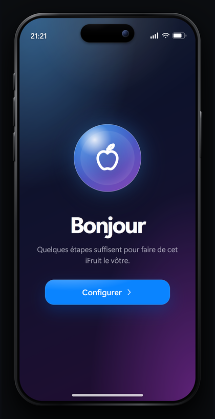 | 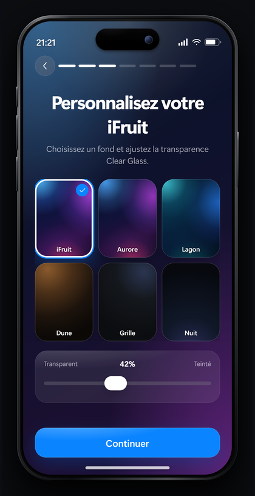 | 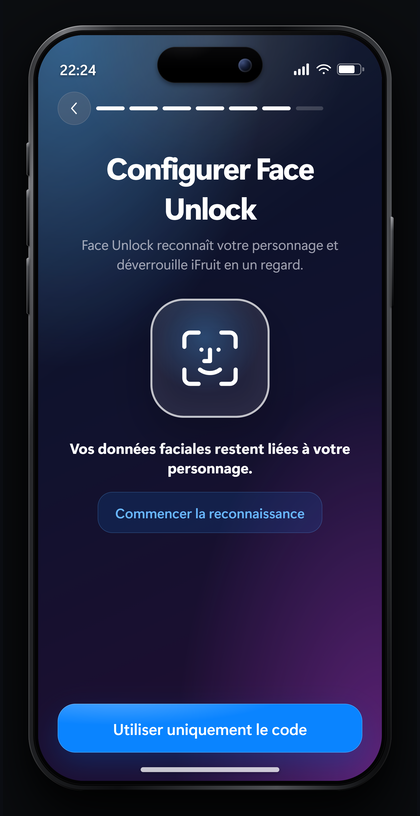 |

### Every day

| Home screen | Lock screen | The Island |
|---|---|---|
| 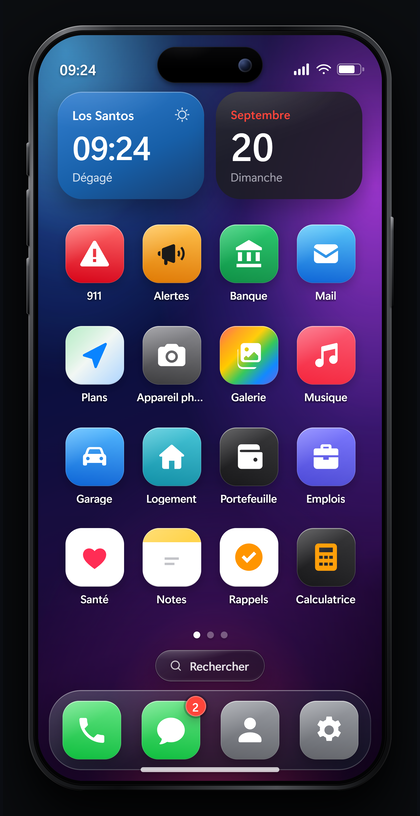 | 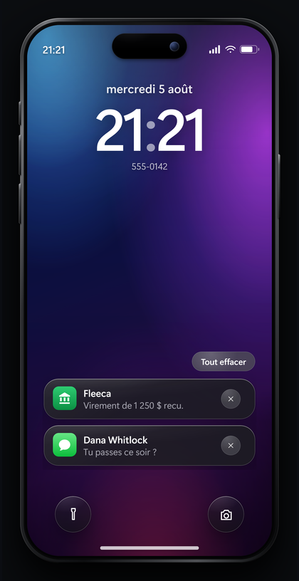 | 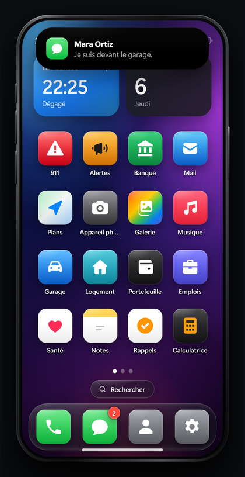 |

The Island is not decoration: a message arrives out of it, a call lives in it, and locking pinches it around a padlock.

### Apps

| Settings | Bank | Messages |
|---|---|---|
| 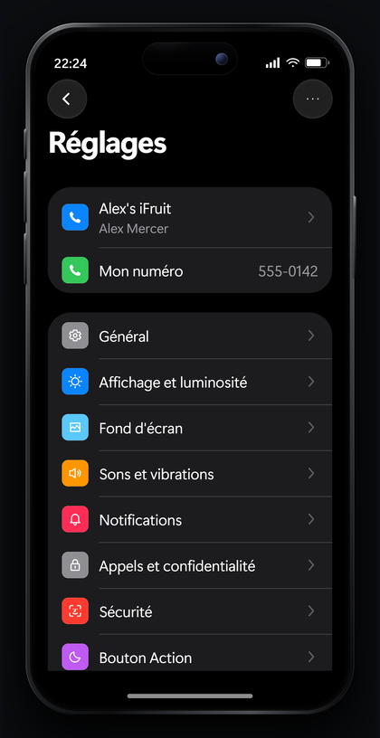 | 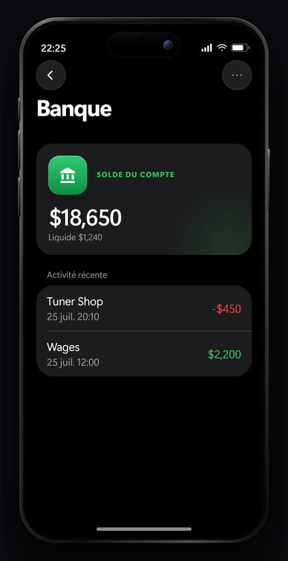 | 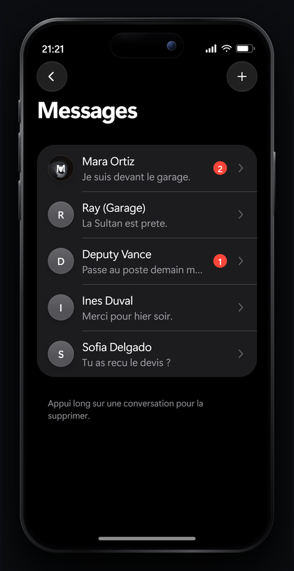 |

### Quick settings

Pull down from the top right for the toggles, the brightness and volume slabs, and what is playing.

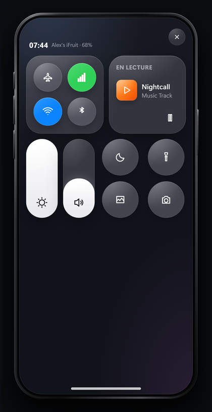

### The home screen, arranged

| Widgets | Arranging them | The gallery |
| --- | --- | --- |
| 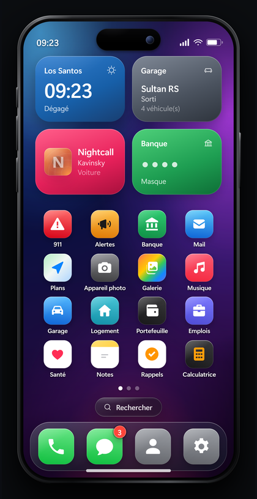 | 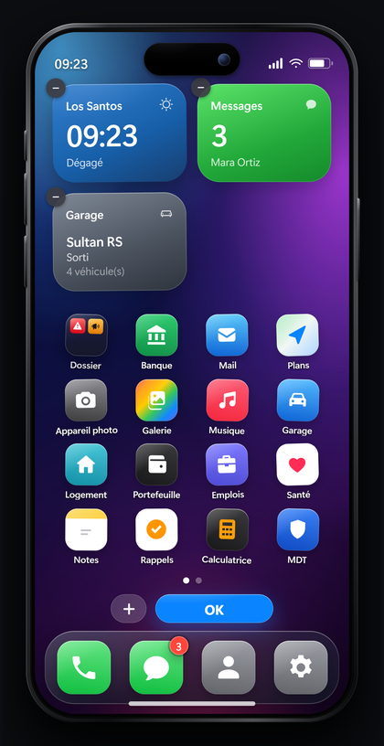 | 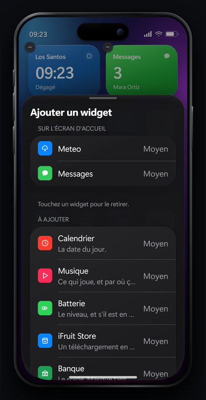 |

### Hush

| The deck | Premium | Who liked you | Your profile |
| --- | --- | --- | --- |
| 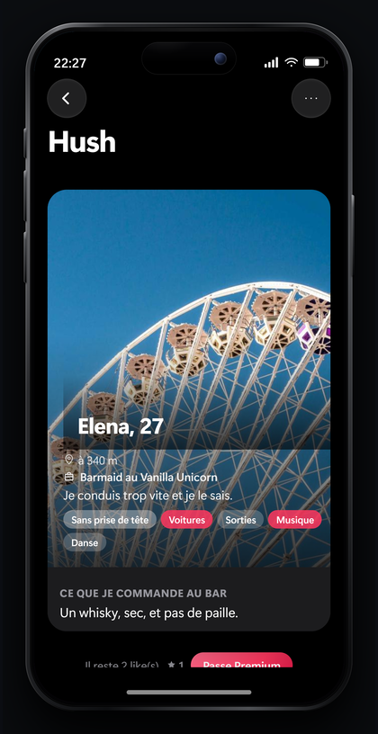 | 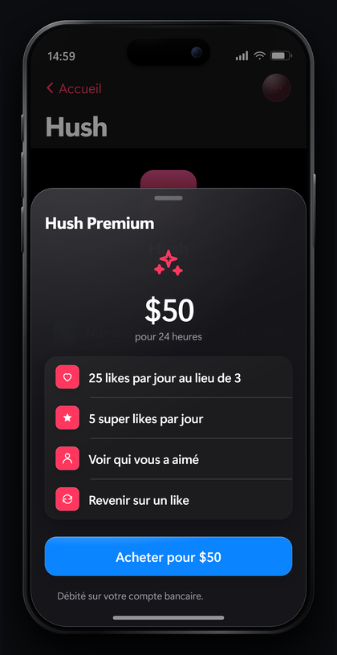 | 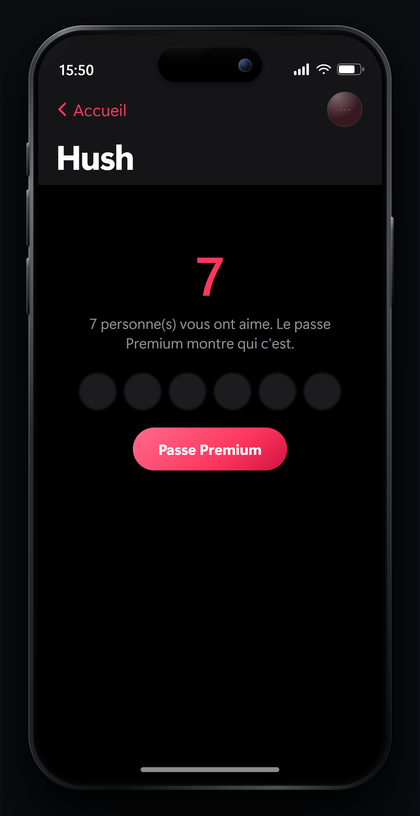 | 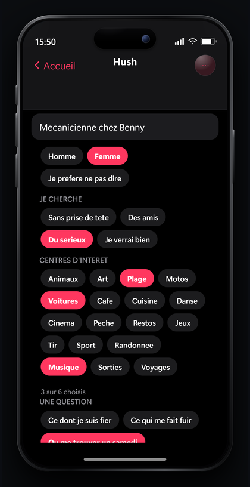 |


## Features

### The phone
- **FruitOS interface, measured rather than remembered**: the palette, the type scale, the corner radii and the Glass material on the bars, sheets and bar buttons were measured against a 76 file reference export rather than eyeballed, and the stylesheet records the file and the count each value came from. Nothing is copied in: a measured length or a measured hex is a fact about a shape, and no glyph, font, wallpaper or sound comes from anywhere but this repository. The reference is light theme only, so every dark value is an invention and says so beside itself. On top of that: the Glass slider that sets how much wallpaper comes through, an Island that reacts to calls, notifications, locking and Face Unlock, a quick settings panel, a notification shade and a phone wide search.
- **First run setup**: name, appearance, wallpaper, transparency, a six digit passcode and optional Face Unlock. The passcode never reaches the page: the server keeps a character salted SHA-256 digest and blocks for thirty seconds after five failures.
- **Configurable home screen**: choose the dock, which apps ship installed, their order, which cannot be removed and which are hidden, all in one table.
- **Home screen widgets**: twelve of them, arranged from the phone. Hold the home screen, then the minus removes one, the plus opens the gallery, and dragging reorders. Weather, Calendar, Messages, Music, Battery, iFruit Store, Bank, Health, Garage, Reminders, Market and Alerts. Six never touch the server at all and the other six share one request, made only when one of them is on the strip - a phone left as it ships costs nothing extra. `Config.Widgets` turns any of them off, and a widget only appears for a player who has its app. The Messages tile shows who texted and never what they said; the Bank tile is masked until its owner unmasks it, and the figure does not leave the server while it is off.
- **An update check in the console**: the server asks GitHub once at start-up whether a newer release exists and prints one block if so. Nothing is downloaded, and nothing is told to a player - the version a server runs is not something to hand out. `Config.UpdateCheck`.
- **Grid sizes** from 3x3 to 6x7, chosen by the player in Settings.
- **Sound**: twenty-four audio files ship with the phone: eight ringtones, seven alerts, five interface sounds, two emergency signals and the payphone's two struck-metal key clicks. They are generated rather than sampled, so a melody is a table in `tools/make-sounds.py` and nothing is taken from anywhere.
- **In hand**: a prop, an animation, and a phone that keeps working while you walk and drive.
- **Battery** with charging in a vehicle, at a public charger, and inside a property you have a key to (Quasar housing and the rest). Power banks and a low battery warning. Charging in a vehicle and in a property are each a switch.
- **Paid charging points**: give a charger a price and the phone asks before it charges. One payment buys the whole stop - charge as long as you like, and pay again only after leaving the zone. The money goes to a job or society account you name, per charger. See [Paid charging points](#paid-charging-points).
- **Security you can change**: the passcode and Face Unlock are set during first run and can be changed from Settings afterwards - both asking for the current code first.
- **Police forensics**: a warrant terminal at a map point where police read a suspect's texts, contacts, calls and social from the number, on a lab-bench interface with a case reference and evidence rows. Opened by a key press, and by a target zone when a target script is running. Cipher stays end-to-end encrypted, with an optional, deliberately hard lawful-intercept crack.
- **Payphones**: the call boxes already standing in Los Santos, made to work - no coordinate list, because the client finds the props themselves. A booth **places calls and can never receive them**, its number is derived from where it stands so it is the same every restart, and calls are paid for with a prepaid card item fed into the box. Emergency numbers are free, and walking away hangs up.
- **Group calls**: put somebody else on a call that is already running, up to five. A voice channel has always been a conference - it wires every member to every other one, both ways - so the work is who may be added: the ceiling, whether only the person who placed the call may invite, and one invitation at a time so a tap-through cannot set a whole contact list ringing. Each line is degraded on its own bars, and somebody leaving gets their voice back at once rather than staying quiet for the rest of the call.
- **A call does not own the phone**: put an active call away with the chevron and it carries on in the Island, green handset and timer, while you use Messages, Maps or anything else. Tapping the island brings it back.
- **Notifications, three levels per app**: on, silent (the banner and the card arrive, the sound does not) or off. The middle one is the difference between an app you silence and an app you switch off and then miss something important from. Alerts is the one app that cannot be silenced, and it says so rather than ignoring the tap.
- **Messages over more than one line**: Enter sends, Shift+Enter breaks the line, and the box grows with the text.
- **An outbox**: a message written with no signal is held by the handset and sent when the bars come back, one at a time, in order.
- **Blocking a number**: a blocked number cannot call, cannot add you to a call, and cannot
  text - and is told none of it. A call reports the phone as off, which is what they would have
  seen had it simply been put away, and a text is written to the sender's own thread and
  delivered nowhere: no sound, no banner, no unread badge, and their own copy never turns
  "Read". Reachable from a contact, from holding a conversation, and from Settings > Privacy,
  which is also where a number that was never saved can be blocked. Everything in
  `Config.RequiredContacts` is unblockable, 911 included, and a block is stored against the
  CHARACTER as well as the number so `/phoneadmin renumber` neither breaks it nor turns it into
  a mute on whoever is handed that number next. `Config.Blocking`.
- **Apps take time to arrive**: ten seconds on four bars, a minute on one. The server owns the clock, so a download keeps running with the phone in a pocket, and walking out of a tunnel speeds it up.
- **`/phonedebug doctor`**: a static check run from inside the game. It reads the resource's own shipped files and reports the seams - a page route with no client callback, an app with no renderer, a locale key missing in one language, an icon that does not exist, a server callback nothing answers.
- **A theme in one place**: `Config.Theme` sets the accent and the whole system palette without editing a stylesheet inside somebody else's resource. Unset colours keep the phone's own.
- **`/refreshphone`**: a get-out-of-jail command for a phone stuck to the hand or a frozen animation.
- **Media hosting**: photographs captured in game and uploaded either to a CDN (Fivemanage) or to an **S3-compatible bucket you rent yourself** - Amazon, MEGA S4, MinIO, Cloudflare R2 - with an auto-delete clock per file and a retention set per provider. The upload runs on the server, so the credential never reaches a player. See [Media hosting](#media-hosting).
- **Copy a picture's link**: any photograph opened full screen offers its address on the
  clipboard, for pasting into Discord or anywhere else. Only for pictures the phone has
  uploaded: one that lives only on the handset has no link, and says so rather than copying
  itself. `vphone_media_test` in the server console checks the upload endpoint and the key
  directly and prints what the host answers, so a failing upload has a cause rather than a
  stack trace.
- **Front camera**: a selfie mode - a game camera in front of you - for photos of yourself. Framing is the game's own: the Camera app draws nothing at all, and arrow up flips between the two.
- **FaceTime**: a real video call. With `Config.FaceTime.videoFeed` on, the front camera goes up and a shrunk, cropped frame of each player is relayed to the other a few times a second, over the normal voice call. Needs [screenshot-basic](https://github.com/citizenfx/screenshot-basic); off by default.

### The apps
Twenty-two are installed to begin with: Phone, Messages, Contacts, **911**, **Alerts**, Mail, Maps, Camera, Gallery, Music, Bank, Garage, Property, Wallet, Jobs, Health, Notes, Reminders, Calculator, MDT, FruitStore and Settings. Fifteen more are downloads from the store: **Bank Pro**, Bleeter, Snapmatic, Hush, Cipher, Zuber, Taxi, **Repair**, **Export**, FruitCharge, the Lottery, OnlyFruits, FruitBrawl, FlappyFruit and Fruitee. Four of those are paid.

- **Phone**: keypad, favourites, history, voicemail, speaker mode heard by nearby players, and group calls of up to five. On one bar the line breaks up - the voice really cuts out, both ends - and a bad enough line can drop the call.
- **911**: pick a service, pick a reason, and everybody working that service gets it on their own phone with a map pin they can drive to. Installed by default and not removable. The caller is told when somebody takes it, so silence never has to be guessed at. Anonymous reporting, per-service duty and grade rules, and an API so a shop till or a downed player can raise one.
- **Messages**: private and group threads, photos, GIFs, location sharing, reactions, forwarding and emoji.
- **Bank**: the balance your framework already keeps, a statement, transfers to another character by phone number, saved beneficiaries, and a notification when money arrives - a salary, a society payout, a transfer. No companion resource - it reads qb-core, qbx, ESX, ox or your banking script through the bridge. Limits, an optional fee and offline transfers are configurable.
- **Camera**: no interface of its own, on purpose. Opening it goes straight into the game's own phone camera, which draws the framing and names the keys in its own help box - **Enter photographs, arrow up flips to the selfie, Backspace leaves** - and the app closes itself the moment the engine hands the camera back. A NUI page is an overlay and can never show the game inside itself, so anything the app painted would sit over the shot and land in the photograph with it. There is no video recording and no mode strip: photo is the whole app.
- **Bleeter** (Twitter): two timelines, likes, comments, reposts, a searchable directory, follows, direct messages and profiles. **Up to four photographs on one post**, reordered in the composer; `Config.Social.maxImages` is the ceiling and the server truncates a longer list rather than refusing it, so setting it to 1 turns the feature off without breaking anything.
- **Snapmatic** (Instagram): stories with a 24 hour life, a photo feed, a profile grid, search and direct messages. Four photographs to a post here too, from the same setting.
- **Hush** (Tinder): a card you throw with your finger, matches kept in their own tab, an editable profile.
- **What's new on Bleeter and Snapmatic**: at most one banner an hour, per app, telling that player how many posts have appeared since they last opened it. Never sent on a feed they have already read, and the same posts are never announced twice, so ignoring one does not mean receiving it again every hour. Somebody who has never opened the app is marked where the feed stands and told nothing, rather than handed the whole history as a number. The hour is a ceiling rather than a schedule and every player carries their own clock, so a restart does not make every handset on the server buzz at once. Do not disturb, an app silenced in Settings, an app they uninstalled, a flat battery and a phone they are not carrying all stop it. On by default; `Config.Social.nudge` has an on/off switch and an interval for each of the two apps, and `set phone_socialNudge false` turns the whole thing off without a restart.
- **Cipher**: an encrypted messenger. The server routes sealed envelopes and keeps neither the clear text nor a private key.
- **Taxi** (a download): hail a ride, or drive one. Runs on **doc-taxijob** when present - its drivers, calls, fares and ratings, through its own callbacks - and on `Config.Taxi` otherwise. A passenger books, follows the ride, settles up and rates the driver; a driver gets the queue with the nearest fare first.
- **Zuber** (a download): food ordered from the phone. Runs on **doc-restaurant** when that resource is present - its restaurants, menus, promotions, loyalty and reviews, driven through its own callbacks without a line of it being changed - and on `Config.Zuber.restaurants` otherwise, so it works on qb-core, ESX, ox and standalone alike. A live order tracker, a history you can reorder from in one tap, favourites, a search across every menu, and a tip.
- **Bank Pro** (a download): the business side of the bank, for whoever holds a boss grade.
  Deposit, withdraw, payroll to an employee, and a transfer out of the company to a private
  individual or another company - all between BANK accounts, never cash. The history is the
  account's own real movements rather than only the ones made from a phone, so an ATM deposit and
  a payroll run by another script are in it too. Which companies appear is a list you write in
  `Config.BankPro.payees`, with the name to show beside each one, so a server with forty jobs does
  not put forty rows in front of a business owner. Reads qb-banking, Renewed-Banking, doc-banking
  and ESX society accounts through the bridge.
- **Alerts** (installed by default): what the authorities broadcast, and what every phone
  receives. Runs on **doc-civilalerte** when present - its alerts, its table, its permissions
  and its Discord relay, through the same callback and events its own iframe used - and on
  `Config.Alerts` otherwise, with the phone's own table and its own job whitelist. Standing
  alerts, a searchable archive, and a composer for whoever may broadcast. It is not optional
  and it cannot be bought: an alert system only works if everybody already has it when the
  alert goes out.
- **Export** (a paid download, $1,000): what your haul is worth, before you drive across the map. Runs
  on **doc-shops** when present - its markets, items, fluctuating prices and history, read
  through its `GetMarketData` **server** export - and on `Config.Export.items` otherwise. The
  board with what moved at the top, a line per item, where a price sits between its floor and
  its ceiling, favourites, and **price alerts**: rises to, falls to, or swings by a percentage.
  The phone's own server watches the board on a timer, so an alert fires while the app is
  closed and the phone is in a pocket. It never sells anything - that happens at the shop.
- **Repair** (a free download): reaching a mechanic from the side of the road. Runs on
  **doc-mechanicmdt** when present - its garages, opening states, ratings, invoice rule and
  callout queue, through the eight server callbacks its own tablet and iframe used - and on
  `Config.Repair` otherwise. Garages sorted by distance with their score and whether anybody is
  in, a callout that carries your position, a live tracker, reviews, and a route. **Both sides**:
  a mechanic holding the job gets the queue on their phone, takes a job, routes to the customer
  and can ring them - which the original app had a tablet for, no use to somebody out on a job.
  Ringing a garage rings a mechanic who is actually on duty there.
- **Lottery** (a paid download, $250): the weekly draw. Runs on **doc-lottery** when present - its
  session, jackpot, tickets and prize tiers, through its own two callbacks - and on
  `Config.Lottery` otherwise, with its own draw on a schedule you set. Numbers are tapped on a
  grid rather than typed, there is a lucky dip, the draw itself is followed live in the app, and
  your own past lines and winnings are there - none of which its original app had.
- **Plugging in** (`Config.PlugIn`, off by default): by default the phone charges the moment
  you sit in any car or step into your own house. Turn this on and those places offer a
  switch in FruitCharge instead - "Put on charge" - and the battery only moves once it is
  thrown. Walking away unplugs it, so it is once per stop rather than once per session. Per
  source, so a server can require it in cars and leave public chargers automatic.
- **FruitCharge** (a paid download): finds every public charger, routes you to one, and pays a paid charger from the phone - with an optional auto-accept and a price ceiling. Standing at a paid charger without it points you at the store.

### For developers
- **Drop-in apps**: an app is a folder in `apps/`. No edit to the phone, no build step, no JavaScript framework. See [DEVELOPERS.md](DEVELOPERS.md).
- **App SDK**: the same Glass components the native apps use.
- **Integration hooks**: point any app at your own script in one function rather than forking the resource.
- **A documented API**: over a hundred server exports, five client exports, three events and seven hooks. See [API.md](API.md).

## Compatibility

Everything below is detected automatically. Naming one explicitly in `Config.Compat` always wins, and `off` disables the integration.

| Kind | Supported |
|---|---|
| Framework | qb-core, qbx_core, ox_core, es_extended, standalone |
| Inventory | ox_inventory, qs-inventory (Quasar), ps-inventory, qb-inventory, origen_inventory, codem-inventory |
| Banking | qs-banking, Renewed-Banking, qb-banking, okokBanking, esx_banking |
| Garage | qs-advancedgarages, jg-advancedgarages, qb-garages, cd_garage, okokGarage |
| Housing | qs-housing, ps-housing, qb-houses, ox_property, loaf_housing, esx_property |
| Voice | pma-voice, saltychat, mumble-voip |
| Notifications | ox_lib, qb-core, ESX, chat, or your own event |

**Every app is audited per ecosystem.** [COMPATIBILITY.md](COMPATIBILITY.md) lists what each app needs, what it reads on qb, ox, ESX and Quasar, and how to point it at your own script in one function.

**Standalone works.** With no framework the phone falls back to the licence identifier, and apps that need a job or a bank simply are not offered.

**The phone owns its own storage.** Preferences, layouts and photo lists live in `vphone_kv`, keyed by character. Nothing is written into your framework's metadata column, so a framework update cannot break the phone.

**Every table it creates begins with `vphone_`,** so it can never collide with another script's table. A server upgraded from an older build has its data moved to the new names automatically at boot.

## Dependencies

**Required** - the phone will not start without it:

- [oxmysql](https://github.com/overextended/oxmysql) - the database layer.

**Optional** - each unlocks one feature and is detected at runtime; the phone runs fine without any of them:

| Resource | Unlocks | Link |
|---|---|---|
| [screenshot-basic](https://github.com/citizenfx/screenshot-basic) | the Camera app uploading photos, and the FaceTime live picture | citizenfx/screenshot-basic |
| [screencapture](https://github.com/itschip/screencapture) | **all media hosting** - a CDN (Fivemanage), a custom host, *and* your own S3 bucket | itschip/screencapture |
| [pma-voice](https://github.com/AvarianKnight/pma-voice) | phone call voice | AvarianKnight/pma-voice |
| [xsound](https://github.com/Xogy/xsound) | **the Music app actually playing** - see below | Xogy/xsound |
| [ox_lib](https://github.com/overextended/ox_lib) | nicer notifications | overextended/ox_lib |
| [ox_target](https://github.com/overextended/ox_target) | targeting the police forensics terminal | overextended/ox_target |
| A framework | jobs, money, licences, character names | [qb-core](https://github.com/qbcore-framework/qb-core) · [qbx_core](https://github.com/Qbox-project/qbx_core) · [ox_core](https://github.com/overextended/ox_core) · [es_extended](https://github.com/esx-framework/esx_core) |

Inventory, banking, garage and housing scripts are detected too - see [COMPATIBILITY.md](COMPATIBILITY.md) for the full list and the exact resource names.

**screencapture is not only for Fivemanage.** Every upload path is gated on it, the bucket
included, so a server that rents its own storage and skips this resource gets media hosting off
with no error beyond one line at boot. If you plan to use [Media hosting](#media-hosting) at all,
`ensure screencapture`.

The Bank, Garage, Property, Wallet and Jobs apps need **no companion resource**: they read whatever your framework and your scripts already keep, through the bridge.

### Music needs a player

The phone has no audio engine of its own, and it cannot have one: playing a URL out loud in
GTA means an NUI page that streams it, and that page belongs to a resource. So the Music app
keeps the library, the playlists, the queue and the favourites - all of that works with
nothing installed - and hands the actual sound to whatever player your server runs.

Install [**xsound**](https://github.com/Xogy/xsound) (MIT, free) and the phone plays tracks
itself, with all three outputs working:

```
ensure xsound
```

| Output | What happens |
|---|---|
| Headphones | only you hear it |
| Phone speaker | everybody near you hears it, and it follows you as you walk |
| Car radio | positioned on the vehicle, so it moves with the car |

`Config.Music.speakerRange` sets how far the speaker carries - 12 m by default, because a
phone speaker is a phone speaker.

`rcore_radiocar` and `xdiskjockey` are detected too, but neither can be driven from outside:
with those the phone opens their own interface and copies the link for you to paste. With no
player at all the app still works as a library and says so on screen.


## What lives in config.lua

`config.lua` is the only file you edit, and it carries its own contents table at the top with the
line number of each of its main sections. What follows is the map, not a second copy of it - the
file itself explains each setting where the setting is.

**The phone itself**
`Framework`, `Compat` (which framework, inventory, banking, voice and target script to use - all
`auto`), `Settings`, `PhoneItem`, `PowerbankItem`, `DeviceSize`, `DeviceSide`, `Watchdog`
(the nets that stop a stuck cursor), `Log`, `MigrateLegacyTables`.

**Apps**
`Apps` (the catalogue and the home-screen order), `AppMetadata` (what the store shows),
`Categories`, `StoreApps` (your own apps, no resource needed), `SdkExample` (the worked example in
`apps/example/`, off by default), `Compat.apps` (switch any app off entirely).

**Look**
`Wallpapers`, `DefaultWallpaper`, `WallpaperFit`, `WallpaperHosts` (which hosts a player may paste
an image from), `DefaultGlass`, `Clock`, `Theme` (the accent and the system palette).

**Talking**
`Messages`, `Cipher`, `Calls` (including `badSignal`, which is what makes one bar sound like one
bar), `RingOut`, `Booth` (payphones), `FruitDrop` (sharing between two phones in the room),
`Blocking` (what a blocked number can and cannot do), `FaceTime` (video calls, off by default),
`RequiredContacts` (numbers in every phone - 911 is one, and calling it opens the app).

**Money and work**
`Bank`, `BankPro`, `Licences`, `Property`, `Garages`, `Hospitals`, `HealthRecord`.

**The paid and the optional**
`Battery`, `Chargers`, `PaidCharging` (public chargers) and `PlugIn` (charging on purpose), `Zuber`,
`Taxi`, `Repair`, `Export`, `Lottery`, `Alerts`, `Media` (photo and video hosting, and the S3
bucket), `Music`, `Police` (the forensics terminal), `Social` (the three networks, four photographs
to a post, and the what's-new nudge), `SocialVerify` (the desk that sells the blue tick), `Store`,
`Widgets` (the home screen strip), `UpdateCheck`.

**Staff**
`Admin`, `Commands` (the three command groups). Outages are not configured: they are set at runtime with `/phoneadmin outage` and nothing about them is persisted.

## Installation

Nothing here is optional-but-actually-required. Step 3 is the only one most servers need.

### 1. oxmysql

The one hard requirement. [Install it](https://github.com/overextended/oxmysql) and make sure
your `mysql_connection_string` is set, because every table the phone needs is created through
it on the first start.

### 2. Drop the folder in

`resources/[phone]/v-phone`, or wherever you keep things. The folder name **must stay
`v-phone`** - the resource looks itself up by name in a few places.

### 3. server.cfg

Order matters: after your framework, after oxmysql.

```cfg
ensure oxmysql
ensure qb-core          # or qbx_core, ox_core, es_extended - whatever you run
ensure v-phone
```

### 4. Start the server once

Every table is created automatically, and the console says what was detected:

```
[v-phone] framework: qb-core
```

If that line says `standalone` and you do run a framework, the framework started *after* the
phone - move its `ensure` above. (Turn `Config.Log.boot = true` on to see that line at all;
it is off by default so a live console stays readable.)

### 5. Give players a phone item

**Skipped entirely if you do not want an item.** Set `Config.Settings.requireItem = false`, or
`set phone_requireItem false` in server.cfg, and everybody has a phone. That is a legitimate
choice and plenty of servers make it.

If you *do* want the item, see [Creating the items](#creating-the-items) below - it
is one row of SQL or one table entry, per framework.

### 6. Optional convars

```cfg
setr phone_locale "en"        # French is the default; en, or any locale file you add
set phone_battery false      # any Config.Settings key, prefixed with phone_
set phone_requireItem false   # everybody gets a phone, no item needed
set phone_camera true         # the Camera app (needs screenshot-basic or screencapture)
set phone_media true          # photo hosting
setr phone_verbose true       # the boot summary
setr phone_debug true         # the page's tracing in F8. Leave this OFF on a live server
```

`setr` where the client has to read it too, `set` where only the server does. A plain `set`
convar does not exist on a client at all, which is a mistake worth knowing about before it
costs you an afternoon.

### 7. Staff permissions

```cfg
add_ace group.admin vphone.admin allow
```

qb-core's own `qbadmin.menu` is accepted too, so existing staff usually work without this. See
[Admin commands](#admin-commands).

## Creating the items

Only needed when `Config.Settings.requireItem` is on (it is, by default). The item name the
phone looks for is `Config.PhoneItem`, `phone` out of the box. Two legacy names that servers
commonly already have in their catalogue, `phone` and `iphone`, are accepted whatever you set,
so an item you already have usually just works.

The phone does **not** need the item to be usable-on-click: it opens with the keybind either
way. Making it usable is nicer, so both halves are below.

### qb-core

`qb-core/shared/items.lua` - add one entry:

```lua
['phone'] = {
    ['name'] = 'phone',
    ['label'] = 'Phone',
    ['weight'] = 700,
    ['type'] = 'item',
    ['image'] = 'phone.png',
    ['unique'] = false,
    ['useable'] = true,
    ['shouldClose'] = true,
    ['combinable'] = nil,
    ['description'] = 'To call and text people',
},
```

Recent qb-core versions ship a `phone` item already - check before adding a second one. Put a
`phone.png` in `qb-inventory/html/images/` or the slot shows a blank square.

Give one to a player:

```
/giveitem 1 phone 1
```

### qbx_core (Qbox)

Items live in `ox_inventory/data/items.lua`, because Qbox uses ox_inventory:

```lua
['phone'] = {
    label = 'Phone',
    weight = 700,
    stack = false,
    close = true,
    description = 'To call and text people',
},
```

No `client` block and no export: the phone listens to `ox_inventory:usedItem` itself, so
declaring the item is all there is to do.

### ox_core / ox_inventory

Same file, same entry as Qbox above.

### ESX

ESX keeps items in the database. One row:

```sql
INSERT INTO items (name, label, weight, rare, can_remove)
VALUES ('phone', 'Phone', 1, 0, 1);
```

On an ESX server using ox_inventory, use the ox entry above instead - ox_inventory reads its
own file, not the `items` table.

Give one to a player:

```
/giveitem 1 phone 1
```

### Any inventory: making it open the phone

The phone registers a usable item by itself for every inventory it detects: `ox_inventory`,
`qs-inventory`, `ps-inventory`, `qb-inventory`, `origen_inventory`, `codem-inventory`. On
qb-core and qbx it goes through `CreateUseableItem`, on ESX through `ESX.RegisterUsableItem`,
and on ox_inventory it listens to `ox_inventory:usedItem` - so on all of those, declaring the
item is enough.

If yours is not in that list, have it call the client export:

```lua
exports['v-phone']:Open()
```

`Config.Compat.inventory` also takes a resource name instead of `'auto'`, for a fork whose name
the bridge does not recognise.

### The power bank

Optional, and nothing breaks without it: a flat phone simply stays flat until the player finds a
charger. With the item, using it returns `Config.Settings.powerbankCharge` percent (45 by
default) and consumes it.

`Config.PowerbankItem` names it - `powerbank` out of the box, and that name keeps working
whatever you set, so an item you already have is never orphaned.

qb-core, in `qb-core/shared/items.lua`:

```lua
['powerbank'] = {
    ['name'] = 'powerbank',
    ['label'] = 'Power bank',
    ['weight'] = 400,
    ['type'] = 'item',
    ['image'] = 'powerbank.png',
    ['unique'] = false,
    ['useable'] = true,
    ['shouldClose'] = true,
    ['description'] = 'Recharges a phone',
},
```

ox_inventory (Qbox, ox_core, or ESX running ox_inventory), in `ox_inventory/data/items.lua`:

```lua
['powerbank'] = {
    label = 'Power bank',
    weight = 400,
    stack = true,
    close = true,
    description = 'Recharges a phone',
},
```

ESX with its own inventory:

```sql
INSERT INTO items (name, label, weight, rare, can_remove)
VALUES ('powerbank', 'Power bank', 1, 0, 1);
```

**`useable = true` matters on qb-core.** The phone registers the item itself, but qb only offers
the click in the inventory when its own catalogue says the item is usable.

Another resource can charge a phone without any item at all - a wall socket, an electric car -
with `exports['v-phone']:SetCharging(src, true, rate)`. See [API.md](API.md).

## Phone numbers

Every `#` in `Config.NumberFormat` becomes a digit and everything else is kept verbatim, so
all of these work:

| Format | Example |
|---|---|
| `555-####` | `555-0142` — the GTA shape, and the default |
| `5555-####-####` | `5555-0142-9930` |
| `(###) ###-####` | `(415) 555-0142` |
| `+33 # ## ## ## ##` | `+33 6 12 34 56 78` |
| `##########` | `4155550142` |

Four `#` minimum, 20 characters maximum, and it must not collide with
`Config.Booth.numberFormat` — a payphone is recognised by the shape of its number alone. The
server checks all three at boot and says which one is wrong.

### Grouping a number for reading

Ten digits in a row is not something a person can read back over voice. `Config.NumberDisplay`
puts a separator in **visually** while the stored value is untouched:

```lua
Config.NumberDisplay = {
    groupEvery    = 3,      -- 0 turns it off
    separator     = '-',
    onlyWhenPlain = true,   -- leave a number that already has punctuation alone
    scope         = 'own',  -- own | all
}
```

`4155550142` reads as `415-555-0142`. A trailing group of one is absorbed into the group
before it, so it is never `415-555-014-2` — a single orphaned digit looks like a bug rather
than a convention.

Nothing here changes the database, the dialler, the clipboard or what any export answers. It
is the last step before text reaches a screen. A number that already carries its own
punctuation — `555-0142`, because `Config.NumberFormat` said so — is left exactly as it is,
since regrouping it would give `555--01-42`.

`scope = 'own'` is your own number: the lock screen, Settings, Contacts, and where an app asks
you to confirm it. `all` extends it to every number the phone draws.

### Already have players with numbers?

qb-core writes a number into `charinfo` when a character is created, and ox_core keeps one in
`characters.phoneNumber`. By default the phone **adopts** it, so every script that already
knows how to reach a player still can.

If you would rather the phone's own format won:

```lua
Config.Compat.numbers = 'phone'   -- auto | framework | phone
```

`phone` ignores the framework's numbers entirely and mints in your format, and does not write
back into `charinfo`.

That governs characters from then on. It cannot retroactively change a number already stored,
so for players whose framework number was adopted on an earlier boot, run this once:

```
/phoneadmin renumber all confirm
```

Or one at a time: `/phoneadmin renumber 3 confirm`.

**Anybody who saved the old number in their contacts keeps the old number.** That is not
something the phone can fix — a contact is a row on somebody else's phone, and rewriting other
people's address books to follow a staff action would be worse than the problem. The
character's own contacts, messages and call log are untouched.


## Paid charging points

A charger with a `price` asks before it charges. The phone shows the offer, the player accepts
or refuses, and **one payment buys the whole stop**: they charge for as long as they like and
pay again only if they leave the zone and come back. Nothing is metered.

```lua
Config.Chargers = {
    { id = 'ch_lsia', label = 'LSIA, arrivals hall', x = -1037.0, y = -2737.0, z = 20.2,
      radius = 8.0, price = 40, account = 'airport' },   -- paid
    { id = 'ch_legion', label = 'Legion Square kiosk', x = 195.0, y = -933.0, z = 30.7,
      radius = 6.0 },                                    -- free
}

Config.PaidCharging = {
    enabled    = true,
    price      = 0,        -- for a charger whose row names none
    money      = 'cash',   -- or 'bank'
    account    = '',       -- where it goes when a row names none; '' pays nobody
    refusedFor = 90,       -- seconds before it asks again after a refusal
    skipAbove  = 95,       -- do not ask somebody whose phone is nearly full
}
```

`account` is a **job or society account** in your banking script. qb-banking, Renewed-Banking,
okokBanking and esx_addonaccount are handled; anything else fills
`Config.Compat.hooks.society = function(account, amount, reason) ... end`. An account that
cannot be credited still charges the player and prints one line naming it, so a kiosk never
stops working because a banking script changed.

Everything is decided on the server from the player's real position: the phone sends yes or no
and nothing else.

**Charging in a vehicle** is `Config.Compat.chargeInVehicle`, next to `chargeAtProperty`. Off
makes a long drive cost battery.

## Media hosting

Photographs taken with the Camera are captured in game and
uploaded **from the server**, so the credential that pays for the storage never reaches a
player's machine. Two lines switch it on:

```cfg
ensure screencapture       # the capture resource - nothing is captured without it
set phone_media true       # hosting on
```

`set phone_media true` beats `Config.Media.enabled` in both directions, and it is the better half
of the pair: this is the one feature whose configuration carries a secret, so it belongs in the
file that already holds the secret rather than in a tracked `config.lua` that people copy, diff
and paste into a support channel.

With hosting off the Camera still takes photographs into the local gallery.

### Choosing the provider

```cfg
set phone_media_provider "s3"
```

The convar wins over `Config.Media.provider`, and with neither set it is `fivemanage`. Three
values are read:

| Value | Where a file goes |
|---|---|
| `fivemanage` | The hosted CDN. `Config.Media.endpoint` takes a multipart POST and the key travels as `Authorization`. |
| `custom` | Any host that takes a multipart file and answers with a URL: `Config.Media.endpoint`, `formField`, and whatever `headers` you list. |
| `s3` | An S3-compatible bucket you rent yourself: Amazon, MEGA S4, MinIO, Cloudflare R2. |

For the first two the key is `set phone_media_key "YOUR_API_KEY"`, which wins over
`Config.Media.apiKey`.

A value that is none of those three is **not refused**: it is carried through as written and
takes the `custom` path, so `set phone_media_provider "S3"` or `"s3 "` uploads to
`Config.Media.endpoint` rather than to your bucket, and nothing says so. Spell it exactly.

### An S3-compatible bucket

Read only when the provider is `s3`. Every setting lives in `Config.Media.s3`, and all of them
except the key prefix can be given as a convar instead. **The convar always wins.**

| `Config.Media.s3` | Convar | What it is |
|---|---|---|
| `endpoint` | `phone_s3_endpoint` | The service host, **without** the bucket and without `https://`. Amazon is `s3.<region>.amazonaws.com`; for anything else, the endpoint your provider's console shows you. `config.lua` lists the exact shape per provider. |
| `bucket` | `phone_s3_bucket` | The bucket name on its own. |
| `region` | `phone_s3_region` | The region string as it must appear in the signature. `us-east-1` when nothing else says. |
| `pathStyle` | `phone_s3_pathstyle` | `false` puts the bucket in the hostname (`<bucket>.<endpoint>`), `true` puts it in the path (`<endpoint>/<bucket>`). |
| `keyPrefix` | none | A folder inside the bucket, `vphone` out of the box, so the phone's files sit apart from anything else you keep there. Config only. |
| `publicBase` | `phone_s3_public` | The address a **player** loads the picture from, when that is not the bucket's own: a CDN, a custom domain. Empty otherwise. |
| `accessKey` | `phone_s3_key` | The access key id. |
| `secretKey` | `phone_s3_secret` | The secret. |
| `accountId` | `phone_s3_account` | MEGA S4 only, and nothing else has an equivalent. **The shipped `s3` block stops at `secretKey` and does not carry this key**, so set it with the convar - writing it into `config.lua` works, but you are adding the line yourself. See [MEGA S4](#mega-s4). |

**The two secrets go in `server.cfg`, never in `config.lua`.**

```cfg
set phone_media_provider "s3"

set phone_s3_endpoint "<your-s3-endpoint-host>"
set phone_s3_bucket   "<your-bucket>"
set phone_s3_key      "YOUR_ACCESS_KEY"
set phone_s3_secret   "YOUR_SECRET_KEY"

# the two that vphone_s3_test finds for you
set phone_s3_region    "us-east-1"
set phone_s3_pathstyle "false"
```

`phone_s3_pathstyle` reads a real three-state answer. `true`, `1`, `yes` and `on` turn path style
on; `false`, `0`, `no` and `off` turn it off; **anything else, including an empty convar and a
typo, is treated as unset** and leaves `Config.Media.s3.pathStyle` deciding - which ships `false`.
Case does not matter. A typo falls back to the config rather than quietly flipping the addressing
mode, because path style is the difference between `host/bucket/key` and `bucket.host/key`, and on
a service that wants one and not the other it is the setting between working and 403 on every
object.

Nothing is uploaded until `endpoint`, `bucket`, an access key and a secret are all present.
Region has a default and the rest are optional.

A file lands at `<keyPrefix>/YYYY/MM/<citizen id>-<random>.<extension>`, dated in UTC, because a
bucket holding a hundred thousand objects in one flat key space is one an operator cannot look
through. **The citizen id is truncated to its first sixteen characters** in that name, which
matters if you are writing a prefix-scoped policy or grepping your bucket by owner: a 32 or 40
character identifier will not match itself there.

**The bucket has to serve these objects publicly.** The phone draws a photograph with an ``
carrying no credentials, and a presigned link expires after seven days at the outside, so no
signed-URL arrangement survives the retention below. Grant public object access on the phone's
bucket, and only on it - see [What the key has to be allowed to do](#what-the-key-has-to-be-allowed-to-do)
for the two policies. Behind a CDN or a custom domain, point `phone_s3_public` at that instead and
the phone stores the address a player will actually load.

### What the key has to be allowed to do

The phone makes exactly three kinds of request against your bucket, and an access key allowed to
do more than these three is a key that can do more than it needs to if it ever leaks.

| Request | When | Made by |
|---|---|---|
| `s3:PutObject` | a photograph is taken, and once per attempt during `vphone_s3_test` | the server, signed |
| `s3:DeleteObject` | the retention sweep, `phoneclean media confirm`, deleting a photograph in the Gallery, and the end of `vphone_s3_test` | the server, signed |
| `s3:GetObject` | a player's phone drawing the picture | **the player's browser, with no credentials at all** |

Nothing ever lists the bucket: there is no `s3:ListBucket` anywhere in the resource, so the key
does not need it. Nothing issues a HEAD either.

**On Amazon, the key's policy.** Scope it to the prefix rather than the whole bucket, which is why
`vphone_s3_test` writes its pixel under `<keyPrefix>/probe/` and not beside it. `vphone` below is
the shipped `keyPrefix` - use whatever yours says:

```json
{
  "Version": "2012-10-17",
  "Statement": [{
    "Effect": "Allow",
    "Action": ["s3:PutObject", "s3:DeleteObject"],
    "Resource": "arn:aws:s3:::<your-bucket>/vphone/*"
  }]
}
```

**And the bucket's own policy, which is what makes a photograph load.** The upload sends no
`x-amz-acl` header at all - MEGA S4 has no ACL support and the phone does not depend on one
anywhere - so anonymous read has to be granted on the bucket rather than object by object:

```json
{
  "Version": "2012-10-17",
  "Statement": [{
    "Effect": "Allow",
    "Principal": "*",
    "Action": "s3:GetObject",
    "Resource": "arn:aws:s3:::<your-bucket>/vphone/*"
  }]
}
```

**Block Public Access is on by default on every new Amazon bucket, and it wins over that policy.**
This is the step people miss, because the console accepts the policy and then quietly refuses every
read. On the bucket's Permissions tab, turn off **Block public access** - the two settings that
mention *bucket policies*, not necessarily all four - before the policy above has any effect. Do it
on the phone's bucket and on no other. If you would rather leave it on, put a CDN in front and point
`phone_s3_public` at the CDN; then the bucket stays private and the CDN is what the public reads.

`vphone_s3_test` tells the two apart for you: it uploads with the key and then fetches the same
object with none, so "the upload worked and a browser gets HTTP 403" means the policy or Block
Public Access, and never the key.

### MEGA S4

Four things differ from Amazon, and each is worth knowing before rather than after.

**The public address carries the account id.** S4 serves an object publicly at the same host as
its S3 API, with the account id as the first path segment:

```
https://<endpoint>/<bucket>/<key>                 the API - a signature is required
https://<endpoint>/<account-id>/<bucket>/<key>    what a browser reads
```

Without `phone_s3_account` the read is taken for an unsigned API call and answered 403, which is
indistinguishable from a bucket that is simply not public and sends people to change settings
that were already right. Find the id in the S4 console: right-click any object, Share, Manage
object URL, Copy. It is the segment between the host and the bucket name, letters and digits and
around 37 characters. MEGA's own specification calls it 15 digits and their examples show 18;
both are wrong, so copy the real one rather than recognising a shape.

That path form is used whatever `pathStyle` says, because the two are separate decisions:
`pathStyle` picks how the **signed** request is addressed, and the account id picks how a browser
reads the object.

**A presigned URL is capped at seven days.** That is S4's ceiling rather than a setting, and it
is why public object access is the arrangement here.

**There is no CORS API and no ACL support.** Neither is in the phone's way: the page loads a
photograph as an image rather than fetching it, so no CORS rule is needed, and public access is
granted on the bucket in the S4 console rather than object by object with an ACL.

**And `HEAD` is refused on a public object.** This one costs nobody a working phone - the resource
never issues a HEAD, and `vphone_s3_test` checks readability with a GET - but `curl -I <url>` is
the first thing anybody reaches for to ask "is this object public", and on S4 it fails on a bucket
that is configured perfectly. Ask with a GET instead:

```
curl -s -o /dev/null -w '%{http_code}\n' "<the URL vphone_s3_test printed>"
```

### How long a file is kept

```lua
Config.Media.retentionDays = {
    fivemanage = 30,
    custom     = 30,
    s3         = 365,
}
```

Per provider, because the two are not the same kind of storage. A hosted CDN is somebody else's
quota on a monthly plan and thirty days is generous there; a bucket you rent by the gigabyte is
yours, and a year of it is the reason to pay for one. `0` keeps a file for ever. A provider not
named in the table falls back to `Config.Media.autoDeleteDays` (30 days), which is also what a
config written before this table keeps using.

Whichever provider uploaded a file decides its life, and the answer is stamped on the row in
`vphone_media` at upload. Changing this later does not retroactively move files that are already
stored, and a server that switches provider keeps its old files on the clock they were uploaded
under.

The sweep runs once at boot and then hourly, two hundred rows at a time:

- **A file something still shows is never deleted**, whatever the numbers above say. If a post, a
  message, an avatar or a gallery still points at it, the expiry moves a week out instead. These
  are a floor, not a guillotine.
- When nothing points at it, the settings that merely reference it are cleared first, so a
  wallpaper or an avatar falls back to the placeholder it was designed with rather than to a
  hole. Only then is the file deleted from the host, by its stored key on a bucket, and the row
  dropped.
- A host that refuses or cannot be reached **keeps its row** and is asked again in an hour.
  Dropping the row would leave the file on your bill with nothing left that knows its name.

**This clock is the file's. The post has its own, and it follows the same decision.** How long a
bleet, a comment, a story or a social direct message lives is a separate set of numbers in
`Config.Settings` - `socialRetentionPosts`, `socialRetentionComments`, `socialRetentionStories`,
`socialRetentionMessages`, 60 / 60 / 1 / 30 days out of the box - and with `provider = 's3'` the
four in `socialRetentionS3` are read instead, 180 / 180 / 1 / 180. Switching to a bucket therefore
takes the pictures from thirty days to a year and the feed from two months to six. A
`phone_socialRetention*` convar still wins over both, so following the provider never silences a
number you set yourself.

You do not have to check the two against each other: **a file something still shows is never
deleted**, whatever the numbers say, so a photograph cannot go while the post that shows it is
still there.

### Moving from Fivemanage to a bucket

Switching provider changes where the **next** photograph goes and nothing else. There is no
migration step, and there is deliberately no button that starts one.

- **Posts, messages, avatars and galleries made before the switch keep working.** What the phone
  stored is an absolute URL, not a key, so an old picture goes on being fetched from the old host
  exactly as it always was. Nothing rewrites those rows and nothing re-uploads the files.
- **The old files stay on the old host and stay on its bill** until its own retention removes them
  or you delete them there yourself. The phone will not do it for you: a row in `vphone_media`
  records no provider, so the sweep asks whichever provider is configured *now*.
- **That is worth knowing before you switch, because it goes two ways.** A legacy row that carries
  a Fivemanage file id has a signed `DELETE` sent to your bucket for a key that was never in it;
  the bucket answers 404, the sweep reads that as "already gone", the row is dropped and the file
  is left on Fivemanage with nothing that knows its name. A legacy row with no file id has its URL
  passed instead, which the bucket path refuses outright because nothing can be deleted from a URL
  alone - so that row is kept and retried every hour, for ever.
- **So do the tidying while the old provider is still configured**, or not at all.
  `phoneclean media confirm` run *before* the switch does reach the old host, because it asks the
  provider that is configured at the time - but it empties **every** photograph on the server, old
  and new alike, and it is irreversible. On a server that has been running a while, accepting the
  orphans and clearing the old account by hand from its own console is usually the smaller loss.

Turn the provider back and the same is true in reverse: nothing that was written to the bucket is
moved, and the pictures go on loading from it.

### Checking it works

Three commands, all **console only**: typed by a player they do nothing, because the answers
quote headers and addresses.

| Command | What it answers |
|---|---|
| `vphone_s3_test` | Whether the bucket takes an upload, and the two settings no documentation can give you. |
| `vphone_media_test` | Whether the hosted endpoint accepts your key. |
| `vphone_media_last` | The last five files this phone recorded, with the address it stored for each. |

**Run `vphone_s3_test` once before going live.** The region string a service expects in the
signature, and whether it wants path-style or virtual-hosted addressing, are not reliably
documented for anything but Amazon, and a wrong region does not say "wrong region": it says
`SignatureDoesNotMatch`, which reads exactly like a wrong secret and sends you to check the one
thing that is right. So the command uploads a one-pixel PNG under `<keyPrefix>/probe/` - the same
prefix real uploads use, so a bucket policy scoped to that prefix does not fail the test it
should pass - tries both addressing styles across your region and six common ones, and prints the
first pair the bucket accepted along with the two `set` lines to paste.

It then fetches that URL with no credentials, because "did the upload work" and "can a browser
read it" are different questions: a bucket that takes writes and refuses anonymous reads gives a
gallery full of empty frames. The pixel is deleted once the answer is known. When the check could
not be made from the server at all, the pixel is **left in place** so you can open it yourself,
and its key is printed for you to delete afterwards.

If it says nothing worked: `SignatureDoesNotMatch` on every row is the secret key, `AccessDenied`
is that key's permissions on this bucket, and a DNS or TLS error is the endpoint.

`vphone_media_test` is the other half, for `fivemanage` and `custom`. It posts a one-pixel PNG
straight at `Config.Media.endpoint` with your key, taking screencapture out of the middle, and
prints the status the host answered. **401 or 403 is the key. 404 is the endpoint. 413 is a size
limit that cannot be about a one-pixel file. 429 is the quota.** No answer at all means the host
hung up part way through, which is nearly always the key again.

`vphone_media_last` prints the five most recent rows in `vphone_media`: the address the phone
stored, the key or file id it recorded beside it, whether it was an image or a clip, and the expiry
date, or `never`. It is the one thing that tells "wrong address" apart from "missing file" - a
gallery tile is a CSS background, so both look identical on screen. Open the top address in a
browser: it loads, and the address is right; it does not, and the address is wrong.

There is also a **boot line**. Every start-up prints one line saying what the camera is going to
do, and it names which of the three things is missing rather than making you guess:

```
[v-phone] camera: on, uploading through screencapture (s3), video off (Config.Media.video)
[v-phone] camera: on. screencapture is running but media hosting is off - `set phone_media true` to use it.
[v-phone] camera: on, but nowhere to put a photo. Set Config.Media (with screencapture) or `phone_cameraUpload`.
[v-phone] camera: OFF (Config.Settings.camera / set phone_camera true)
```

**If you get the last-but-one line with a bucket that `vphone_s3_test` says is perfect, the answer
is screencapture.** Media hosting is off unless `screencapture` is *started*, whatever the provider
is - see [Dependencies](#dependencies) - and the line names `Config.Media` because that is the more
common cause, not because the bucket is at fault.

## The staff menu

`/phoneadmin` with no arguments opens a menu: pick the nearest player or type an id, then read
the phone, open it on their screen, set the battery or the number, send a message or a
notification, give or take an app, take the handset out of service, wipe it, or cut the
network.

It is drawn through **ox_lib** or **qb-menu**, whichever is running, and uses **qb-input** or
ox_lib's dialog to ask for values. With neither, it says so and the subcommands below still
work.

**qb-adminmenu cannot be extended by another resource** - it builds its menu from local
variables in its own client file and hands them to MenuV, so nothing outside that file can
reach them. To put the phone's menu in front of staff from any admin menu, point a button at:

```lua
TriggerServerEvent('v-phone:admin:menu')
```

The menu is a front end, not a second set of permissions: it sends the same arguments to the
same handler the typed command reaches, and the ace is checked there.

## Admin commands

Behind `Config.Admin.ace` (`vphone.admin` by default), or qb-core's `qbadmin.menu`. Type
`/phoneadmin` in chat and the autocomplete lists every subcommand with its arguments - staff
only, so a player who cannot run them is never offered them. With no arguments at all it opens
[the staff menu](#the-staff-menu).

Each one has its own switch in `Config.Admin.actions`, so an action you would rather staff did
not have is **removed**, not merely left untyped.

### Reading a phone

```
/phoneadmin info     [id|cid|number]      number, battery, unread, online
/phoneadmin who                            everybody with a phone open right now
/phoneadmin number   [id|cid]              read a number
/phoneadmin contacts [id|cid]              read the contact book
/phoneadmin apps     [id|cid]              what is installed
/phoneadmin bricked                        which phones are out of service
/phoneadmin outages                        what outages are in force, and for how long
/phoneadmin verified (snap)                who holds a verified badge
/phoneadmin officials (snap)               who holds the orange official mark
```

### Acting on one phone

```
/phoneadmin open     [id]                  open their phone on their screen (support)
/phoneadmin battery  [id] [0-100]
/phoneadmin number   [id|cid] [number]     set a number
/phoneadmin message  [id|cid] [text]       a text message, from Staff
/phoneadmin notify   [id|cid] [text]       a banner - does not persist, comes from no number
/phoneadmin app      [id|cid] give|take [appid]
/phoneadmin brick    [id|cid] (minutes)    take one handset out of service
/phoneadmin unbrick  [id|cid]
/phoneadmin wipe     [id|cid] confirm      DELETE everything on that phone. Irreversible
```

### The whole server

```
/phoneadmin announce   [text]              a banner on every phone online
/phoneadmin batteryall [0-100]
/phoneadmin outage     [bars 0-4] (minutes)              the whole server
/phoneadmin outage here [radius] [bars] (minutes)        a circle around you
/phoneadmin outage at [x] [y] [z] [radius] [bars] (minutes)
/phoneadmin outage clear [id|all]
```

An outage is a **ceiling in bars**, not an on/off switch: one bar is a far more interesting
outage than no phone, because calls drop and players have to move to be heard. It goes through
the same path as the map's dead zones and the worst one wins, so a global outage cannot be
escaped by standing somewhere with perfect reception. `minutes = 0`, or omitted, means until
somebody clears it. **Nothing is persisted** - a restart lifts every outage, deliberately, so
one nobody remembers setting can never survive a crash.

`brick` is the other half: the network is fine, that handset is not. For a phone that was
smashed or confiscated. Keyed by citizen id, so it survives reconnecting, and a bricked phone
refuses to **open** rather than opening onto features that quietly fail.

### Social

```
/phoneadmin verify   [@handle] (off) (snap)   grant or revoke the BLUE verified badge
/phoneadmin verified (snap)                   who holds the blue one
/phoneadmin official [@handle] (off) (snap)   grant or revoke the ORANGE official mark
/phoneadmin officials (snap)                  who holds the orange one
```

By handle rather than by character, because a badge belongs to an account and a report has the
@handle in it. Both are **exports, never callbacks**: a client cannot ask to be badged.

**The two badges are two different things, not two levels of one.** The blue tick is bought by
the player at a desk on the map; the orange mark is granted here and nothing else writes it,
which is the only thing that makes it worth holding. They are separate columns, so an account
can carry both, and revoking one leaves the other exactly where it was. Both are per app: a
badge on Bleeter is not a badge on Snapmatic.

Where an account holds both, the mark drawn beside the name is the orange one - two discs after
one name is clutter rather than two badges - and the profile page, which has room for words,
says both.

### Selling the blue tick

`Config.SocialVerify` puts a verification desk in the world. A player walks to it, interacts, and
the phone raises a sheet listing the apps it sells with their prices. Everything is in the
config: whether the feature is on at all, the coordinates, the blip (sprite, colour, scale,
label, or off entirely), the marker, the interaction key, the price **per app**, which purse
pays, which society account is credited, and how close a player has to stand.

```lua
Config.SocialVerify = {
    enabled = true,
    price   = { bleeter = 25000, snap = 25000 },
    apps    = { 'bleeter', 'snap' },   -- which ones the desk sells at all
    money   = 'bank',            -- or 'cash'
    account = '',                -- society account credited, '' pays nobody
    requireApp = true,           -- must have the app before its badge can be sold
    distance = 2.0,
    key     = 38,                -- E
    marker  = true,
    helpText = true,             -- the "[E] Verification desk" prompt when in range
    useTarget = true,            -- also register an ox_target / qb-target zone
    points  = { { label = 'Weazel News, reception', x = -598.51, y = -929.98, z = 23.86 } },
}
```

`apps` is how you stop selling one of them altogether: take a name out and the desk stops offering
it, while anybody who already paid keeps what they bought. A price of `0` is a price, not a switch -
it hands that badge to anybody who walks in. `requireApp` off sells a badge for an app the player
cannot open, which is money taken for nothing, so it ships on. `helpText`, `marker` and the blip
each turn off on their own for a server that would rather the desk was somewhere you are told about
in character.

The desk uses ox_target or qb-target when one is running, and the key press is live either way -
a target script whose zone fails to register must not be the only route to a place the map has a
blip for. The money goes through the bridge, so qb-core, qbx_core, ox_core and ESX all work
without a branch.

**Every refusal is answered before a single unit moves**, and the purchase is checked on the
server: the price comes from the config, the desk comes from the ped's real position, and the
badge is written only after the debit is confirmed. A page claiming to stand at the desk is
refused. `set phone_socialVerify false` closes the desk on a running server without taking a
badge off anybody.

### Emptying an app

`phoneclean` is separate from `phoneadmin` on purpose. That one reads and nudges a single player;
this one empties tables, and two different risks should not share a prefix, a help line or an
accidental tab-completion. It runs from the console always, and in game behind the same
`Config.Admin.ace`.

```
phoneclean                     the list of names it accepts, and nothing else
phoneclean bleeter             what WOULD go, counted table by table. Nothing is deleted
phoneclean bleeter confirm     it goes
```

The bare call is a help line: it prints the twenty-four names in alphabetical order plus `media`
and `all`, and runs no count at all. Naming a target is what counts the rows.

**Nothing deletes on the first call, ever.** These commands destroy content players made and
there is no undo, so the first call counts the rows, prints them table by table and stops; only a
second call carrying `confirm` acts. A typo in a console must not cost six months of a server's
social feed.

| Name | What it empties |
|---|---|
| `bleeter` | Posts, comments, likes, reposts, saves, follows, tags, notifications and stories. Accounts and handles are **kept**: a handle is somebody's identity, and deleting it silently frees their name for the next person to take. |
| `snapmatic` | The same tables, because Snapmatic and Bleeter share them. Cleaning either cleans both. |
| `accounts` | Social accounts and handles, which is the half `bleeter` deliberately spares. |
| `hush` | Profiles, likes and matches, plus Hush's own conversations out of the shared DM table. |
| `dm` | Every social direct message, Bleeter, Snapmatic and Hush alike. |
| `onlyfruits` | Creators, posts, subscriptions, follows, unlocks and transactions. |
| `fruitee` | Fundraising pages, gifts and transactions. |
| `messages` | Text messages, groups, members, reactions. |
| `calls` | Call history and voicemail. |
| `contacts` | Every contact list. |
| `mail` | Mail messages, mailboxes and addresses. |
| `notes`, `reminders`, `pins` | Notes, Reminders, map pins. |
| `alerts` | Civil alerts. |
| `bank` | Bank statements, pending transfers, the Bank Pro log. |
| `lottery`, `zuber`, `repair`, `export`, `arcade` | Tickets and draws, orders, call-outs and reviews, watchlists and price alerts, arcade scores and brawl stats. |
| `cipher` | Cipher profiles and encrypted messages. |
| `reviews` | FruitStore reviews. |
| `appdata` | Storage belonging to dropped-in apps. |
| `media` | Every uploaded photograph and clip, from the **host** as well as from the phone. |
| `all` | Every name above at once. |

**Tables are listed by name in the command rather than found by prefix.** `vphone_characters` and
`vphone_kv` hold the phone's identity and every player's settings, and a cleanup that went looking
for `vphone_*` would eventually find those two. A list somebody has to extend by hand is the
correct trade.

So `all` keeps phones, numbers and settings and empties content. It does **not** touch uploaded
files: `phoneclean media confirm` is a separate run, deliberately, because each file there is a
request to the storage provider rather than a row in a table. That one clears the avatars,
wallpapers and gallery tiles pointing at a file before deleting it, so nothing is left showing a
hole, and a file the host would not remove keeps its row so it can be retried rather than being
orphaned on your bill.

A confirmed clean of a named target is written to the admin log with the row count.

### From the server console only

These answer nothing at all when typed by a player, because what they print is headers, addresses
and what the server decided:

```
vphone_update       ask GitHub whether a newer release exists, and print the answer
vphone_s3_test      find the region and the addressing style your bucket wants, and whether a
                    browser can read what was just written to it
vphone_media_test   post a one-pixel PNG to the configured CDN endpoint and print the status
vphone_media_last   the last five files this phone recorded, with the address stored for each
vphone_ox_test      ask ox_core which of the exports the money path reads actually answer
phoneclean          empty one app's tables. Nothing goes without a second call carrying `confirm`
```

`phoneclean` is the exception to "console only": it also runs in game behind
`Config.Admin.ace`. The four `vphone_*` ones do not.

### Everybody's commands

```
/refreshphone      reset your own stuck phone: prop, animation, NUI focus, control guard
/phonedebug doctor staff only: what each callback, provider and seam actually answers
```

Every refused staff command is printed to the server console with who tried it.


## Support

| You want to... | Go to |
| --- | --- |
| Report something broken | [Bug report](https://github.com/laforetbrut/v-phone-fivem/issues/new?template=01-bug.yml) |
| An app does not read your inventory / banking / housing script | [Compatibility report](https://github.com/laforetbrut/v-phone-fivem/issues/new?template=02-compatibility.yml) |
| Suggest a feature | [Feature request](https://github.com/laforetbrut/v-phone-fivem/issues/new?template=03-feature.yml) |
| Fix the docs | [Documentation](https://github.com/laforetbrut/v-phone-fivem/issues/new?template=04-docs.yml) |
| Ask a question, get setup help | [Discussions](https://github.com/laforetbrut/v-phone-fivem/discussions) |
| Report a vulnerability | [Privately](https://github.com/laforetbrut/v-phone-fivem/security/advisories/new) — never a public issue |

A bug report needs **both** consoles (server and client F8) and steps from a fresh connection.
Read [CONTRIBUTING.md](CONTRIBUTING.md) before opening a pull request.

## Licence

[Apache License 2.0](LICENSE). Use it, change it, sell your server with it.

Attribution lives in [NOTICE](NOTICE). Section 4(d) of the licence asks a derivative work to carry that file and to show what it says wherever the work normally shows the notices of what it is built on. For this phone that place is **Settings > About**, where the author is already on screen. Restyle it, translate it, put your own credits next to it. Keep it reachable.

No third-party asset ships in this repository. The tones are generated by a script in `tools/`, the voice recordings were made by the author for this project, the icons are inline paths, the wallpapers are CSS gradients, and no font file is distributed. `NOTICE` shows the working.

## Credits

Author: vyrriox

Bleeter, Snapmatic and Hush are brands from Grand Theft Auto V.

---

# v-phone (Version Française)

Un téléphone au style FruitOS pour FiveM qui tourne sur **votre** framework. qb-core, qbx_core, ox_core, ESX ou aucun framework : le téléphone détecte ce qui tourne et s'y adapte, et chacune de ces décisions est une ligne du fichier de configuration quand vous voulez en changer.

Trente-sept applications, un vrai FruitStore, trois réseaux sociaux, un SDK pour que d'autres ressources livrent leurs propres applications, et une configuration au premier démarrage avec code et Face Unlock.

## Captures d'écran

### Premier démarrage

Un téléphone ouvert pour la première fois est activé, pas seulement allumé : un nom, une apparence, un fond d'écran avec le curseur Glass, un code à six chiffres, et Face Unlock si le joueur le souhaite.

| Bonjour | Fond et transparence | Face Unlock |
|---|---|---|
|  |  |  |

### Au quotidien

| Écran d'accueil | Écran de verrouillage | L'Île |
|---|---|---|
|  |  |  |

L'île n'est pas décorative : un message en sort, un appel y vit, et le verrouillage la pince autour d'un cadenas.

### Applications

| Réglages | Banque | Messages |
|---|---|---|
|  |  |  |

### Réglages rapides

Tirez depuis le coin haut droit pour les interrupteurs, les curseurs de luminosité et de volume, et ce qui est en lecture.


### L'écran d'accueil, organisé

| Widgets | Les organiser | La galerie |
| --- | --- | --- |
|  |  |  |

### Hush

| Le paquet | Premium | Qui vous a aimé | Votre profil |
| --- | --- | --- | --- |
|  |  |  |  |

## Caractéristiques

### Le téléphone
- **Interface FruitOS, mesurée et non pas retenue de mémoire** : la palette, l'échelle typographique, les rayons de coin et le matériau Glass des barres, des feuilles et des boutons de barre ont été relevés sur un export de référence de 76 fichiers plutôt qu'estimés à l'œil, et la feuille de style note pour chaque valeur le fichier et le nombre d'occurrences d'où elle vient. Rien n'est repris : une longueur ou un code hexadécimal mesuré est un constat sur une forme, et aucun glyphe, police, fond d'écran ou son ne vient d'ailleurs que de ce dépôt. La référence ne couvre que le thème clair : chaque valeur sombre est donc une invention et le dit à côté d'elle-même. Par-dessus : le curseur Glass qui règle la quantité de fond d'écran qui traverse, une île qui réagit aux appels, aux notifications, au verrouillage et au Face Unlock, un panneau de réglages rapides, un volet de notifications et une recherche globale.
- **Configuration au premier démarrage** : nom, apparence, fond d'écran, transparence, code à six chiffres et Face Unlock optionnel. Le code n'atteint jamais la page : le serveur garde une empreinte SHA-256 salée par personnage et bloque trente secondes après cinq échecs.
- **Écran d'accueil configurable** : le dock, les applications livrées, leur ordre, celles qu'on ne peut pas supprimer et celles qui sont masquées, le tout dans une seule table.
- **Widgets sur l'écran d'accueil** : douze, organisés depuis le téléphone. Maintenez l'écran d'accueil : le moins en retire un, le plus ouvre la galerie, le glissement réordonne. Six ne touchent jamais au serveur et les six autres partagent une seule requête. `Config.Widgets` désactive ce que vous voulez. La tuile Messages affiche qui a écrit, jamais ce qui a été écrit ; la tuile Banque est masquée tant que son propriétaire ne l'affiche pas, et le montant ne quitte pas le serveur.
- **Vérification de mise à jour en console** : le serveur demande une fois à GitHub au démarrage si une release plus récente existe. Rien n'est téléchargé et rien n'est dit à un joueur. `Config.UpdateCheck`.
- **Grilles** de 3x3 à 6x7, choisies par le joueur dans les Réglages.
- **Son** : vingt-quatre fichiers audio sont livrés avec le téléphone, huit sonneries, sept alertes, cinq sons d'interface et les deux clics de touche en métal frappé de la cabine. Ils sont générés plutôt qu'échantillonnés : une mélodie est une table dans `tools/make-sounds.py` et rien n'est repris de nulle part.
- **En main** : un prop, une animation, et un téléphone qui continue de fonctionner en marchant et en conduisant.
- **Batterie** avec recharge dans un véhicule, à une borne publique, et à l'intérieur d'un logement dont vous avez la clé (Quasar housing et les autres). Batteries externes et alerte de batterie faible. La recharge en véhicule et en logement sont chacune une option.
- **Bornes de recharge payantes** : donnez un prix à une borne et le téléphone demande avant de recharger. Un seul paiement couvre tout le passage - rechargez autant que vous voulez, et ne repayez qu'après avoir quitté la zone. L'argent va sur le compte de métier ou de société que vous désignez, borne par borne. Voir [Bornes de recharge payantes](#bornes-de-recharge-payantes).
- **Une sécurité modifiable** : le code et le Face Unlock sont définis au premier démarrage et peuvent être changés ensuite depuis les Réglages - les deux demandant d'abord le code actuel.
- **Enquête police** : un terminal d'analyse à un point de la carte où la police lit les SMS, contacts, appels et réseaux d'un suspect à partir du numéro, sur une interface de laboratoire avec référence de dossier et lignes de preuve. Ouvert par une touche, et par une zone de target quand un script de target tourne. Cipher reste chiffré de bout en bout, avec une interception légale optionnelle et volontairement difficile.
- **Cabines téléphoniques** : les bornes déjà présentes à Los Santos, rendues fonctionnelles - aucune liste de coordonnées, car le client trouve les props lui-même. Une cabine **passe des appels et ne peut jamais en recevoir**, son numéro est dérivé de sa position et reste donc identique à chaque redémarrage, et les appels se paient avec un item carte prépayée inséré dans la borne. Les numéros d'urgence sont gratuits, et s'éloigner raccroche.
- **Appels de groupe** : ajouter quelqu'un à un appel déjà en cours, jusqu'à cinq. Un canal vocal a toujours été une conférence - il relie chaque membre à tous les autres, dans les deux sens - donc le travail porte sur qui peut être ajouté : le plafond, l'option où seul celui qui a lancé l'appel peut inviter, et une invitation à la fois pour qu'un enchaînement de taps ne fasse pas sonner tout un répertoire. Chaque ligne est dégradée sur ses propres barres, et celui qui quitte récupère sa voix immédiatement au lieu de rester muet le reste de l'appel.
- **Un appel ne confisque plus le téléphone** : rangez un appel actif avec le chevron et il continue dans l'île, combiné vert et chrono, pendant que vous utilisez Messages, Plans ou autre chose. Toucher l'île le ramène.
- **Notifications, trois niveaux par application** : activées, silencieuses (la bannière et la carte arrivent, le son non) ou coupées. Le niveau intermédiaire est la différence entre une application qu'on fait taire et une qu'on coupe avant de rater quelque chose d'important. Alertes est la seule qui ne peut pas être réduite au silence, et elle le dit au lieu d'ignorer le tap.
- **Des messages sur plusieurs lignes** : Entrée envoie, Maj+Entrée saute la ligne, et la zone grandit avec le texte.
- **Une boîte d'envoi** : un message écrit sans réseau est gardé par le combiné et part quand les barres reviennent, un par un, dans l'ordre.
- **Les applications mettent du temps à arriver** : dix secondes à quatre barres, une minute à une seule. Le serveur possède l'horloge, donc un téléchargement continue téléphone en poche, et sortir d'un tunnel l'accélère.
- **`/phonedebug doctor`** : un contrôle statique lancé depuis le jeu. Il lit les fichiers livrés par la ressource elle-même et signale les jointures - une route de page sans callback client, une application sans rendu, une clé de langue absente d'un côté, une icône qui n'existe pas, un callback serveur auquel rien ne répond.
- **Un thème en un seul endroit** : `Config.Theme` définit l'accent et toute la palette système sans éditer une feuille de style à l'intérieur de la ressource de quelqu'un d'autre. Les couleurs non renseignées gardent celles du téléphone.
- **`/refreshphone`** : une commande de secours quand le téléphone reste collé à la main ou qu'une animation se fige.
- **Hébergement média** : photos capturées en jeu et envoyées soit vers un CDN (Fivemanage), soit vers un **bucket compatible S3 que vous louez vous-même** - Amazon, MEGA S4, MinIO, Cloudflare R2 - avec une horloge de suppression automatique par fichier et une rétention réglée par hébergeur. L'envoi tourne sur le serveur, l'identifiant n'atteint jamais un joueur. Voir [Hébergement des médias](#hébergement-des-médias).
- **Caméra frontale** : un mode selfie - une caméra de jeu devant vous - pour se photographier. Le cadrage est celui du jeu : l'application Appareil photo ne dessine rien du tout, et la flèche haut bascule entre les deux.
- **FaceTime** : un vrai appel vidéo. Avec `Config.FaceTime.videoFeed` activé, la caméra frontale se lève et une image réduite et recadrée de chaque joueur est relayée à l'autre plusieurs fois par seconde, par-dessus l'appel vocal normal. Nécessite [screenshot-basic](https://github.com/citizenfx/screenshot-basic) ; désactivé par défaut.

### Les applications
Vingt-deux sont installées au départ : Téléphone, Messages, Contacts, **911**, **Alertes**, Mail, Plans, Appareil photo, Galerie, Musique, Banque, Garage, Logement, Portefeuille, Emplois, Santé, Notes, Rappels, Calculatrice, MDT, FruitStore et Réglages. Quinze autres se téléchargent depuis la boutique : **Bank Pro**, Bleeter, Snapmatic, Hush, Cipher, Zuber, Taxi, **Dépannage**, **Export**, FruitCharge, la Loterie, OnlyFruits, FruitBrawl, FlappyFruit et Fruitee. Quatre d'entre elles sont payantes.

- **Téléphone** : clavier, favoris, historique, répondeur, haut-parleur entendu par les joueurs autour, et appels de groupe jusqu'à cinq. À une barre de réseau la ligne coupe — la voix se coupe vraiment, des deux côtés — et une ligne assez mauvaise peut faire raccrocher.
- **911** : on choisit un service, un motif, et toutes les personnes en poste dans ce service reçoivent l'alerte sur leur téléphone avec un point sur la carte. Installée par défaut, impossible à supprimer. L'appelant est prévenu quand quelqu'un prend l'appel, pour ne jamais avoir à interpréter le silence. Signalement anonyme, règles de service et de grade par service, et une API pour qu'une caisse de magasin ou un joueur à terre puisse lancer une alerte.
- **Messages** : conversations privées et groupées, photos, GIF, partage de position, réactions, transfert et emoji.
- **Banque** : le solde que votre framework tient déjà, un relevé, des virements vers un autre personnage par numéro de téléphone, des bénéficiaires enregistrés, et une notification quand de l'argent arrive — salaire, versement de société, virement. Aucune ressource compagnon : elle lit qb-core, qbx, ESX, ox ou votre script bancaire via le bridge. Limites, frais optionnels et virements hors ligne configurables.
- **Appareil photo** : aucune interface à elle, volontairement. L'ouvrir passe directement dans la caméra de téléphone du jeu, qui dessine le cadrage et nomme les touches dans sa propre boîte d'aide - **Entrée photographie, flèche haut retourne en selfie, retour arrière quitte** - et l'application se ferme dès que le moteur rend la caméra. Une page NUI est une surcouche et ne peut jamais afficher le jeu à l'intérieur d'elle-même : tout ce que l'application peindrait se poserait sur la prise en cours et finirait dans la photo avec elle. Il n'y a plus d'enregistrement vidéo ni de bande de modes : le mode photo est toute l'application.
- **Bleeter** (Twitter) : deux fils, likes, commentaires, republications, annuaire cherchable, abonnements, messages privés et profils. **Jusqu'à quatre photos sur une publication**, réordonnables dans le compositeur ; `Config.Social.maxImages` est le plafond et le serveur tronque une liste plus longue au lieu de la refuser, donc le régler sur 1 désactive la fonctionnalité sans rien casser d'autre.
- **Snapmatic** (Instagram) : stories d'une journée, fil photo, profil en grille, recherche et messages privés. Quatre photos par publication ici aussi, depuis le même réglage.
- **Hush** (Tinder) : une carte qu'on lance au doigt, les matchs conservés dans leur onglet, un profil modifiable.
- **Du nouveau sur Bleeter et Snapmatic** : au plus une bannière par heure et par application, qui dit à ce joueur combien de publications sont parues depuis sa dernière visite. Jamais envoyée sur un fil qu'il a déjà lu, et les mêmes publications ne sont jamais annoncées deux fois : en ignorer une ne signifie pas la recevoir de nouveau toutes les heures. Celui qui n'a jamais ouvert l'application est repéré là où en est le fil et ne reçoit rien, plutôt que tout l'historique sous forme de nombre. L'heure est un plafond et non un horaire, et chaque joueur porte sa propre horloge : un redémarrage ne fait pas vibrer tous les téléphones du serveur en même temps. Ne pas déranger, une application coupée dans les Réglages, une application désinstallée, une batterie à plat et un téléphone qu'on n'a pas sur soi l'arrêtent tous. Activé par défaut ; `Config.Social.nudge` porte un interrupteur et un intervalle pour chacune des deux applications, et `set phone_socialNudge false` désactive l'ensemble sans redémarrer.
- **Cipher** : messagerie chiffrée. Le serveur route des enveloppes scellées et ne conserve ni le texte clair ni la clé privée.
- **Taxi** (téléchargement) : commander une course, ou en conduire. Fonctionne sur **doc-taxijob** quand il est présent — ses chauffeurs, appels, tarifs et notes, via ses propres callbacks — et sur `Config.Taxi` sinon. Le passager réserve, suit la course, règle et note ; le chauffeur voit la file, la course la plus proche d'abord.
- **Zuber** (téléchargement) : commander à manger depuis le téléphone. Fonctionne sur **doc-restaurant** quand la ressource est présente — ses restaurants, cartes, promotions, fidélité et avis, pilotés par ses propres callbacks sans qu'une ligne n'en soit modifiée — et sur `Config.Zuber.restaurants` sinon, donc sur qb-core, ESX, ox et standalone. Suivi de commande en direct, historique avec « recommander » en un appui, favoris, recherche dans toutes les cartes, et pourboire.
- **Bank Pro** (téléchargement) : le volet entreprise de la banque, pour qui détient un grade de
  patron. Dépôt, retrait, paie d'un employé, et virement de l'entreprise vers un particulier ou une
  autre société — toujours entre comptes BANCAIRES, jamais d'espèces. L'historique donne les
  mouvements réels du compte plutôt que les seuls faits depuis un téléphone : un dépôt au DAB ou une
  paie faite par un autre script y figurent aussi. Les entreprises affichées sont une liste que vous
  écrivez dans `Config.BankPro.payees`, avec le nom à afficher pour chacune, pour qu'un serveur de
  quarante métiers n'en mette pas quarante devant un patron. Lit qb-banking, Renewed-Banking,
  doc-banking et les comptes de société ESX via le bridge.
- **Alertes** (installée par défaut) : ce que les autorités diffusent, et ce que tous les
  téléphones reçoivent. Fonctionne sur **doc-civilalerte** quand il est présent — ses alertes,
  sa table, ses permissions et son relais Discord, via le callback et les événements que sa
  propre iframe utilisait — et sur `Config.Alerts` sinon, avec la table du téléphone et sa
  propre liste de métiers. Alertes en cours, archives consultables, et un formulaire de
  diffusion pour ceux qui en ont le droit. Ni optionnelle ni payante : un système d'alerte ne
  sert que si tout le monde l'a déjà quand l'alerte part.
- **Export** (téléchargement payant, 1 000 $) : ce que vaut votre chargement, avant de traverser la
  carte. Fonctionne sur **doc-shops** quand il est présent — ses marchés, ses articles, ses
  cours fluctuants et son historique, via son export **serveur** `GetMarketData` — et sur
  `Config.Export.items` sinon. Le tableau avec ce qui bouge en tête, une courbe par article,
  la position du prix entre son plancher et son plafond, les favoris, et des **alertes de
  prix** : monte à, descend à, ou bouge de X%. Le serveur du téléphone surveille les cours sur
  une minuterie, donc une alerte part application fermée, téléphone en poche. L'application ne
  vend jamais rien : cela se passe au magasin.
- **Dépannage** (téléchargement gratuit) : joindre un mécano depuis le bord de la route.
  Fonctionne sur **doc-mechanicmdt** quand il est présent — ses garages, leurs états, les notes,
  sa règle de facture et sa centrale d'appel, via les huit callbacks serveur que sa tablette et
  son iframe utilisaient — et sur `Config.Repair` sinon. Garages triés par distance avec leur
  note et le nombre de mécanos en service, une demande qui emporte votre position, un suivi en
  direct, les avis, l'itinéraire. **Les deux côtés** : un mécano en poste reçoit la file sur son
  téléphone, prend une demande, trace la route vers le client et peut l'appeler — ce que
  l'application d'origine confiait à une tablette, inutile quand on est en intervention.
  Appeler un garage fait sonner un mécano réellement en service.
- **Loterie** (téléchargement payant, 250 $) : le tirage hebdomadaire. Fonctionne sur
  **doc-lottery** quand il est présent — sa session, sa cagnotte, ses tickets et ses rangs de gain,
  via ses deux callbacks — et sur `Config.Lottery` sinon, avec son propre tirage à l'heure que vous
  fixez. Les numéros se touchent sur une grille au lieu d'être tapés, il y a un flash, le tirage se
  suit en direct dans l'application, et vos grilles passées et vos gains y sont — ce que son
  application d'origine n'avait pas.
- **Se brancher** (`Config.PlugIn`, désactivé par défaut) : par défaut le téléphone se charge
  dès qu'on s'assoit dans une voiture ou qu'on entre chez soi. Activez ceci et ces endroits
  proposent un bouton dans FruitCharge — « Mettre en charge » — et la batterie ne bouge
  qu'une fois appuyé. S'éloigner débranche, donc c'est une fois par arrêt et non par session.
  Réglable par source : exiger le geste en voiture et laisser les bornes publiques automatiques.
- **FruitCharge** (téléchargement payant) : localise toutes les bornes publiques, place l'itinéraire vers l'une d'elles, et paie une borne payante depuis le téléphone — avec acceptation automatique et plafond de prix. Sans l'application, une borne payante renvoie vers le store.

### Pour les développeurs
- **Applications déposables** : une application est un dossier dans `apps/`. Aucune modification du téléphone, aucune étape de build, aucun framework JavaScript. Voir [DEVELOPERS.md](DEVELOPERS.md).
- **SDK** : les mêmes composants Glass que les applications natives.
- **Points d'accroche** : branchez n'importe quelle application sur votre propre script en une fonction plutôt qu'en forkant la ressource.
- **Une API documentée** : plus de cent exports serveur, cinq exports client, trois événements et sept hooks. Voir [API.md](API.md).

## Compatibilité

Tout ce qui suit est détecté automatiquement. Nommer explicitement une ressource dans `Config.Compat` l'emporte toujours, et `off` désactive l'intégration.

| Type | Pris en charge |
|---|---|
| Framework | qb-core, qbx_core, ox_core, es_extended, autonome |
| Inventaire | ox_inventory, qs-inventory (Quasar), ps-inventory, qb-inventory, origen_inventory, codem-inventory |
| Banque | qs-banking, Renewed-Banking, qb-banking, okokBanking, esx_banking |
| Garage | qs-advancedgarages, jg-advancedgarages, qb-garages, cd_garage, okokGarage |
| Logement | qs-housing, ps-housing, qb-houses, ox_property, loaf_housing, esx_property |
| Voix | pma-voice, saltychat, mumble-voip |
| Notifications | ox_lib, qb-core, ESX, chat, ou votre propre événement |

**Chaque application est auditée par écosystème.** [COMPATIBILITY.md](COMPATIBILITY.md) liste ce dont chaque application a besoin, ce qu'elle lit sur qb, ox, ESX et Quasar, et comment la brancher sur votre propre script en une fonction.

**Le mode autonome fonctionne.** Sans framework, le téléphone se rabat sur l'identifiant de licence, et les applications qui ont besoin d'un métier ou d'une banque ne sont simplement pas proposées.

**Le téléphone possède son propre stockage.** Préférences, dispositions et listes de photos vivent dans `vphone_kv`, par personnage. Rien n'est écrit dans la colonne metadata de votre framework, donc une mise à jour de celui-ci ne peut pas casser le téléphone.

## Dépendances

**Obligatoire** - le téléphone ne démarre pas sans :

- [oxmysql](https://github.com/overextended/oxmysql) - la couche base de données.

**Optionnelles** - chacune débloque une fonctionnalité et est détectée à l'exécution ; le téléphone tourne très bien sans aucune :

| Ressource | Débloque | Lien |
|---|---|---|
| [screenshot-basic](https://github.com/citizenfx/screenshot-basic) | l'upload de photos de l'app Appareil photo, et l'image FaceTime en direct | citizenfx/screenshot-basic |
| [screencapture](https://github.com/itschip/screencapture) | **tout l'hébergement des médias** - un CDN (Fivemanage), un hôte personnalisé, *et* votre propre bucket S3 | itschip/screencapture |
| [pma-voice](https://github.com/AvarianKnight/pma-voice) | la voix des appels | AvarianKnight/pma-voice |
| [xsound](https://github.com/Xogy/xsound) | **la lecture réelle dans l'app Musique** - voir plus bas | Xogy/xsound |
| [ox_lib](https://github.com/overextended/ox_lib) | de plus belles notifications | overextended/ox_lib |
| [ox_target](https://github.com/overextended/ox_target) | le ciblage du terminal d'enquête police | overextended/ox_target |
| Un framework | métiers, argent, licences, noms de personnage | [qb-core](https://github.com/qbcore-framework/qb-core) · [qbx_core](https://github.com/Qbox-project/qbx_core) · [ox_core](https://github.com/overextended/ox_core) · [es_extended](https://github.com/esx-framework/esx_core) |

Les scripts d'inventaire, de banque, de garage et de logement sont aussi détectés - voir [COMPATIBILITY.md](COMPATIBILITY.md) pour la liste complète et les noms exacts.

**screencapture ne sert pas qu'à Fivemanage.** Tous les chemins d'envoi en dépendent, le bucket
compris : un serveur qui loue son propre stockage et se passe de cette ressource se retrouve avec
l'hébergement des médias désactivé, sans autre erreur qu'une ligne au démarrage. Si vous comptez
utiliser l'[hébergement des médias](#hébergement-des-médias), faites `ensure screencapture`.

### La musique a besoin d'un lecteur

Le téléphone n'a pas de moteur audio et ne peut pas en avoir : jouer une URL à voix haute dans
GTA suppose une page NUI qui la diffuse, et cette page appartient à une ressource. L'app
Musique garde donc la bibliothèque, les playlists, la file d'attente et les favoris - tout cela
fonctionne sans rien installer - et confie le son au lecteur que votre serveur fait tourner.

Installez [**xsound**](https://github.com/Xogy/xsound) (MIT, gratuit) et le téléphone joue les
titres lui-même, avec les trois sorties fonctionnelles :

```
ensure xsound
```

| Sortie | Ce qui se passe |
|---|---|
| Écouteurs | vous seul entendez |
| Haut-parleur du téléphone | tout le monde autour de vous entend, et le son vous suit quand vous marchez |
| Autoradio | positionné sur le véhicule, donc il se déplace avec la voiture |

`Config.Music.speakerRange` règle la portée du haut-parleur - 12 m par défaut, parce qu'un
haut-parleur de téléphone reste un haut-parleur de téléphone.

`rcore_radiocar` et `xdiskjockey` sont également détectés, mais aucun des deux ne se pilote de
l'extérieur : avec ceux-là le téléphone ouvre leur propre interface et copie le lien à coller.
Sans aucun lecteur, l'app fonctionne toujours comme bibliothèque et le dit à l'écran.

Les applications Banque, Garage, Logement, Portefeuille et Emplois n'ont besoin d'**aucune ressource compagnon** : elles lisent ce que votre framework et vos scripts conservent déjà, via le bridge.

## Ce que contient config.lua

`config.lua` est le seul fichier que vous modifiez, et il porte son propre sommaire en tête avec le
numéro de ligne de chacune de ses sections principales. Ce qui suit est la carte, pas une seconde
copie : le fichier explique chaque réglage à l'endroit du réglage.

**Le téléphone lui-même**
`Framework`, `Compat` (quel framework, inventaire, banque, voix et script de ciblage utiliser — tous
en `auto`), `Settings`, `PhoneItem`, `PowerbankItem`, `DeviceSize`, `DeviceSide`, `Watchdog`
(les filets qui empêchent un curseur bloqué), `Log`, `MigrateLegacyTables`.

**Applications**
`Apps` (le catalogue et l'ordre de l'écran d'accueil), `AppMetadata` (ce que montre la boutique),
`Categories`, `StoreApps` (vos propres applications, sans ressource), `SdkExample` (l'exemple de
`apps/example/`, désactivé par défaut), `Compat.apps` (désactiver entièrement une application).

**Apparence**
`Wallpapers`, `DefaultWallpaper`, `WallpaperFit`, `WallpaperHosts` (les hôtes depuis lesquels un
joueur peut coller une image), `DefaultGlass`, `Clock`, `Theme` (l'accent et la palette système).

**Communication**
`Messages`, `Cipher`, `Calls` (dont `badSignal`, ce qui fait qu'une barre s'entend comme une barre),
`RingOut`, `Booth` (cabines), `FruitDrop` (partage entre deux téléphones proches),
`Blocking` (ce qu'un numéro bloqué peut et ne peut pas faire), `FaceTime` (appels vidéo, désactivés
par défaut), `RequiredContacts` (numéros présents dans tous les téléphones — le 911 en est un, et
l'appeler ouvre l'application).

**Argent et travail**
`Bank`, `BankPro`, `Licences`, `Property`, `Garages`, `Hospitals`, `HealthRecord`.

**Payantes et optionnelles**
`Battery`, `Chargers`, `PaidCharging` (bornes publiques) et `PlugIn` (charge volontaire), `Zuber`,
`Taxi`, `Repair`, `Export`, `Lottery`, `Alerts`, `Media` (hébergement photo et vidéo, et le bucket
S3), `Music`, `Police` (terminal scientifique), `Social` (les trois réseaux, quatre photos par
publication, et la notification « du nouveau »), `SocialVerify` (le guichet qui vend la pastille
bleue), `Store`, `Widgets` (la bande de l'écran d'accueil), `UpdateCheck`.

**Staff**
`Admin`, `Commands` (les trois groupes de commandes). Les coupures ne se configurent pas : elles se posent à l'exécution avec `/phoneadmin outage` et rien n'en est conservé.

## Installation

Rien ici n'est « optionnel mais en fait obligatoire ». L'étape 3 est la seule dont la plupart
des serveurs ont besoin.

### 1. oxmysql

La seule dépendance dure. [Installez-la](https://github.com/overextended/oxmysql) et vérifiez
que votre `mysql_connection_string` est renseignée : toutes les tables du téléphone sont créées
à travers elle au premier démarrage.

### 2. Déposez le dossier

`resources/[phone]/v-phone`, ou là où vous rangez vos ressources. Le nom du dossier **doit
rester `v-phone`** : la ressource se cherche elle-même par ce nom à plusieurs endroits.

### 3. server.cfg

L'ordre compte : après votre framework, après oxmysql.

```cfg
ensure oxmysql
ensure qb-core          # ou qbx_core, ox_core, es_extended - ce que vous faites tourner
ensure v-phone
```

### 4. Démarrez le serveur une fois

Toutes les tables sont créées automatiquement, et la console indique ce qui a été détecté :

```
[v-phone] framework: qb-core
```

Si cette ligne dit `standalone` alors que vous avez bien un framework, c'est qu'il a démarré
*après* le téléphone : remontez son `ensure`. (Mettez `Config.Log.boot = true` pour voir cette
ligne : elle est désactivée par défaut pour qu'une console de production reste lisible.)

### 5. Donnez un item téléphone aux joueurs

**Entièrement facultatif.** Mettez `Config.Settings.requireItem = false`, ou
`set phone_requireItem false` dans server.cfg, et tout le monde a un téléphone. C'est un choix
parfaitement valable et beaucoup de serveurs le font.

Si vous **voulez** l'item, voir [Créer les items](#créer-les-items) plus bas : une
ligne de SQL ou une entrée de table, selon le framework.

### 6. Convars optionnels

```cfg
setr phone_locale "fr"        # le français est la valeur par défaut ; en, ou tout fichier que vous ajoutez
set phone_battery false       # n'importe quelle clé de Config.Settings, préfixée phone_
set phone_requireItem false   # tout le monde a un téléphone, sans item
set phone_camera true         # l'app Appareil photo (nécessite screenshot-basic ou screencapture)
set phone_media true          # l'hébergement des photos
setr phone_verbose true       # le résumé de démarrage
setr phone_debug true         # le traçage de la page dans F8. À laisser SUR OFF en production
```

`setr` quand le client doit le lire aussi, `set` quand seul le serveur en a besoin. Un convar
posé avec un simple `set` n'existe pas du tout côté client — une subtilité qu'il vaut mieux
connaître avant qu'elle ne vous coûte une après-midi.

### 7. Permissions du staff

```cfg
add_ace group.admin vphone.admin allow
```

Le `qbadmin.menu` de qb-core est aussi accepté, donc un staff existant fonctionne généralement
sans cette ligne. Voir [Commandes admin](#commandes-admin).

## Créer les items

Nécessaire seulement si `Config.Settings.requireItem` est actif (c'est le cas par défaut). Le
nom d'item que le téléphone cherche est `Config.PhoneItem`, soit `phone` d'origine. Deux noms
historiques que les serveurs ont souvent déjà dans leur catalogue, `phone` et `iphone`, sont
acceptés dans tous les cas, donc un item que vous avez déjà fonctionne généralement tel quel.

Le téléphone n'a **pas** besoin que l'item soit utilisable au clic : il s'ouvre avec la touche
dans tous les cas. Le rendre utilisable est plus agréable, donc les deux moitiés sont ci-dessous.

### qb-core

`qb-core/shared/items.lua` — ajoutez une entrée :

```lua
['phone'] = {
    ['name'] = 'phone',
    ['label'] = 'Téléphone',
    ['weight'] = 700,
    ['type'] = 'item',
    ['image'] = 'phone.png',
    ['unique'] = false,
    ['useable'] = true,
    ['shouldClose'] = true,
    ['combinable'] = nil,
    ['description'] = 'Pour appeler et envoyer des messages',
},
```

Les versions récentes de qb-core livrent déjà un item `phone` — vérifiez avant d'en ajouter un
second. Placez un `phone.png` dans `qb-inventory/html/images/` sinon la case reste vide.

Donner l'item à un joueur :

```
/giveitem 1 phone 1
```

### qbx_core (Qbox)

Les items vivent dans `ox_inventory/data/items.lua`, puisque Qbox utilise ox_inventory :

```lua
['phone'] = {
    label = 'Téléphone',
    weight = 700,
    stack = false,
    close = true,
    description = 'Pour appeler et envoyer des messages',
},
```

Pas de bloc `client` ni d'export : le téléphone écoute lui-même `ox_inventory:usedItem`, donc
déclarer l'item est tout ce qu'il y a à faire.

### ox_core / ox_inventory

Même fichier, même entrée que Qbox ci-dessus.

### ESX

ESX garde ses items en base. Une ligne :

```sql
INSERT INTO items (name, label, weight, rare, can_remove)
VALUES ('phone', 'Téléphone', 1, 0, 1);
```

Sur un serveur ESX qui utilise ox_inventory, prenez l'entrée ox ci-dessus à la place :
ox_inventory lit son propre fichier, pas la table `items`.

Donner l'item à un joueur :

```
/giveitem 1 phone 1
```

### N'importe quel inventaire : faire ouvrir le téléphone

Le téléphone enregistre lui-même un item utilisable pour chaque inventaire qu'il détecte :
`ox_inventory`, `qs-inventory`, `ps-inventory`, `qb-inventory`, `origen_inventory`,
`codem-inventory`. Sur qb-core et qbx il passe par `CreateUseableItem`, sur ESX par
`ESX.RegisterUsableItem`, et sur ox_inventory il écoute `ox_inventory:usedItem` — sur tous
ceux-là, déclarer l'item suffit.

Si le vôtre n'y est pas, faites-lui appeler l'export client :

```lua
exports['v-phone']:Open()
```

`Config.Compat.inventory` accepte aussi un nom de ressource au lieu de `'auto'`, pour un fork
dont le bridge ne connaît pas le nom.

### La batterie externe

Facultative, et rien ne casse sans elle : un téléphone vide reste vide jusqu'à ce que le joueur
trouve un chargeur. Avec l'item, l'utiliser rend `Config.Settings.powerbankCharge` pour cent (45
par défaut) et le consomme.

`Config.PowerbankItem` le nomme — `powerbank` d'origine, et ce nom continue de fonctionner quoi
que vous mettiez, pour qu'un item que vous avez déjà ne soit jamais orphelin.

qb-core, dans `qb-core/shared/items.lua` :

```lua
['powerbank'] = {
    ['name'] = 'powerbank',
    ['label'] = 'Batterie externe',
    ['weight'] = 400,
    ['type'] = 'item',
    ['image'] = 'powerbank.png',
    ['unique'] = false,
    ['useable'] = true,
    ['shouldClose'] = true,
    ['description'] = 'Recharge un téléphone',
},
```

ox_inventory (Qbox, ox_core, ou ESX avec ox_inventory), dans `ox_inventory/data/items.lua` :

```lua
['powerbank'] = {
    label = 'Batterie externe',
    weight = 400,
    stack = true,
    close = true,
    description = 'Recharge un téléphone',
},
```

ESX avec son propre inventaire :

```sql
INSERT INTO items (name, label, weight, rare, can_remove)
VALUES ('powerbank', 'Batterie externe', 1, 0, 1);
```

**`useable = true` compte sur qb-core.** Le téléphone enregistre l'item lui-même, mais qb ne
propose le clic dans l'inventaire que si son propre catalogue déclare l'item utilisable.

Une autre ressource peut recharger un téléphone sans aucun item — une prise murale, une voiture
électrique — avec `exports['v-phone']:SetCharging(src, true, rate)`. Voir [API.md](API.md).

## Numéros de téléphone

Chaque `#` de `Config.NumberFormat` devient un chiffre et tout le reste est conservé tel quel,
donc tous ceux-ci fonctionnent :

| Format | Exemple |
|---|---|
| `555-####` | `555-0142` — la forme GTA, et la valeur par défaut |
| `5555-####-####` | `5555-0142-9930` |
| `(###) ###-####` | `(415) 555-0142` |
| `+33 # ## ## ## ##` | `+33 6 12 34 56 78` |
| `##########` | `4155550142` |

Quatre `#` au minimum, 20 caractères au maximum, et le format ne doit pas entrer en collision
avec `Config.Booth.numberFormat` — une cabine est reconnue à la seule forme de son numéro. Le
serveur vérifie les trois au démarrage et dit lequel ne va pas.

### Grouper un numéro pour le lire

Dix chiffres d'affilée, ce n'est pas quelque chose qu'une personne peut relire à voix haute.
`Config.NumberDisplay` insère un séparateur **visuellement**, sans toucher à la valeur stockée :

```lua
Config.NumberDisplay = {
    groupEvery    = 3,      -- 0 désactive
    separator     = '-',
    onlyWhenPlain = true,   -- laisser tel quel un numéro déjà ponctué
    scope         = 'own',  -- own | all
}
```

`4155550142` se lit `415-555-0142`. Un groupe final d'un seul caractère est absorbé par le
groupe précédent : jamais `415-555-014-2` — un chiffre orphelin ressemble à un bug plutôt qu'à
une convention.

Rien ici ne change la base, le clavier d'appel, le presse-papiers ni ce que répond un export.
C'est la dernière étape avant que le texte n'atteigne l'écran. Un numéro qui porte déjà sa
propre ponctuation — `555-0142`, parce que `Config.NumberFormat` l'a dit — est laissé exactement
tel quel, puisque le regrouper donnerait `555--01-42`.

`scope = 'own'` concerne votre propre numéro : l'écran de verrouillage, les Réglages, les
Contacts, et là où une application vous demande de le confirmer. `all` l'étend à tous les
numéros que le téléphone affiche.

### Vous avez déjà des joueurs avec des numéros ?

qb-core écrit un numéro dans `charinfo` à la création d'un personnage, et ox_core en garde un
dans `characters.phoneNumber`. Par défaut le téléphone l'**adopte**, pour que tout script qui
sait déjà joindre un joueur continue de le pouvoir.

Si vous préférez que le format du téléphone l'emporte :

```lua
Config.Compat.numbers = 'phone'   -- auto | framework | phone
```

`phone` ignore entièrement les numéros du framework et génère dans votre format, sans réécrire
dans `charinfo`.

Cela vaut pour les personnages à partir de ce moment. Cela ne peut pas changer rétroactivement
un numéro déjà enregistré : pour les joueurs dont le numéro du framework a été adopté à un
démarrage précédent, lancez ceci une fois :

```
/phoneadmin renumber all confirm
```

Ou un par un : `/phoneadmin renumber 3 confirm`.

**Quiconque avait enregistré l'ancien numéro dans ses contacts garde l'ancien numéro.** Ce
n'est pas quelque chose que le téléphone peut corriger — un contact est une ligne sur le
téléphone de quelqu'un d'autre, et réécrire les répertoires des autres pour suivre une action
staff serait pire que le problème. Les contacts, messages et historique d'appels du personnage
lui-même ne sont pas touchés.


## Bornes de recharge payantes

Une borne avec un `price` demande avant de recharger. Le téléphone affiche l'offre, le joueur
accepte ou refuse, et **un seul paiement couvre tout le passage** : il recharge aussi longtemps
qu'il veut et ne repaie que s'il quitte la zone et revient. Rien n'est au compteur.

```lua
Config.Chargers = {
    { id = 'ch_lsia', label = 'LSIA, arrivals hall', x = -1037.0, y = -2737.0, z = 20.2,
      radius = 8.0, price = 40, account = 'airport' },   -- payante
    { id = 'ch_legion', label = 'Legion Square kiosk', x = 195.0, y = -933.0, z = 30.7,
      radius = 6.0 },                                    -- gratuite
}

Config.PaidCharging = {
    enabled    = true,
    price      = 0,        -- pour une borne qui n'en indique pas
    money      = 'cash',   -- ou 'bank'
    account    = '',       -- destination quand la borne n'en indique pas ; '' ne paie personne
    refusedFor = 90,       -- secondes avant de redemander après un refus
    skipAbove  = 95,       -- ne pas déranger un téléphone presque plein
}
```

`account` est un **compte de métier ou de société** de votre script bancaire. qb-banking,
Renewed-Banking, okokBanking et esx_addonaccount sont gérés ; pour tout autre, remplissez
`Config.Compat.hooks.society = function(account, amount, reason) ... end`. Un compte qui ne
peut pas être crédité fait quand même payer le joueur et affiche une ligne le nommant : une
borne ne cesse jamais de fonctionner parce qu'un script bancaire a changé.

Tout est décidé sur le serveur depuis la position réelle du joueur : la page n'envoie que oui
ou non.

**La recharge en véhicule** est `Config.Compat.chargeInVehicle`, à côté de `chargeAtProperty`.
Désactivée, un long trajet coûte de la batterie.

## Hébergement des médias

Les photos prises avec l'Appareil photo sont
capturés en jeu puis envoyés **depuis le serveur** : l'identifiant qui paie le stockage n'atteint
jamais la machine d'un joueur. Deux lignes l'activent :

```cfg
ensure screencapture       # la ressource de capture - sans elle, rien n'est capturé
set phone_media true       # hébergement actif
```

`set phone_media true` l'emporte sur `Config.Media.enabled` dans les deux sens, et c'est la
meilleure moitié de la paire : c'est la seule fonctionnalité dont la configuration porte un
secret, elle a donc sa place dans le fichier qui contient déjà ce secret plutôt que dans un
`config.lua` suivi par git, que l'on copie, compare et colle dans un canal de support.

Hébergement désactivé, l'Appareil photo continue de prendre des photos dans la galerie locale.

### Choisir l'hébergeur

```cfg
set phone_media_provider "s3"
```

Le convar l'emporte sur `Config.Media.provider`, et sans l'un ni l'autre c'est `fivemanage`.
Trois valeurs sont lues :

| Valeur | Où va un fichier |
|---|---|
| `fivemanage` | Le CDN hébergé. `Config.Media.endpoint` reçoit un POST multipart et la clé voyage dans `Authorization`. |
| `custom` | N'importe quel hôte qui accepte un fichier multipart et répond une URL : `Config.Media.endpoint`, `formField`, et les `headers` que vous listez. |
| `s3` | Un bucket compatible S3 que vous louez vous-même : Amazon, MEGA S4, MinIO, Cloudflare R2. |

Pour les deux premiers, la clé est `set phone_media_key "YOUR_API_KEY"`, qui l'emporte sur
`Config.Media.apiKey`.

Une valeur qui n'est aucune des trois n'est **pas refusée** : elle est reprise telle quelle et
prend le chemin `custom`, donc `set phone_media_provider "S3"` ou `"s3 "` envoie vers
`Config.Media.endpoint` plutôt que dans votre bucket, sans que rien ne le dise. Écrivez-la
exactement.

### Un bucket compatible S3

Lu uniquement quand l'hébergeur est `s3`. Chaque réglage vit dans `Config.Media.s3`, et tous sauf
le préfixe de clé peuvent être donnés en convar à la place. **Le convar l'emporte toujours.**

| `Config.Media.s3` | Convar | Ce que c'est |
|---|---|---|
| `endpoint` | `phone_s3_endpoint` | L'hôte du service, **sans** le bucket et sans `https://`. Amazon, c'est `s3.<region>.amazonaws.com` ; pour le reste, l'endpoint que vous montre la console de votre fournisseur. `config.lua` donne la forme exacte par fournisseur. |
| `bucket` | `phone_s3_bucket` | Le nom du bucket seul. |
| `region` | `phone_s3_region` | La région telle qu'elle doit apparaître dans la signature. `us-east-1` quand rien ne dit autre chose. |
| `pathStyle` | `phone_s3_pathstyle` | `false` met le bucket dans le nom d'hôte (`<bucket>.<endpoint>`), `true` le met dans le chemin (`<endpoint>/<bucket>`). |
| `keyPrefix` | aucun | Un dossier dans le bucket, `vphone` d'origine, pour que les fichiers du téléphone soient à part de ce que vous y gardez déjà. Config uniquement. |
| `publicBase` | `phone_s3_public` | L'adresse depuis laquelle un **joueur** charge l'image, quand ce n'est pas celle du bucket : un CDN, un domaine à vous. Vide sinon. |
| `accessKey` | `phone_s3_key` | L'identifiant de clé d'accès. |
| `secretKey` | `phone_s3_secret` | Le secret. |
| `accountId` | `phone_s3_account` | MEGA S4 uniquement, aucun autre n'a d'équivalent. **Le bloc `s3` livré s'arrête à `secretKey` et ne contient pas cette clé** : posez-la donc en convar - l'écrire dans `config.lua` fonctionne, mais c'est vous qui ajoutez la ligne. Voir [MEGA S4](#mega-s4-1). |

**Les deux secrets vont dans `server.cfg`, jamais dans `config.lua`.**

```cfg
set phone_media_provider "s3"

set phone_s3_endpoint "<your-s3-endpoint-host>"
set phone_s3_bucket   "<your-bucket>"
set phone_s3_key      "YOUR_ACCESS_KEY"
set phone_s3_secret   "YOUR_SECRET_KEY"

# les deux que vphone_s3_test trouve pour vous
set phone_s3_region    "us-east-1"
set phone_s3_pathstyle "false"
```

`phone_s3_pathstyle` lit une vraie réponse à trois états. `true`, `1`, `yes` et `on` activent le
path style ; `false`, `0`, `no` et `off` le désactivent ; **toute autre valeur, un convar vide et
une faute de frappe comprises, est traitée comme non renseignée** et laisse
`Config.Media.s3.pathStyle` décider - celui-ci valant `false` d'origine. La casse est indifférente.
Une faute de frappe retombe sur la config plutôt que de basculer le mode d'adressage en silence,
parce que le path style est la différence entre `hôte/bucket/clé` et `bucket.hôte/clé`, et que sur
un service qui veut l'un et pas l'autre c'est le réglage entre « ça marche » et 403 sur chaque
objet.

Rien n'est envoyé tant que `endpoint`, `bucket`, une clé d'accès et un secret ne sont pas tous
présents. La région a une valeur par défaut et le reste est facultatif.

Un fichier atterrit à `<keyPrefix>/AAAA/MM/<citizen id>-<aléatoire>.<extension>`, daté en UTC,
parce qu'un bucket qui garde cent mille objets dans un seul espace de noms plat est un bucket que
personne ne peut parcourir. **Le citizen id est tronqué à ses seize premiers caractères** dans ce
nom, ce qui compte si vous écrivez une politique limitée à un préfixe ou si vous cherchez dans
votre bucket par propriétaire : un identifiant de 32 ou 40 caractères ne s'y retrouvera pas
lui-même.

**Le bucket doit servir ces objets publiquement.** Le téléphone dessine une photo avec une balise
`` qui ne porte aucun identifiant, et un lien présigné expire au bout de sept jours au grand
maximum : aucun montage à URL signée ne survit donc à la rétention ci-dessous. Accordez l'accès
public aux objets sur le bucket du téléphone, et sur lui seul - voir
[Ce que la clé doit avoir le droit de faire](#ce-que-la-clé-doit-avoir-le-droit-de-faire) pour les
deux politiques. Derrière un CDN ou un domaine à vous, pointez `phone_s3_public` dessus et le
téléphone enregistre l'adresse qu'un joueur chargera réellement.

### Ce que la clé doit avoir le droit de faire

Le téléphone n'adresse que trois sortes de requêtes à votre bucket, et une clé d'accès autorisée
à faire plus que ces trois-là est une clé qui pourra faire plus que nécessaire si elle fuit un jour.

| Requête | Quand | Faite par |
|---|---|---|
| `s3:PutObject` | à chaque photo prise, et une fois par tentative pendant `vphone_s3_test` | le serveur, signée |
| `s3:DeleteObject` | le balayage de rétention, `phoneclean media confirm`, la suppression d'une photo dans la Galerie, et la fin de `vphone_s3_test` | le serveur, signée |
| `s3:GetObject` | le téléphone d'un joueur qui affiche l'image | **le navigateur du joueur, sans aucun identifiant** |

Rien ne liste jamais le bucket : il n'y a aucun `s3:ListBucket` dans la ressource, donc la clé n'en
a pas besoin. Rien n'émet de HEAD non plus.

**Chez Amazon, la politique de la clé.** Limitez-la au préfixe plutôt qu'au bucket entier, ce qui
est précisément pourquoi `vphone_s3_test` écrit son pixel sous `<keyPrefix>/probe/` et non à côté.
Le `vphone` ci-dessous est le `keyPrefix` livré : mettez celui que vous utilisez.

```json
{
  "Version": "2012-10-17",
  "Statement": [{
    "Effect": "Allow",
    "Action": ["s3:PutObject", "s3:DeleteObject"],
    "Resource": "arn:aws:s3:::<your-bucket>/vphone/*"
  }]
}
```

**Et la politique du bucket lui-même, celle qui fait qu'une photo s'affiche.** L'envoi ne pose
aucun en-tête `x-amz-acl` - MEGA S4 ne gère pas les ACL et le téléphone n'en dépend nulle part -
donc la lecture anonyme doit être accordée sur le bucket plutôt qu'objet par objet :

```json
{
  "Version": "2012-10-17",
  "Statement": [{
    "Effect": "Allow",
    "Principal": "*",
    "Action": "s3:GetObject",
    "Resource": "arn:aws:s3:::<your-bucket>/vphone/*"
  }]
}
```

**Block Public Access est actif d'origine sur tout nouveau bucket Amazon, et il l'emporte sur cette
politique.** C'est l'étape que tout le monde saute, parce que la console accepte la politique puis
refuse silencieusement chaque lecture. Dans l'onglet Permissions du bucket, désactivez **Block
public access** - les deux réglages qui mentionnent les *bucket policies*, pas forcément les
quatre - avant que la politique ci-dessus ait le moindre effet. Faites-le sur le bucket du
téléphone et sur aucun autre. Si vous préférez le laisser actif, mettez un CDN devant et pointez
`phone_s3_public` sur ce CDN : le bucket reste privé et c'est le CDN que le public lit.

`vphone_s3_test` distingue les deux pour vous : il envoie avec la clé puis relit le même objet sans
aucune, donc « l'envoi a marché et un navigateur reçoit HTTP 403 » désigne la politique ou Block
Public Access, jamais la clé.

### MEGA S4

Quatre choses diffèrent d'Amazon, et chacune vaut mieux être sue avant qu'après.

**L'adresse publique porte l'identifiant de compte.** S4 sert un objet publiquement sur le même
hôte que son API S3, avec l'identifiant de compte en premier segment de chemin :

```
https://<endpoint>/<bucket>/<key>                 l'API - une signature est exigée
https://<endpoint>/<account-id>/<bucket>/<key>    ce que lit un navigateur
```

Sans `phone_s3_account`, la lecture est prise pour un appel d'API non signé et répondue 403, ce
qui est impossible à distinguer d'un bucket qui n'est simplement pas public et envoie changer des
réglages qui étaient déjà bons. L'identifiant se trouve dans la console S4 : clic droit sur
n'importe quel objet, Share, Manage object URL, Copy. C'est le segment entre l'hôte et le nom du
bucket, des lettres et des chiffres, environ 37 caractères. Les spécifications de MEGA parlent de
15 chiffres et leurs exemples en montrent 18 ; les deux sont faux, donc copiez le vrai plutôt que
de reconnaître une forme.

Cette forme de chemin est utilisée quoi que dise `pathStyle`, parce que ce sont deux décisions
distinctes : `pathStyle` choisit comment la requête **signée** est adressée, l'identifiant de
compte choisit comment un navigateur lit l'objet.

**Une URL présignée est plafonnée à sept jours.** C'est le plafond de S4, pas un réglage, et
c'est pourquoi l'accès public aux objets est le montage retenu ici.

**Il n'y a ni API CORS ni prise en charge des ACL.** Ni l'une ni l'autre ne gêne le téléphone :
la page charge une photo comme une image plutôt qu'en la récupérant en fetch, donc aucune règle
CORS n'est nécessaire, et l'accès public s'accorde sur le bucket depuis la console S4 plutôt
qu'objet par objet avec une ACL.

**Et `HEAD` est refusé sur un objet public.** Celle-ci ne coûte un téléphone à personne - la
ressource n'émet jamais de HEAD, et `vphone_s3_test` vérifie la lisibilité avec un GET - mais
`curl -I <url>` est la première chose que l'on tape pour demander « cet objet est-il public », et
sur S4 elle échoue sur un bucket parfaitement configuré. Demandez avec un GET à la place :

```
curl -s -o /dev/null -w '%{http_code}\n' "<l'URL affichée par vphone_s3_test>"
```

### Combien de temps un fichier est gardé

```lua
Config.Media.retentionDays = {
    fivemanage = 30,
    custom     = 30,
    s3         = 365,
}
```

Par hébergeur, parce que les deux ne sont pas le même genre de stockage. Un CDN hébergé, c'est le
quota de quelqu'un d'autre sur un forfait mensuel et trente jours y sont généreux ; un bucket que
vous louez au gigaoctet est à vous, et en garder un an est la raison d'en payer un. `0` garde un
fichier pour toujours. Un hébergeur absent de la table retombe sur `Config.Media.autoDeleteDays`
(30 jours), qui est aussi ce qu'une config écrite avant cette table continue d'utiliser.

L'hébergeur qui a envoyé un fichier décide de sa durée de vie, et la réponse est inscrite sur la
ligne de `vphone_media` au moment de l'envoi. Changer ceci plus tard ne déplace pas
rétroactivement des fichiers déjà stockés, et un serveur qui change d'hébergeur garde ses anciens
fichiers sur l'horloge sous laquelle ils ont été envoyés.

Le balayage tourne une fois au démarrage puis toutes les heures, deux cents lignes à la fois :

- **Un fichier que quelque chose affiche encore n'est jamais supprimé**, quoi que disent les
  nombres ci-dessus. Si une publication, un message, un avatar ou une galerie pointe encore
  dessus, c'est l'échéance qui recule d'une semaine. Ce sont un plancher, pas un couperet.
- Quand plus rien ne pointe dessus, les réglages qui ne font que le référencer sont d'abord
  effacés, pour qu'un fond d'écran ou un avatar retombe sur l'espace réservé prévu plutôt que sur
  un trou. Seulement ensuite le fichier est supprimé chez l'hébergeur, par sa clé enregistrée
  dans le cas d'un bucket, et la ligne est retirée.
- Un hôte qui refuse ou qu'on ne peut pas joindre **garde sa ligne** et est redemandé une heure
  plus tard. Retirer la ligne laisserait le fichier sur votre facture sans plus rien qui connaisse
  son nom.

**Cette horloge est celle du fichier. La publication a la sienne, et elle suit la même décision.**
La durée de vie d'un bleet, d'un commentaire, d'une story ou d'un message privé social est un autre
jeu de nombres dans `Config.Settings` - `socialRetentionPosts`, `socialRetentionComments`,
`socialRetentionStories`, `socialRetentionMessages`, soit 60 / 60 / 1 / 30 jours d'origine - et avec
`provider = 's3'` ce sont les quatre de `socialRetentionS3` qui sont lus à la place, 180 / 180 / 1 /
180. Passer sur un bucket fait donc passer les images de trente jours à un an et le fil de deux mois
à six. Une convar `phone_socialRetention*` l'emporte toujours sur les deux, donc suivre l'hébergeur
ne fait jamais taire un nombre que vous avez réglé vous-même.

Vous n'avez pas à confronter les deux horloges : **un fichier que quelque chose affiche encore n'est
jamais supprimé**, quoi que disent les nombres, donc une photo ne peut pas partir tant que la
publication qui l'affiche est là.

### Passer de Fivemanage à un bucket

Changer d'hébergeur change l'endroit où va la **prochaine** photo, et rien d'autre. Il n'y a pas
d'étape de migration, et volontairement aucun bouton qui en lance une.

- **Les publications, messages, avatars et galeries faits avant le changement continuent de
  fonctionner.** Ce que le téléphone a enregistré est une URL absolue et non une clé : une ancienne
  image continue donc d'être récupérée chez l'ancien hôte exactement comme avant. Rien ne réécrit
  ces lignes et rien ne renvoie ces fichiers.
- **Les anciens fichiers restent chez l'ancien hôte et restent sur sa facture** jusqu'à ce que sa
  propre rétention les retire, ou que vous les supprimiez vous-même là-bas. Le téléphone ne le fera
  pas : une ligne de `vphone_media` n'enregistre aucun hébergeur, donc le balayage interroge celui
  qui est configuré *maintenant*.
- **Cela vaut la peine d'être su avant de changer, parce que cela va dans les deux sens.** Une
  ancienne ligne qui porte un identifiant de fichier Fivemanage voit un `DELETE` signé partir vers
  votre bucket pour une clé qui n'y a jamais été ; le bucket répond 404, le balayage le lit comme
  « déjà parti », la ligne est retirée et le fichier reste chez Fivemanage sans plus rien qui
  connaisse son nom. Une ancienne ligne sans identifiant voit son URL passée à la place, ce que le
  chemin bucket refuse d'emblée puisque rien ne peut être supprimé à partir d'une seule URL - cette
  ligne est donc gardée et retentée toutes les heures, indéfiniment.
- **Faites donc le ménage pendant que l'ancien hébergeur est encore configuré**, ou pas du tout.
  `phoneclean media confirm` lancé *avant* le changement atteint bien l'ancien hôte, puisqu'il
  interroge l'hébergeur configuré à ce moment-là - mais il vide **toutes** les photos du serveur,
  anciennes comme nouvelles, et c'est irréversible. Sur un serveur qui tourne depuis un moment,
  accepter les orphelins et vider l'ancien compte à la main depuis sa propre console est
  généralement la moindre perte.

Repassez l'hébergeur en arrière et l'inverse est vrai : rien de ce qui a été écrit dans le bucket
n'est déplacé, et les images continuent d'y être chargées.

### Vérifier que cela fonctionne

Trois commandes, toutes **console uniquement** : tapées par un joueur, elles ne font rien, parce
que les réponses citent des en-têtes et des adresses.

| Commande | Ce qu'elle répond |
|---|---|
| `vphone_s3_test` | Si le bucket accepte un envoi, et les deux réglages qu'aucune documentation ne peut vous donner. |
| `vphone_media_test` | Si l'endpoint hébergé accepte votre clé. |
| `vphone_media_last` | Les cinq derniers fichiers que ce téléphone a enregistrés, avec l'adresse retenue pour chacun. |

**Lancez `vphone_s3_test` une fois avant la mise en production.** La chaîne de région qu'un
service attend dans la signature, et son choix entre path-style et virtual-hosted, ne sont
documentés de façon fiable que chez Amazon, et une mauvaise région ne dit pas « mauvaise
région » : elle dit `SignatureDoesNotMatch`, ce qui se lit exactement comme un mauvais secret et
envoie vérifier la seule chose qui est juste. La commande envoie donc un PNG d'un pixel sous
`<keyPrefix>/probe/` - le préfixe même des vrais envois, pour qu'une politique de bucket limitée
à ce préfixe ne fasse pas échouer un test qui devrait passer - essaie les deux styles d'adressage
sur votre région et six courantes, et affiche la première paire acceptée par le bucket avec les
deux lignes `set` à coller.

Elle récupère ensuite cette URL sans aucun identifiant, parce que « est-ce que l'envoi a marché »
et « est-ce qu'un navigateur peut la lire » sont deux questions différentes : un bucket qui
accepte les écritures et refuse les lectures anonymes donne une galerie de cadres vides. Le pixel
est supprimé une fois la réponse connue. Quand la vérification n'a pas pu être faite depuis le
serveur, le pixel est **laissé en place** pour que vous l'ouvriez vous-même, et sa clé est
affichée pour que vous le supprimiez ensuite.

Si elle dit que rien n'a marché : `SignatureDoesNotMatch` sur toutes les lignes, c'est la clé
secrète ; `AccessDenied`, ce sont les permissions de cette clé sur ce bucket ; une erreur DNS ou
TLS, c'est l'endpoint.

`vphone_media_test` est l'autre moitié, pour `fivemanage` et `custom`. Elle envoie un PNG d'un
pixel directement sur `Config.Media.endpoint` avec votre clé, en retirant screencapture du milieu,
et affiche le statut répondu par l'hôte. **401 ou 403, c'est la clé. 404, c'est l'endpoint. 413,
c'est une limite de taille qui ne peut pas porter sur un fichier d'un pixel. 429, c'est le quota.**
Aucune réponse du tout signifie que l'hôte a raccroché en cours de route, ce qui est presque
toujours la clé, encore.

`vphone_media_last` affiche les cinq lignes les plus récentes de `vphone_media` : l'adresse
enregistrée par le téléphone, la clé ou l'identifiant de fichier noté à côté, s'il s'agit d'une
image ou d'un clip, et la date d'expiration, ou `never`. C'est la seule chose qui distingue
« mauvaise adresse » de « fichier absent » - une tuile de galerie est un fond CSS, donc les deux
sont identiques à l'écran. Ouvrez la première adresse dans un navigateur : elle charge, l'adresse
est bonne ; elle ne charge pas, l'adresse est mauvaise.

Il y a aussi une **ligne au démarrage**. Chaque lancement affiche une ligne disant ce que
l'appareil photo va faire, et elle nomme laquelle des trois choses manque au lieu de vous laisser
deviner :

```
[v-phone] camera: on, uploading through screencapture (s3), video off (Config.Media.video)
[v-phone] camera: on. screencapture is running but media hosting is off - `set phone_media true` to use it.
[v-phone] camera: on, but nowhere to put a photo. Set Config.Media (with screencapture) or `phone_cameraUpload`.
[v-phone] camera: OFF (Config.Settings.camera / set phone_camera true)
```

**Si vous obtenez l'avant-dernière ligne avec un bucket que `vphone_s3_test` déclare parfait, la
réponse est screencapture.** L'hébergement des médias est désactivé tant que `screencapture` n'est
pas *démarré*, quel que soit l'hébergeur - voir [Dépendances](#dépendances) - et la ligne nomme
`Config.Media` parce que c'est la cause la plus fréquente, pas parce que le bucket serait en cause.

## Le menu staff

`/phoneadmin` sans argument l'ouvre : choisissez le joueur le plus proche ou saisissez un id,
puis lisez le téléphone, ouvrez-le sur son écran, réglez la batterie ou le numéro, envoyez un
message ou une notification, donnez ou retirez une application, mettez le combiné hors service,
effacez-le, ou coupez le réseau.

Il est dessiné via **ox_lib** ou **qb-menu**, selon ce qui tourne, et utilise **qb-input** ou la
boîte de dialogue d'ox_lib pour demander les valeurs. Sans ni l'un ni l'autre, il le dit et les
sous-commandes ci-dessous fonctionnent toujours.

**qb-adminmenu ne peut pas être étendu par une autre ressource** : il construit son menu à
partir de variables locales dans son propre fichier client et les passe à MenuV, donc rien
d'extérieur ne peut les atteindre. Pour mettre le menu du téléphone devant le staff depuis
n'importe quel menu admin, pointez un bouton sur :

```lua
TriggerServerEvent('v-phone:admin:menu')
```

Le menu est une façade, pas un second jeu de permissions : il envoie les mêmes arguments au même
gestionnaire que la commande tapée, et l'ACE y est vérifié.

## Commandes admin

Derrière `Config.Admin.ace` (`vphone.admin` par défaut), ou le `qbadmin.menu` de qb-core. Tapez
`/phoneadmin` dans le chat et l'autocomplétion liste toutes les sous-commandes avec leurs
arguments — réservé au staff, donc un joueur qui ne peut pas les lancer ne se les voit jamais
proposer. Sans aucun argument, elle ouvre [le menu staff](#le-menu-staff).

Chacune a son interrupteur dans `Config.Admin.actions` : une action que vous préférez ne pas
donner au staff est **retirée**, pas seulement supposée jamais tapée.

### Lire un téléphone

```
/phoneadmin info     [id|cid|numéro]      numéro, batterie, non lus, en ligne
/phoneadmin who                            tous ceux qui ont leur téléphone ouvert
/phoneadmin number   [id|cid]              lire un numéro
/phoneadmin contacts [id|cid]              lire le répertoire
/phoneadmin apps     [id|cid]              ce qui est installé
/phoneadmin bricked                        quels téléphones sont hors service
/phoneadmin outages                        quelles pannes sont en cours, et pour combien de temps
/phoneadmin verified (snap)                qui a un badge de certification
/phoneadmin officials (snap)               qui a la certification officielle orange
```

### Agir sur un téléphone

```
/phoneadmin open     [id]                  ouvrir son téléphone sur son écran (support)
/phoneadmin battery  [id] [0-100]
/phoneadmin number   [id|cid] [numéro]     définir un numéro
/phoneadmin message  [id|cid] [texte]      un SMS, de la part du Staff
/phoneadmin notify   [id|cid] [texte]      une bannière — ne persiste pas, ne vient d'aucun numéro
/phoneadmin app      [id|cid] give|take [appid]
/phoneadmin brick    [id|cid] (minutes)    mettre un combiné hors service
/phoneadmin unbrick  [id|cid]
/phoneadmin wipe     [id|cid] confirm      EFFACER tout sur ce téléphone. Irréversible
```

### Tout le serveur

```
/phoneadmin announce   [texte]             une bannière sur tous les téléphones connectés
/phoneadmin batteryall [0-100]
/phoneadmin outage     [barres 0-4] (minutes)            tout le serveur
/phoneadmin outage here [rayon] [barres] (minutes)       un cercle autour de vous
/phoneadmin outage at [x] [y] [z] [rayon] [barres] (minutes)
/phoneadmin outage clear [id|all]
```

Une panne est un **plafond en barres**, pas un interrupteur : une barre est une panne bien plus
intéressante que pas de téléphone, parce que les appels coupent et que les joueurs doivent se
déplacer pour être entendus. Elle passe par le même chemin que les zones mortes de la carte et
le pire l'emporte : une panne globale ne se contourne pas en se plaçant là où la réception est
parfaite. `minutes = 0`, ou omis, signifie jusqu'à ce que quelqu'un la lève. **Rien n'est
persisté** — un redémarrage lève toutes les pannes, volontairement, pour qu'une panne que
personne ne se rappelle avoir posée ne survive jamais à un crash.

`brick` est l'autre moitié : le réseau va bien, ce combiné non. Pour un téléphone cassé ou
confisqué. Indexé par citizen id, donc cela survit à une reconnexion, et un téléphone hors
service refuse de **s'ouvrir** au lieu de s'ouvrir sur des fonctions qui échouent en silence.

### Réseaux sociaux

```
/phoneadmin verify   [@handle] (off) (snap)   attribuer ou retirer la certification BLEUE
/phoneadmin verified (snap)                   qui a la bleue
/phoneadmin official [@handle] (off) (snap)   attribuer ou retirer la certification ORANGE
/phoneadmin officials (snap)                  qui a l'orange
```

Par handle plutôt que par personnage, parce qu'un badge appartient à un compte et qu'un
signalement contient le @handle. Les deux sont des **exports, jamais des callbacks** : un client
ne peut pas demander à être certifié.

**Les deux certifications sont deux choses différentes, pas deux niveaux d'une seule.** La
pastille bleue s'achète par le joueur à un guichet sur la carte ; la marque orange s'attribue
ici et rien d'autre ne l'écrit, ce qui est la seule chose qui lui donne de la valeur. Ce sont
deux colonnes séparées : un compte peut porter les deux, et en retirer une laisse l'autre
exactement où elle était. Les deux sont par application : une certification sur Bleeter n'en est
pas une sur Snapmatic.

Quand un compte porte les deux, la marque dessinée à côté du nom est l'orange — deux pastilles
après un nom, ce n'est pas deux badges, c'est du désordre — et la page de profil, qui a la place
de l'écrire en toutes lettres, affiche les deux.

### Vendre la certification bleue

`Config.SocialVerify` place un guichet de certification dans le monde. Le joueur s'y rend,
interagit, et le téléphone ouvre une feuille listant les applications vendues avec leur prix.
Tout est dans la configuration : l'activation, les coordonnées, le blip (sprite, couleur,
échelle, libellé, ou aucun blip), le marqueur, la touche d'interaction, le prix **par
application**, la bourse qui paie, le compte de société crédité, et la distance d'interaction.

```lua
Config.SocialVerify = {
    enabled = true,
    price   = { bleeter = 25000, snap = 25000 },
    apps    = { 'bleeter', 'snap' },   -- celles que le guichet vend réellement
    money   = 'bank',            -- ou 'cash'
    account = '',                -- compte de société crédité, '' ne paie personne
    requireApp = true,           -- il faut avoir l'application pour qu'on lui vende son badge
    distance = 2.0,
    key     = 38,                -- E
    marker  = true,
    helpText = true,             -- l'invite « [E] Guichet de certification » quand on est à portée
    useTarget = true,            -- enregistre aussi une zone ox_target / qb-target
    points  = { { label = 'Weazel News, accueil', x = -598.51, y = -929.98, z = 23.86 } },
}
```

`apps` est le moyen d'arrêter d'en vendre une : retirez un nom et le guichet cesse de la proposer,
tandis que ceux qui ont déjà payé gardent ce qu'ils ont acheté. Un prix de `0` est un prix, pas un
interrupteur : il donne ce badge à quiconque se présente. `requireApp` désactivé vend un badge pour
une application que le joueur ne peut pas ouvrir, c'est-à-dire de l'argent pris pour rien, donc il
est livré actif. `helpText`, `marker` et le blip se désactivent chacun de leur côté, pour un serveur
qui préfère qu'on parle du guichet en jeu plutôt que sur la carte.

Le guichet utilise ox_target ou qb-target quand l'un tourne, et la touche reste active dans tous
les cas : un script de ciblage dont la zone ne s'enregistre pas ne doit pas être le seul accès à
un endroit que la carte signale par un blip. L'argent passe par le bridge, donc qb-core,
qbx_core, ox_core et ESX fonctionnent sans embranchement.

**Chaque refus est prononcé avant qu'une seule unité ne bouge**, et l'achat est vérifié sur le
serveur : le prix vient de la configuration, le guichet vient de la position réelle du ped, et
la certification n'est écrite qu'une fois le débit confirmé. Une page qui prétend être au
guichet est refusée. `set phone_socialVerify false` ferme le guichet sur un serveur en marche
sans retirer de badge à personne.

### Vider une application

`phoneclean` est séparée de `phoneadmin` volontairement. L'une lit et ajuste un joueur ; l'autre
vide des tables, et deux risques différents ne devraient partager ni préfixe, ni ligne d'aide, ni
autocomplétion malheureuse. Elle tourne toujours depuis la console, et en jeu derrière le même
`Config.Admin.ace`.

```
phoneclean                     la liste des noms acceptés, et rien d'autre
phoneclean bleeter             ce qui PARTIRAIT, compté table par table. Rien n'est supprimé
phoneclean bleeter confirm     ça part
```

L'appel nu est une ligne d'aide : il affiche les vingt-quatre noms par ordre alphabétique plus
`media` et `all`, et ne compte rien du tout. C'est le fait de nommer une cible qui compte les
lignes.

**Rien ne se supprime au premier appel, jamais.** Ces commandes détruisent du contenu créé par
les joueurs et il n'y a pas d'annulation : le premier appel compte les lignes, les affiche table
par table et s'arrête ; seul un second appel portant `confirm` agit. Une faute de frappe dans une
console ne doit pas coûter six mois de fil social à un serveur.

| Nom | Ce qu'il vide |
|---|---|
| `bleeter` | Publications, commentaires, likes, republications, enregistrements, abonnements, tags, notifications et stories. Les comptes et les handles sont **conservés** : un handle est l'identité de quelqu'un, et le supprimer en silence libère son nom pour le suivant. |
| `snapmatic` | Les mêmes tables, parce que Snapmatic et Bleeter les partagent. Vider l'un vide l'autre. |
| `accounts` | Les comptes sociaux et les handles, soit la moitié que `bleeter` épargne volontairement. |
| `hush` | Profils, likes et matchs, plus les conversations propres à Hush dans la table de messages privés partagée. |
| `dm` | Tous les messages privés sociaux, Bleeter, Snapmatic et Hush confondus. |
| `onlyfruits` | Créateurs, publications, abonnements, suivis, déblocages et transactions. |
| `fruitee` | Pages de collecte, dons et transactions. |
| `messages` | SMS, groupes, membres, réactions. |
| `calls` | Historique d'appels et répondeur. |
| `contacts` | Tous les répertoires. |
| `mail` | Messages, boîtes et adresses Mail. |
| `notes`, `reminders`, `pins` | Notes, Rappels, points de carte. |
| `alerts` | Alertes civiles. |
| `bank` | Relevés bancaires, virements en attente, journal Bank Pro. |
| `lottery`, `zuber`, `repair`, `export`, `arcade` | Tickets et tirages, commandes, demandes et avis, listes de suivi et alertes de prix, scores d'arcade et statistiques de brawl. |
| `cipher` | Profils Cipher et messages chiffrés. |
| `reviews` | Avis du store d'applications. |
| `appdata` | Le stockage des applications déposées. |
| `media` | Toutes les photos et clips envoyés, chez l'**hébergeur** autant que sur le téléphone. |
| `all` | Tous les noms ci-dessus d'un coup. |

**Les tables sont nommées une par une dans la commande plutôt que trouvées par préfixe.**
`vphone_characters` et `vphone_kv` portent l'identité du téléphone et les réglages de chaque
joueur, et un nettoyage qui chercherait `vphone_*` finirait par tomber dessus. Une liste que
quelqu'un doit étendre à la main est le bon compromis.

`all` conserve donc les téléphones, les numéros et les réglages, et vide le contenu. Il ne touche
**pas** aux fichiers envoyés : `phoneclean media confirm` est un passage à part, volontairement,
parce que chaque fichier y est une requête vers l'hébergeur plutôt qu'une ligne dans une table.
Celui-là efface d'abord les avatars, fonds d'écran et vignettes de galerie qui pointent sur un
fichier avant de le supprimer, pour que rien ne reste à afficher un trou, et un fichier que
l'hébergeur refuse de retirer garde sa ligne pour pouvoir être réessayé plutôt que d'être
orphelin sur votre facture.

Un nettoyage confirmé d'une cible nommée, et de `all`, est inscrit au journal admin avec le
nombre de lignes.

### Depuis la console du serveur uniquement

Celles-ci ne répondent rien du tout quand un joueur les tape, parce que ce qu'elles affichent, ce
sont des en-têtes, des adresses et ce que le serveur a décidé :

```
vphone_update       demander à GitHub si une release plus récente existe, et afficher la réponse
vphone_s3_test      trouver la région et le style d'adressage que veut votre bucket, et si un
                    navigateur peut lire ce qui vient d'y être écrit
vphone_media_test   envoyer un PNG d'un pixel à l'endpoint CDN configuré et afficher le statut
vphone_media_last   les cinq derniers fichiers enregistrés, avec l'adresse retenue pour chacun
vphone_ox_test      demander à ox_core lesquels des exports lus par le chemin argent répondent
phoneclean          vider les tables d'une application. Rien ne part sans un second appel `confirm`
```

`phoneclean` est l'exception au « console uniquement » : elle tourne aussi en jeu derrière
`Config.Admin.ace`. Les quatre `vphone_*` non.

### Commandes de tout le monde

```
/refreshphone      réinitialiser votre propre téléphone bloqué : prop, animation, focus NUI
/phonedebug doctor staff uniquement : ce que répond réellement chaque callback, hébergeur et jointure
```

Chaque commande staff refusée est imprimée dans la console du serveur avec l'identité de qui a
essayé.


## Support

| Vous voulez... | Allez à |
| --- | --- |
| Signaler un dysfonctionnement | [Rapport de bug](https://github.com/laforetbrut/v-phone-fivem/issues/new?template=01-bug.yml) |
| Une app ne lit pas votre inventaire / banque / logement | [Rapport de compatibilité](https://github.com/laforetbrut/v-phone-fivem/issues/new?template=02-compatibility.yml) |
| Proposer une fonctionnalité | [Demande de fonctionnalité](https://github.com/laforetbrut/v-phone-fivem/issues/new?template=03-feature.yml) |
| Corriger la documentation | [Documentation](https://github.com/laforetbrut/v-phone-fivem/issues/new?template=04-docs.yml) |
| Poser une question, être aidé à l'installation | [Discussions](https://github.com/laforetbrut/v-phone-fivem/discussions) |
| Signaler une vulnérabilité | [En privé](https://github.com/laforetbrut/v-phone-fivem/security/advisories/new) — jamais une issue publique |

Un rapport de bug a besoin des **deux** consoles (serveur et client F8) et d'étapes depuis une connexion propre.
Lisez [CONTRIBUTING.md](CONTRIBUTING.md) avant d'ouvrir une pull request.

## Licence

[Licence Apache 2.0](LICENSE). Utilisez-le, modifiez-le, vendez votre serveur avec.

L'attribution vit dans [NOTICE](NOTICE). L'article 4(d) de la licence demande qu'un travail dérivé transporte ce fichier et en affiche le contenu partout où il montre normalement les mentions des logiciels dont il dépend. Pour ce téléphone, cet endroit est **Réglages > À propos**, où l'auteur est déjà à l'écran. Habillez-le, traduisez-le, mettez vos propres crédits à côté. Gardez-le accessible.

Aucun élément appartenant à un tiers n'est distribué dans ce dépôt. Les tonalités sont générées par un script de `tools/`, les enregistrements vocaux ont été réalisés par l'auteur pour ce projet, les icônes sont des chemins en ligne, les fonds d'écran sont des dégradés CSS, et aucun fichier de police n'est livré. `NOTICE` montre le raisonnement.

## Credits

Author: vyrriox

Bleeter, Snapmatic et Hush sont des marques de Grand Theft Auto V.
